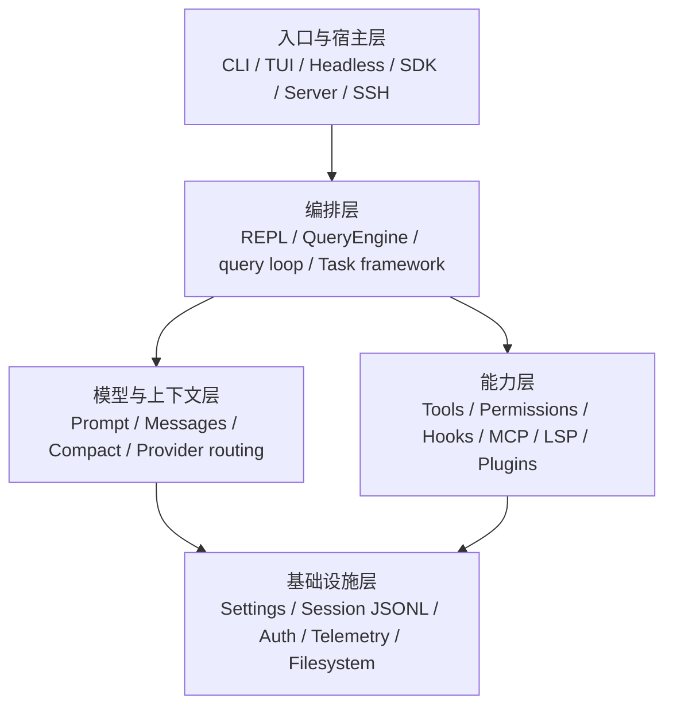

# 00. 全景与核心心智模型

## 1. 项目定位

OpenClaude 是“本地控制面 + 可替换模型后端 + 受控执行环境”的 Code Agent CLI。它提供聊天交互和工具执行能力。模型输出可以描述 `tool_use`。运行时经过权限和 Hook 管道后执行文件、Shell、搜索、网络、MCP、LSP 或代理任务。结构化结果随后加入对话。该过程持续到模型停止调用工具或命中终止条件。

项目的核心价值在于统一下列不稳定边界：

- 多模型 API 和不同流式事件格式。
- 本地文件/进程能力和用户授权。
- 长上下文、工具大输出与压缩。
- 前台交互、后台任务和多代理。
- 交互 TUI、Headless、SDK、远程等不同宿主。

## 2. 五层架构

### 2.1 入口与宿主层

- `bin/openclaude`：安装后的 Node launcher。
- `src/entrypoints/cli.tsx`：启动预处理和 fast path。
- `src/main.tsx`：Commander 命令树、默认交互/打印模式分派。
- `src/screens/REPL.tsx`：React/Ink 交互宿主。
- `src/entrypoints/sdk/index.ts`、`src/QueryEngine.ts`：可编程 API。
- `src/server/`、`src/grpc/`、`src/ssh/`、`src/remote/`：其他运行形态。

### 2.2 编排层

- `src/query.ts`：主 Agent 的状态机式生成器。
- `src/QueryEngine.ts`：SDK/非 React 宿主中的查询编排。
- `src/services/tools/toolOrchestration.ts`：工具批次与并发。
- `src/Task.ts`、`src/tasks/`：后台任务统一状态和 kill 接口。
- `src/tools/AgentTool/`：子代理和 teammate 分派。

### 2.3 模型与上下文层

- `src/context.ts` 与 `src/context/`：系统/用户上下文。
- `src/utils/attachments.ts`：按轮注入的环境附件。
- `src/services/api/`：API client、传输适配、重试、错误映射。
- `src/integrations/`：descriptor-first 的 provider/model 元数据。
- `src/services/compact/`：主动、被动和局部压缩。

### 2.4 能力层

- `src/Tool.ts`、`src/tools.ts`、`src/tools/`：工具协议和实现。
- `src/utils/permissions/`、`src/hooks/useCanUseTool.tsx`：权限决策。
- `src/services/mcp/`：MCP 连接和远端工具动态注册。
- `src/utils/plugins/`：插件安装、发现、组件加载和热刷新。
- `src/utils/hooks.ts`：生命周期 Hook。
- `src/services/lsp/`：语言服务器管理。

### 2.5 基础设施层

- `src/utils/settings/`：多来源设置与策略控制。
- `src/utils/sessionStorage.ts`：JSONL transcript、索引和恢复。
- `src/bootstrap/state.ts`：进程/会话级 bootstrap 状态。
- `src/state/AppStateStore.ts`：交互运行时状态。
- `src/utils/gracefulShutdown.ts`：清理、flush、终端恢复。

## 3. 最重要的数据结构

### 3.1 Message 是数据面的主干

对话采用结构化消息模型：

- `user`：文本、图片、`tool_result`、meta 指令。
- `assistant`：文本、thinking、`tool_use`、usage、stop reason。
- `attachment`：由系统动态注入，并作为消息参与上下文。
- `system`：压缩边界、警告、API retry 等。
- `progress`：UI/SDK 事件，通常不进入持久链。
- tombstone、tool-use summary 等内部消息。

模型协议要求每个 `tool_use.id` 对应一个后续 `tool_result.tool_use_id`。因此异常、中止、fallback 都必须补齐 synthetic result，不能简单丢弃半轮。

### 3.2 Tool 是能力协议

`Tool` 同时定义：

- 名称、描述、输入/输出 schema。
- 启用状态和只读/并发安全属性。
- `validateInput`、`checkPermissions`、`call`。
- API tool result 映射。
- UI 渲染和活动描述。
- 结果上限和持久化策略。

工具执行由此形成可校验、可授权、可观察的事务。

### 3.3 AppState 保存交互共享状态

`AppStateStore` 保存 tasks、MCP clients/tools、权限上下文、todos、插件、provider/model、当前查看的 Agent 等。另有两类状态：

- `bootstrap/state.ts`：sessionId、cwd、成本累计、入口类型等进程级信息。
- 模块级 store：command queue、各类 cache、manager singleton。

阅读时必须问“这个状态属于 React 视图、整个会话，还是某次 query 的局部变量”。

## 4. Agent 循环的最小不变量

1. 同一 REPL 只允许一个本地主查询占有 `QueryGuard`。
2. 一轮模型流可以生成多个 `tool_use`。只读且声明并发安全的连续工具可并行。
3. 每个工具调用必须得到结果或 synthetic error/abort result。
4. 权限模式、规则、Hooks 和工具自身检查都可能影响执行。
5. 需要 follow-up 的工具结果会触发下一次模型请求。
6. stop hook 可以要求模型继续。该路径必须保留防循环 guard。
7. terminal reason 明确区分 completed、abort、model error、prompt-too-long、max-turns、step-limit、tool-failure-loop 等。

## 5. 控制流和持久流分离

- UI 实时 state 会频繁变化。JSONL 仅记录可恢复的 message/metadata。
- `progress` 高频事件通常不参与 parent UUID 链。
- 后台任务状态位于 `AppState.tasks`，重要的远端任务另写 sidecar 以支持进程重启恢复。
- tool result 可能把大内容落盘，消息中仅保留预览/引用。resume 时避免重新加载原始巨型 blob。

## 6. 关键设计权衡

### 6.1 主循环选择 AsyncGenerator 的原因

AsyncGenerator 统一暴露最终结果和过程事件。API retry、stream delta、assistant message、tool progress、tool result、compact boundary 均可逐步 yield。TUI、Headless 和 SDK 可按宿主需要消费同一语义。消费过程可以在整轮结束前开始。

### 6.2 多种状态存储的设计依据

单一全局 store 会造成以下问题：

- 高频 stream 使整个 TUI 重渲染。
- 后台 detached task 捕获错误的 React closure。
- SDK 并发 query 相互污染。
- command queue 的通知被 React 批处理漏掉。

项目因此使用 `useSyncExternalStore`、AsyncLocalStorage、局部状态机和 root `setAppStateForTasks`，以明确隔离和可见性。

### 6.3 Provider 接口的抽象边界

元数据采用 descriptor-first 结构。实际协议保留 thinking signature、Gemini thought、OpenAI responses、Anthropic native web search、Bedrock/Vertex auth、Azure headers 等外部契约差异。项目统一上层消息语义，并显式处理传输例外。最低公分母接口会丢失供应商能力。

## 7. 改动层级判断

- 增加模型/默认 URL/展示标签：优先改 `src/integrations/` descriptor。
- 改 HTTP 请求体/stream 解析：改 provider transport/shim。
- 改工具授权：修改 permission pipeline。UI 仅负责呈现授权状态。
- 改背景任务展示：先看 task state predicate，再看组件。
- 改恢复行为：同时检查写入链和 `loadTranscriptFile` 重建。
- 改交互并发：先证明 `QueryGuard` 和 command queue 的状态转换保持原子性。

下一章：[01 仓库、构建与运行时](01-repository-build-runtime.md)。
