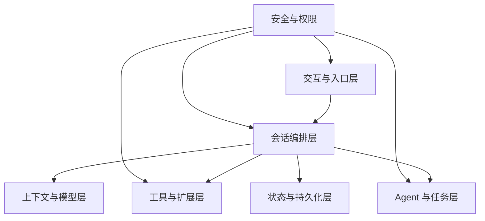
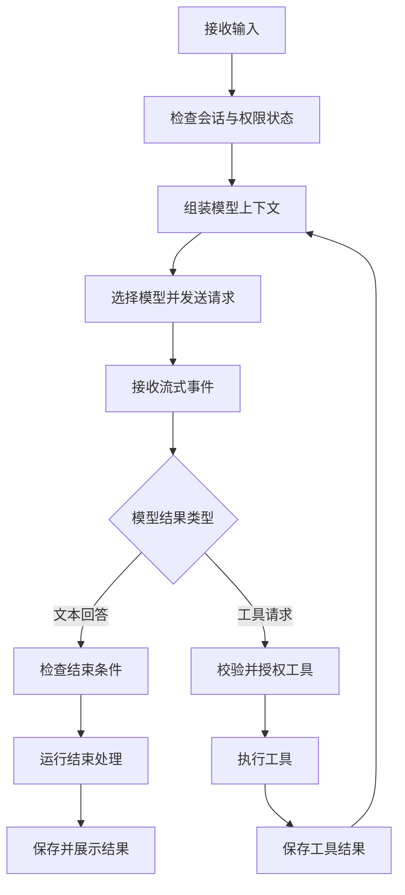
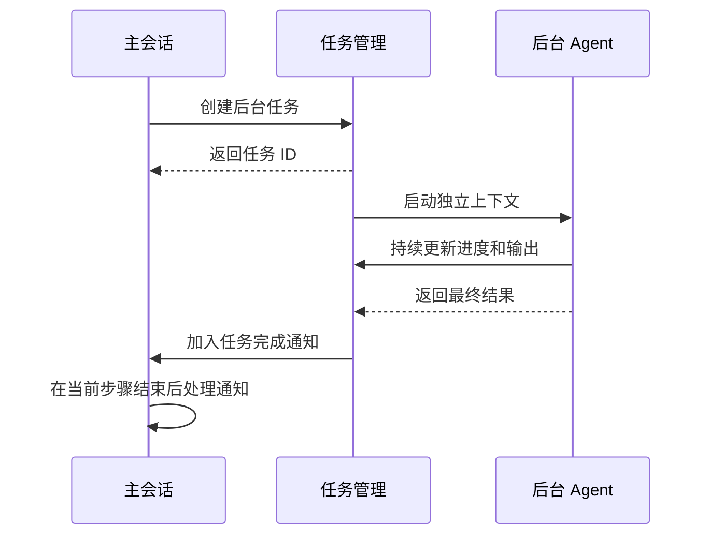

# 00. 总体架构

## 1. 系统定位

OpenClaude 是一个面向软件开发任务的智能代理系统。用户通过终端、Headless 接口、SDK 或远程会话提交任务。系统调用模型理解任务，并在获得授权后执行文件读取、文件修改、Shell 命令、网络访问、MCP 工具、LSP 查询和子 Agent 任务。

系统需要同时解决五类问题：

1. 将不同入口的输入转换为统一的会话请求。
2. 将不同模型供应商的请求和响应转换为统一格式。
3. 控制模型可调用的工具和可访问的资源。
4. 管理长对话、后台任务和并行 Agent 的状态。
5. 保存完整历史，并在中断后恢复到一致状态。

## 2. 架构分层

### 2.1 交互与入口层

该层负责接收输入和交付输出。它包含终端交互、单次 Headless 调用、结构化输入输出、SDK、远程会话、SSH 和服务端接口。

各入口具有独立的输入形式和展示方式。它们向会话编排层提供相同的核心信息：用户内容、会话标识、工作目录、模型选择、权限模式和中止信号。

### 2.2 会话编排层

该层负责推进一次会话请求。主要职责包括：

- 接收用户消息和系统通知。
- 请求上下文模块准备模型输入。
- 调用模型并消费流式结果。
- 识别文本回答和工具请求。
- 调度工具或子 Agent。
- 将工具结果加入下一次模型请求。
- 处理重试、压缩、中止和结束。

会话编排层只依赖统一的消息和工具格式。模型供应商、界面和具体工具的差异由其他模块处理。

### 2.3 上下文与模型层

上下文模块决定模型在本轮可以看到的内容。内容来源包括系统规则、会话历史、项目指令、文件信息、附件、技能、记忆和工具定义。

模型接入模块负责选择 provider 和 model，构造目标 API 请求，并将流式响应转换为内部事件。会话编排层接收的事件包含文本片段、思考内容、工具请求、用量信息和错误信息。

### 2.4 工具与扩展层

工具模块将模型请求转换为本地操作。每个工具声明自己的输入格式、权限检查、并发属性、执行方式和结果格式。

扩展模块可以增加新工具、新命令和新的生命周期处理。MCP 提供远程工具和资源。插件打包命令、Agent、Skill、Hook、MCP 和 LSP 配置。Hook 在会话和工具流程的指定阶段运行。LSP 提供代码定义、引用和诊断信息。

### 2.5 Agent 与任务层

该层管理需要独立上下文或较长执行时间的工作。

- 同步子 Agent 在父请求中运行，父请求等待结果。
- 后台 Agent 注册任务后独立运行，父请求先获得任务 ID。
- Teammate 具有长期团队身份、邮箱和计划审批流程。
- Worktree 为并行修改提供独立文件目录。
- 任务记录保存状态、进度、结果和停止方式。

### 2.6 状态与持久化层

状态模块保存当前运行情况。持久化模块保存可以跨进程恢复的数据。

界面状态包括当前模型、权限请求、任务列表和视图状态。查询状态包括当前阶段、中止控制和恢复次数。任务状态包括进度、输出和通知状态。会话历史使用事件日志保存消息之间的父子关系。

大型工具结果会保存到独立文件。会话消息保留预览和文件位置。该设计控制模型上下文和进程内存的大小。

### 2.7 安全与权限

安全模块贯穿所有层次。主要检查包括：

- 当前工作目录的信任状态。
- 设置和扩展配置的来源。
- 工具调用的允许、拒绝和确认规则。
- 文件路径和符号链接解析结果。
- Shell 命令及其参数。
- 子进程的文件和网络访问范围。
- 外部内容、凭据和日志的处理方式。

## 3. 核心数据

### 3.1 消息

消息是模块之间传递会话内容的主要格式。常见消息包括用户输入、模型回答、工具请求、工具结果、系统通知、进度和错误。

每条持久化消息具有唯一 ID 和父消息 ID。父子关系支持恢复、分支、回退和子 Agent 历史。

### 3.2 工具请求与工具结果

模型发出的每个工具请求都具有调用 ID。工具执行完成后，系统生成使用相同调用 ID 的结果。成功、失败和中止都要生成结果。完整配对可以保证下一次模型请求包含合法历史。

### 3.3 会话状态

会话状态分为三类：

| 状态类型 | 保存内容 | 存续时间 |
|---|---|---|
| 交互状态 | 当前视图、对话框、输入和显示进度 | 当前界面会话 |
| 运行状态 | 当前查询阶段、中止控制、任务进度 | 当前进程或当前请求 |
| 持久状态 | 消息、设置、摘要、分支和文件快照 | 跨进程保留 |

三类状态分别更新。高频流式文本不会触发所有持久化逻辑。后台任务不会依赖某个界面组件继续存在。恢复流程只读取已经保存的数据。

## 4. 主工作流程

### 4.1 输入阶段

入口模块将文本、附件、命令和远程事件转换为会话输入。系统读取当前会话的运行状态，并根据输入类型决定立即执行、排队或更新当前任务。

### 4.2 上下文阶段

上下文模块选择当前有效的历史消息，并加入系统规则、项目指令、技能、记忆和工具定义。上下文超过模型容量时，系统缩短旧历史或生成摘要。

### 4.3 模型阶段

模型接入模块根据当前配置选择 provider 和 model。请求转换完成后，模型流式事件会逐步返回。界面可以立即显示文本进度。会话编排层同时收集完整消息。

### 4.4 工具阶段

模型返回工具请求时，系统依次完成参数校验、Hook、权限判断、用户确认和沙箱准备。可以并发的只读工具会组成并发批次。具有写入影响或顺序要求的工具会串行执行。

### 4.5 继续与结束

工具结果加入上下文后，系统再次请求模型。模型给出最终回答、达到步数限制、收到中止信号或遇到不可恢复错误时，本轮结束。结束处理会保存消息、运行结束 Hook、更新任务和释放资源。

## 5. 后台工作流程

后台 Agent 与主会话共享必要的任务基础设施，并拥有独立的消息上下文。用户取消主会话输入时，后台任务可以继续运行。用户明确停止任务时，任务管理模块会传播中止信号。

## 6. 恢复工作流程

系统使用追加式事件日志保存会话。新事件不会覆盖旧事件。恢复时，系统选择目标末端事件，并沿父事件 ID 重建当前消息链。

对话分支会从历史事件创建新链。文件回退会应用单独保存的文件快照。上下文压缩会记录摘要和压缩位置。大型结果文件保持原路径引用。

## 7. 主要设计选择

### 7.1 统一内部消息格式

各 provider 的消息字段和流式事件存在差异。模型接入模块负责转换。会话编排、工具和持久化模块只处理内部格式。新增 provider 时，修改范围集中在模型配置和 API 适配模块。

### 7.2 流式事件驱动

模型文本、工具进度、重试和任务通知会持续产生。系统逐步发布事件。终端和 SDK 可以在整轮结束前处理已经产生的内容。

### 7.3 按用途分离状态

界面状态、查询状态、后台任务状态和持久化历史具有不同的更新频率和存续时间。独立存储可以减少无关更新，并避免后台任务依赖界面生命周期。

### 7.4 追加式会话日志

追加式日志保留每次状态变化。恢复、分支和回退都可以通过父事件关系表达。损坏行可以单独跳过。审计过程可以查看完整历史。

### 7.5 分层安全检查

目录信任控制项目配置加载。Permission 控制具体工具调用。路径检查限制文件范围。Sandbox 限制子进程。网络检查限制目标地址。各项检查覆盖不同风险。

## 8. 章节关系

启动流程见 [02 启动流程](02-entrypoints-startup.md)。会话执行见 [04 会话执行流程](04-query-agent-loop.md)。模块级细节分别位于 05 至 14 章。源码路径和术语位于 [17 源码索引与术语](17-source-map-glossary.md)。
