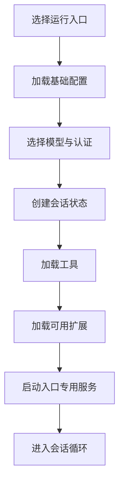

# 01. 运行环境与系统装配

## 1. 运行形态

OpenClaude 的发布产物运行在 Node.js 22 或更高版本。项目开发、依赖管理、构建和测试使用 Bun。用户运行 CLI 时只依赖 Node.js 和发布包中的构建产物。

系统提供多种运行形态：

| 形态 | 主要用途 | 交互方式 |
|---|---|---|
| 终端交互 | 日常开发任务 | React/Ink TUI |
| Headless | 脚本和自动化 | 标准输入输出 |
| SDK | 应用内嵌 | JavaScript/TypeScript API |
| MCP Server | 向外部客户端提供工具 | stdio 协议 |
| Remote | 远程控制本地会话 | WebSocket 或远程 I/O |
| SSH | 在远端环境启动和连接会话 | SSH 与本地转发 |
| gRPC | 开发阶段的服务化实验 | gRPC stream |

这些形态共用会话编排、模型接入、工具定义和持久化能力。每种形态单独处理输入、输出、权限确认和资源关闭。

## 2. 发布单元

系统由三个主要发布单元组成：

### 2.1 CLI

CLI 包含终端界面、Headless 模式、远程入口和本地工具。它负责选择运行模式并初始化当前进程所需的服务。

### 2.2 SDK

SDK 提供不依赖终端界面的调用方式。它复用模型、工具和会话逻辑，并向调用应用返回结构化事件。SDK 构建会限制终端 UI 依赖进入产物。

### 2.3 公共类型

公共类型描述消息、工具、权限请求、会话事件和 SDK 接口。调用应用可以只依赖类型定义，不需要加载 CLI。

## 3. 系统组件装配

进程启动时会根据入口和配置装配所需组件。

基础工具和会话能力始终可用。MCP、插件、LSP、团队协作、远程控制和实验能力根据构建产物、运行配置和权限策略加载。

## 4. 功能可用性的三个条件

一项功能可用需要同时满足三个条件：

1. 代码进入当前构建产物。
2. 运行配置启用该功能。
3. 当前入口和安全策略允许使用该功能。

构建功能开关用于生成不同发布产物。运行设置用于启用已经包含的代码。权限和组织策略用于限制当前用户或会话可以使用的能力。

部分公开构建版本使用功能不完整的替代模块。此类模块会返回明确的不可用状态。功能清单以当前构建产物为准。

## 5. 核心资源

### 5.1 进程级资源

进程级资源包括配置缓存、provider 认证状态、MCP 连接池、LSP 管理器、插件注册表和日志服务。这些资源可以服务多个请求，并在配置变化或进程退出时释放。

### 5.2 会话级资源

会话级资源包括会话 ID、工作目录、消息历史、任务表、权限请求、AbortController 和大型结果存储。会话结束后，系统需要关闭连接并清理等待中的回调。

### 5.3 请求级资源

请求级资源包括本轮上下文、模型选择、工具执行器、token 预算、恢复次数和流式消息缓冲。请求结束后不会继续占用下一轮状态。

## 6. 外部依赖

OpenClaude 可以连接以下外部系统：

- 模型供应商 API。
- MCP Server。
- OAuth 和云平台认证服务。
- Git 与本地文件系统。
- Shell 和本地可执行程序。
- LSP Server。
- 插件 marketplace 和更新服务。
- 远程控制服务。

外部依赖失败时，系统会根据能力重要性选择终止、降级、重试或保留核心会话。模型认证失败通常阻止模型请求。可选 LSP 或插件失败通常形成警告。安全策略可以将特定可选能力设置为强制要求。

## 7. 数据位置

系统使用用户目录保存全局设置、认证信息、插件和长期记忆。项目目录可以提供项目设置、指令和扩展配置。会话目录保存 JSONL 日志、任务输出、大型工具结果和文件历史快照。

设置来源具有优先级和信任等级。项目配置需要经过目录信任检查。凭据优先保存在系统安全存储中。日志和会话数据会过滤已知敏感字段。

## 8. 运行环境设计依据

### 8.1 CLI 与 SDK 分离

CLI 需要终端渲染、键盘输入和交互对话框。SDK 需要较小依赖和可控的资源管理。独立发布单元可以避免应用内嵌 SDK 时加载完整终端界面。

### 8.2 可选组件延迟加载

插件、LSP、MCP 和远程能力可能增加启动时间或引入外部依赖。系统在确认入口和配置后加载这些组件。简单命令和精简模式可以减少启动操作。

### 8.3 资源按范围管理

进程、会话和请求具有不同的存续时间。资源按范围创建和释放可以减少跨会话污染，并支持 SDK 在同一进程中连续运行多个会话。

## 9. 相关章节

启动装配顺序见 [02 启动流程](02-entrypoints-startup.md)。入口差异见 [13 使用入口与部署形态](13-entrypoint-modes-sdk-remote.md)。构建和测试细节见附录 [15 工程质量与验证](15-engineering-and-testing.md)。
