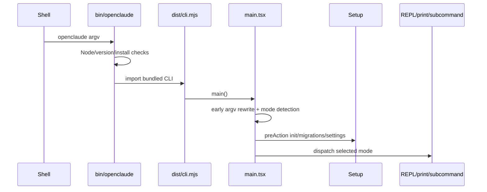
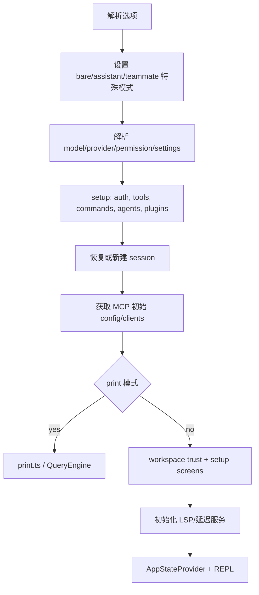

# 02. 入口与启动链路

## 1. 安装后启动链

`src/entrypoints/cli.tsx` 负责必须早于重型 imports 的启动工作。`src/main.tsx` 是默认命令树和主要分派中心。

## 2. `main.tsx` 的早期副作用

在大量模块加载前，代码启动：

- startup profiler checkpoint。
- MDM managed settings 原始读取。
- macOS keychain OAuth/API key 预取。

这样把慢 I/O 与模块解析并行。随后：

- 防止 Windows 从当前目录隐式执行同名命令。
- 注册 warning/exit/SIGINT 行为。
- 处理 URL/deep link、assistant、SSH 等需要改写 argv 的入口。
- 根据 TTY、参数和环境判断 interactive。
- 设置 client type 和 session source。
- eager load `--settings` 等会影响初始化的 flag。

安全含义：trust 之前不能启动项目提供的 LSP/Hook/插件可执行代码。

## 3. Commander 初始化

`run()` 创建 Commander program，并通过 `preAction` 对真实命令统一做：

1. 等待 MDM 和 keychain 预取。
2. `init()` 加载基础环境。
3. 初始化 telemetry sinks。
4. 应用 `--plugin-dir`。
5. 运行版本化 migrations。
6. 异步拉取 remote managed settings 和 policy limits。
7. 可选启动 settings sync。

展示 `--help` 不运行这些重初始化，减少延迟和副作用。

## 4. 默认命令参数分类

### 4.1 宿主/输出

- `-p/--print`：非交互一次或 stream-json 输入。
- `--input-format`、`--output-format`。
- `--include-partial-messages`。
- `--replay-user-messages`。
- `--no-session-persistence`。

### 4.2 模型/provider

- `--model`、`--provider`、`--fallback-model`、`--effort`。
- provider env file。
- API-side task budget。
- beta headers。

### 4.3 能力/安全

- `--tools`、`--allowed-tools`、`--disallowed-tools`。
- `--permission-mode`、危险跳过权限开关。
- `--add-dir`。
- `--mcp-config`、`--strict-mcp-config`。
- `--plugin-dir`、`--disable-slash-commands`。

### 4.4 会话

- `--continue`：当前项目最近会话。
- `--resume [id]`：指定或交互选择。
- `--fork-session`：复用上下文并生成新 sessionId。
- `--resume-session-at`：只恢复到某 assistant message。
- `--rewind-files`：根据 file-history snapshot 恢复工作区。

### 4.5 工作区与协作

- `--worktree [name]`、`--tmux`。
- agent/team 内部身份参数。
- remote/direct-connect/SSH 特有配置。

## 5. 默认 action 的主要阶段

默认 action 可以划分为以下阶段：

### 5.1 `--bare`

把 `CLAUDE_CODE_SIMPLE=1` 设在 `setup()` 前，会使 CLAUDE.md 自动发现、Hooks、LSP、插件同步、auto-memory 等 gate 进入轻量路径。显式提供的 skills、system prompt、MCP、agents 和 plugin dir 保持可用。该选项定义最小副作用模式。工具能力由显式配置决定。

### 5.2 trust gate

项目 settings 和 `.claude/` 内容属于仓库控制，可能执行命令。交互模式在用户信任前不会启动危险扩展。项目也避免仅凭 `.claude/settings.json` 自动开启 assistant/危险模式。

### 5.3 恢复先于渲染

resume 需要在 REPL 初始 state 创建前计算：

- 消息链、content replacement。
- file history / attribution / todos。
- agent setting/name/color。
- provider/model/session mode。
- worktree cwd。
- active goal 和远端任务 sidecar。

这避免组件 mount 后再逐项修补造成短暂错误状态。

## 6. 交互启动

`interactiveHelpers.tsx` 提供公共骨架：

- `showSetupScreens()`：信任、认证、危险模式、MCP project approval 等对话框。
- `showSetupDialog()`：包装 `AppStateProvider + KeybindingSetup`。
- `renderAndRun()`：开始 deferred prefetch，等待 Ink root 退出，然后 graceful shutdown。
- `getRenderContext()`：统一终端错误处理和 exit behavior。

最终 REPL 被包在 AppState、键位、MCP connection manager 等 providers 中。

## 7. 非默认子命令

Commander 同时注册：

- `mcp`：list/get/add/remove/auth/doctor/import。
- `plugin` / `plugins`：marketplace、install、enable、update、validate。
- `auth`：Anthropic 及特定 provider OAuth。
- `agents`、`skills`。
- `doctor`、`update`、`install`。
- `server`、`open`、`ssh`、`assistant`（按 feature）。
- task report、auto-mode 等构建特定命令。

这些 handler 多用动态 import，避免默认交互启动加载整棵命令实现。

## 8. 退出链

`gracefulShutdown` 承担以下退出职责：

- 防重入并设置 failsafe。
- 执行 cleanup registry。
- 停止任务/服务/子进程。
- flush transcript 和 deferred config writes。
- 执行 SessionEnd hooks（有较短 timeout）。
- 恢复 raw mode、光标、alternate screen。
- 交互模式打印 resume hint。
- 最终强制退出。

同步退出路径作为终端断开或 process exit 的保底，能做的清理更有限。

## 9. 快速追踪入口的方法

- 参数失效定位：检查 `main.tsx` 注册、早期 argv rewrite 和 action 解构三处。
- 某功能的初始化时机：查 `preAction`、`setup()`、`startDeferredPrefetches()`。
- 交互和 print 具有不同的宿主行为。相关分析需要比较 `REPL.tsx`、`print.ts` 和 `query.ts`。
- 发布包缺模块：查 `scripts/build.ts` feature definitions 和 externals。

下一章：[03 状态与数据模型](03-state-and-data-model.md)。
