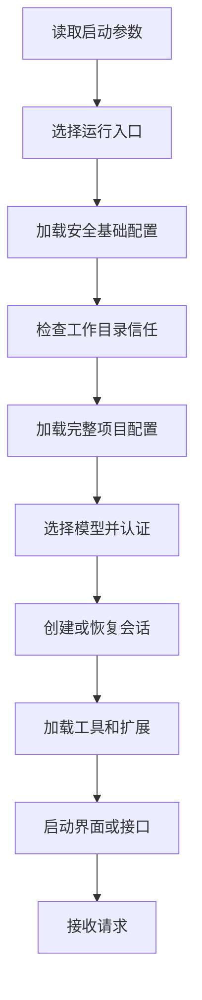

# 02. 启动流程

## 1. 启动目标

启动流程负责建立一个可以安全处理请求的运行环境。完成启动后，系统需要具备以下信息和资源：

- 当前运行入口和输出格式。
- 工作目录及其信任状态。
- 合并后的有效设置。
- 当前 provider、model 和认证方式。
- 新会话或恢复会话的状态。
- 当前入口可用的工具和扩展。
- 日志、任务和中止处理能力。

## 2. 总体顺序

## 3. 参数与入口选择

启动参数首先决定运行形态。入口选择会影响后续加载内容。

| 参数类别 | 影响 |
|---|---|
| 输出与输入 | TUI、普通文本、JSON、流式 JSON |
| 模型 | provider、model、推理强度、fallback |
| 会话 | 新建、继续、恢复、分支 |
| 权限 | 默认审批方式、沙箱、可访问目录 |
| 扩展 | MCP、插件、Agent、Skill |
| 远程 | Remote、SSH、后台进程 |

帮助、版本和部分管理命令可以直接返回结果。它们不需要加载完整会话、模型和终端界面。

## 4. 安全基础配置

目录信任确认前，系统只加载可信来源中的基础设置。该阶段可以读取用户设置、管理员策略和启动参数。项目目录中的 Hook、MCP、命令、插件和危险环境变量暂不生效。

全局证书等需要在首次网络连接前确定的配置会在此阶段处理。项目配置不能在目录信任确认前改变证书、代理、可执行路径和动态库加载方式。

## 5. 工作目录信任

交互模式会向用户展示当前目录可能启用的项目能力，包括 Hook、MCP、Shell 规则、项目命令、Skill、凭据 helper 和危险环境变量。

用户接受目录后，系统加载完整项目配置。用户拒绝目录后，程序退出或保持受限状态。Headless 和 bypass 模式由调用方承担目录信任责任。

目录信任只控制项目配置加载。具体工具调用还要经过权限、路径和沙箱检查。

## 6. 配置合并

设置按来源和优先级合并。主要来源包括管理员策略、启动参数、会话设置、本地项目设置、项目共享设置和用户设置。

合并过程会完成以下操作：

1. 解析配置文件。
2. 校验字段类型和允许值。
3. 按优先级选择或合并字段。
4. 保留每个安全相关字段的来源。
5. 生成当前会话使用的有效配置。

配置错误会包含来源和字段位置。强制策略错误会阻止启动。可选扩展配置错误可以形成警告并跳过对应扩展。

## 7. 模型与认证

系统根据启动参数、会话设置、provider profile 和默认值选择 provider 与 model。模型选择完成后，认证模块读取 API key、OAuth、云平台凭据、系统安全存储或外部 helper。

认证成功后，系统建立模型 API client。模型名称、上下文窗口、工具能力、视觉能力和推理能力会加入当前会话配置。

## 8. 会话创建与恢复

### 8.1 新会话

新会话会生成 session ID，记录原始工作目录，并初始化消息历史、任务表、文件历史和大型结果存储。

### 8.2 继续最近会话

Continue 会选择符合当前项目和入口条件的最近会话。系统重建当前消息链，并恢复模型、工作目录和会话元数据。

### 8.3 恢复指定会话

Resume 根据 session ID 或用户选择加载历史。恢复流程会排除损坏事件和无效分支，并应用上下文压缩、内容替换和文件历史记录。

### 8.4 分支会话

分支会话从指定历史消息创建新的消息链。原会话保持不变。新会话记录来源会话和分支位置。

## 9. 工具与扩展加载

会话准备完成后，系统装配当前入口可用的能力：

- 内置文件、Shell、搜索和任务工具。
- 当前配置允许的 Agent。
- MCP Server 提供的工具和资源。
- 已启用插件提供的命令、Skill、Hook 和 LSP。
- SDK 调用方提供的工具和 MCP Server。

工具装配会应用功能开关、权限规则、入口限制和组织策略。被禁止的工具不会暴露给模型。

## 10. 入口启动

### 10.1 终端交互

终端模式启动 React/Ink 界面，订阅会话状态，并建立输入、滚动、对话框和取消处理。

### 10.2 Headless

Headless 模式创建会话状态和查询循环，并通过标准输入输出交换文本或结构化事件。权限请求需要预设规则或外部回调。

### 10.3 SDK

SDK 创建独立会话对象，并将事件返回给调用应用。调用应用负责消费事件、中止请求和关闭会话。

### 10.4 远程与服务端

远程入口在认证后建立消息通道。服务端入口注册可调用方法。工具执行位置由运行会话编排模块的进程决定。

## 11. 精简模式

精简模式减少自动加载行为。项目指令自动发现、Hook、LSP、插件同步、自动记忆和后台预取可以跳过。调用方明确提供的模型、MCP、Agent、Skill 和目录设置继续生效。

精简模式适用于脚本、诊断和受控自动化。调用方需要明确提供所需能力和凭据。

## 12. 退出流程

正常退出、中止信号和终端断开会进入统一退出流程：

1. 停止接收新请求。
2. 中止当前模型和工具操作。
3. 通知后台任务停止或脱离当前会话。
4. 保存待写入的会话事件。
5. 关闭 MCP、LSP、远程连接和文件监听器。
6. 清理终端状态和临时资源。
7. 返回对应退出状态。

重复退出信号不会重复执行资源清理。

## 13. 启动失败的处理

| 失败位置 | 系统行为 |
|---|---|
| 参数或设置无效 | 显示来源和字段错误并停止 |
| 目录未获信任 | 停止加载项目能力 |
| 模型认证失败 | 阻止模型请求并显示认证信息 |
| 可选 MCP 或 LSP 失败 | 记录警告并继续核心会话 |
| 会话日志部分损坏 | 跳过损坏事件并恢复可确认历史 |
| 强制安全能力不可用 | 停止启动 |

下一章说明启动完成后各类状态的保存位置和协作方式。
