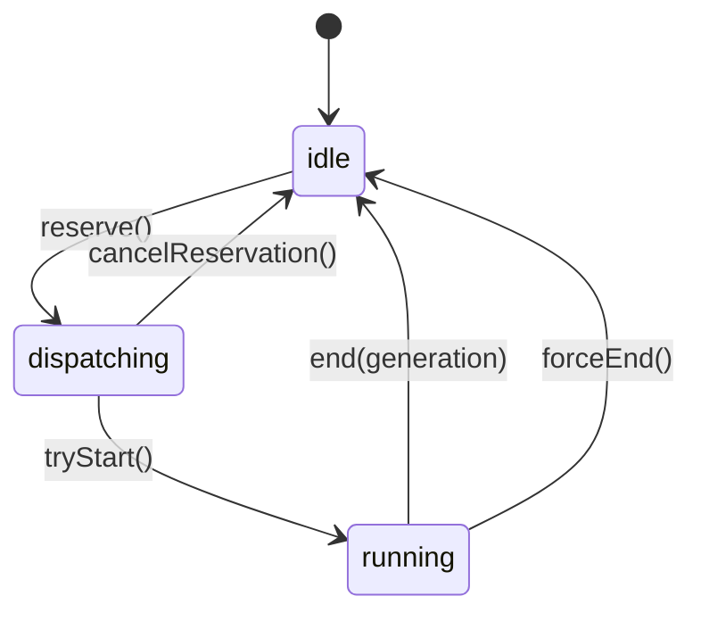

# 03. 状态与数据模型

## 1. 状态分布在多个域

OpenClaude 同时维护四种状态域：

| 状态域 | 典型实现 | 生命周期 | 适合内容 |
|---|---|---|---|
| Query 局部状态 | `query.ts` 的局部 `State` | 单次 Agent 调用 | 当前消息、转移原因、恢复 guard、turn count |
| React 运行状态 | `AppStateStore` | 当前交互宿主 | tasks、MCP、权限、todos、插件、视图 |
| Bootstrap/进程状态 | `bootstrap/state.ts` | 进程或 SDK ALS scope | sessionId、cwd、成本、入口类型、全局 latch |
| 持久状态 | settings / JSONL / sidecar | 跨进程 | 配置、消息链、标题、任务恢复元数据 |

另有 command queue、MCP client memoize、LSP manager、provider profile cache 等模块级 store。它们通常通过 signal 或显式 reset 暴露变化。

## 2. 消息模型

定义集中在 `src/types/message.ts`，上层统一使用内部 `Message`，到 API 边界再正规化。

### 2.1 用户消息

用户消息可包含：

- 文本。
- 图片、文档转换后的 content block。
- `tool_result`。
- `isMeta` 的运行时控制提示。
- `origin`，例如 task notification。
- `toolUseResult` 等仅内部/持久化辅助字段。

“user”角色覆盖多类消息来源。模型协议要求工具结果以 user role 返回。系统注入的延续指令也可能复用 user message。

### 2.2 Assistant 消息

包含 provider 返回的：

- text。
- thinking / redacted thinking。
- 一个或多个 `tool_use`。
- usage、request id、stop reason。
- synthetic/API error 标记。

thinking 有严格轨迹约束：受保护的 thinking 必须和生成它的模型/协议匹配。fallback 或 OpenAI-compatible 恢复时可能需要剥离，Anthropic native 路径则要保留签名。

### 2.3 Attachment 消息

Attachment 是运行时上下文的可追踪载体，包括：

- CLAUDE.md/项目指令。
- IDE selection、诊断、git 状态。
- todo、计划模式状态。
- memory、invoked skills。
- 最近读取文件。
- 后台 Agent 状态。
- max-turns 等控制信息。

附件允许不同宿主共享注入语义，又能在 compaction 后按规则重建。

### 2.4 Progress、System 与 Tombstone

- `progress` 面向 UI/SDK，通常不参与持久 parent chain。
- `system` 可表示 warning、retry、compact boundary。
- tombstone 删除已经流出且随后认定无效的消息。写入层会移除对应 UUID。

## 3. `tool_use` / `tool_result` 配对不变量

合法轨迹：

```text
assistant: [text(optional), tool_use(id=A), tool_use(id=B)]
user:      [tool_result(tool_use_id=A), tool_result(tool_use_id=B)]
assistant: [...]
```

破坏配对会使 Anthropic/OpenAI shim 拒绝请求。项目在多条异常路径补齐：

- 模型 stream 中断。
- 用户取消。
- fallback 丢弃第一次 attempt。
- tool 被队列取消或未开始。
- query runtime 异常。
- resume 时父对话带有 incomplete call。

`runAgent.filterIncompleteToolCalls()` 在 fork 父上下文时剔除孤立 assistant tool call。主 query 则优先生成 synthetic error result，以保留可解释轨迹。

## 4. Query 局部状态

`src/query.ts` 把循环状态显式存入局部 `State`，核心字段包括：

- `messages`：下一次请求的对话。
- `toolUseContext`。
- `autoCompactTracking`。
- `maxOutputTokensRecoveryCount`。
- `hasAttemptedReactiveCompact`。
- `hasAttemptedContextOverflowRecovery`。
- `hasAttemptedProviderFallback`。
- output token overrides/caps。
- pending tool-use summary。
- stop hook 状态。
- `turnCount`、continuation count、agent step limit。
- `transition`：进入本轮的原因。

恢复 guard 必须跨 stop-hook retry 保留。缺失该 guard 会导致 compact/fallback 死循环。

`query/transitions.ts` 把结果分为：

- **Terminal**：completed、model/image error、prompt-too-long、abort、hook stop、max turns、agent step limit、tool failure loop。
- **Continue**：next turn、compact retry、provider cap/fallback retry、output recovery、stop-hook blocking、token-budget continuation。

## 5. `AppStateStore`

`src/state/AppStateStore.ts` 是 vanilla store。`AppStateProvider` 把它注入 React。组件通过 selector 订阅状态切片。该机制避免每次复制整份 state。

主要分区：

- `toolPermissionContext`：模式、allow/deny rule、working directories、prompt 策略。
- `tasks: Record<string, TaskStateBase>`。
- `mcp`：clients、tools、commands、resources、errors。
- `plugins`：enabled/disabled、commands、errors、refresh 状态。
- `todos`、file history、attribution。
- provider/model、effort、fast mode。
- tool result replacement state。
- team context、agent registry、当前查看任务。
- UI 相关的跨组件共享状态。

### 5.1 root `setAppStateForTasks` 的职责

异步子代理可以嵌套创建后台任务。父 `ToolUseContext.setAppState` 在 async agent 隔离中可能是 no-op。该约束防止子代理修改父 UI。task 注册和 kill 必须在根任务表可见。context 因此额外提供 root setter。root setter 仅用于需要跨隔离边界的任务状态。

### 5.2 `onChangeAppState`

所有 state 变化经过 store diff hook，可集中处理副作用：

- 权限模式变化同步到 CCR/SDK metadata。
- model 变化写回设置/profile。
- expanded/verbose 持久化。
- settings 变化清理凭据 cache 并应用环境变量。

集中 choke point 避免多个 UI/命令调用点漏同步。

## 6. `bootstrap/state.ts`

这是刻意受控的模块级会话状态。重要类别：

- identity：sessionId、parentSessionId、client type、query source。
- paths：original cwd、project root、current cwd。
- usage：cost、API/tool duration、tokens、lines changed。
- session options：interactive、persistence、dangerous mode、SDK betas。
- feature latches：fast mode、cache editing、thinking clear。
- invoked skills、prompt cache state、replay index builder。
- SDK/remote writer context。

SDK 通过 `AsyncLocalStorage` 的 `runWithSdkContext()` 覆盖 sessionId 等敏感字段，避免同进程并发 query 共享一个全局 session。

## 7. QueryGuard

`src/utils/QueryGuard.ts` 是同步状态机：



它解决 React state 批处理无法作为并发锁的问题。generation 防止“取消后立刻重提”时旧 query 的 finally 把新 query 误置 idle。

Guard 还有：

- idle timeout 和 hard max timeout。
- activity registration。
- lease：长工具/用户交互可说明当前存在活跃工作。
- active operation snapshot，用于诊断超时。

## 8. Command Queue

`messageQueueManager.ts` 是 React 外部 store：

- `now`：需要中断/尽快处理。
- `next`：用户输入默认优先级。
- `later`：后台 task notification。

同优先级 FIFO。`useQueueProcessor` 同时订阅 queue 和 QueryGuard。只有 query idle 且没有 local JSX modal 时才 dequeue。这样用户输入不会被大量后台完成通知饿死。

## 9. Task 状态

基础定义：

```ts
type TaskStatus = 'pending' | 'running' | 'completed' | 'failed' | 'killed'
```

`TaskStateBase` 含 id/type/description/toolUseId/start/end/output file/offset/notified。具体 task 扩展：

- local shell：command、process/abort、stdout summary。
- local agent：messages、progress、pending messages、background/retain/evict。
- remote agent：sessionId、poll state、todo、remote task type。
- in-process teammate：identity、mailbox、idle/plan/shutdown 状态。
- workflow、monitor、dream 等 gate 下类型。

terminal 状态永不再转换。注入消息、eviction、orphan cleanup 都用 `isTerminalTaskStatus()` 守卫。

## 10. 持久链状态

JSONL 每条消息有 `uuid` 和 `parentUuid`。这组字段可以表示分支结构。metadata 条目可以独立于消息链。恢复过程执行以下步骤：

1. 读 metadata 和 message map。
2. 计算被引用的 parent UUID。
3. 找 leaf。
4. 从 leaf 反向构造主链。
5. 应用 compact preserved-segment relink、snip 删除和 content replacement。

这使 rewind/fork/compact 可以共存。

下一章：[04 主 Agent 执行循环](04-query-agent-loop.md)。
