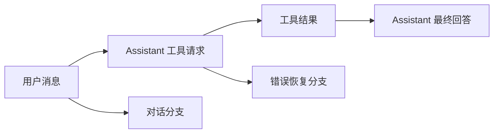
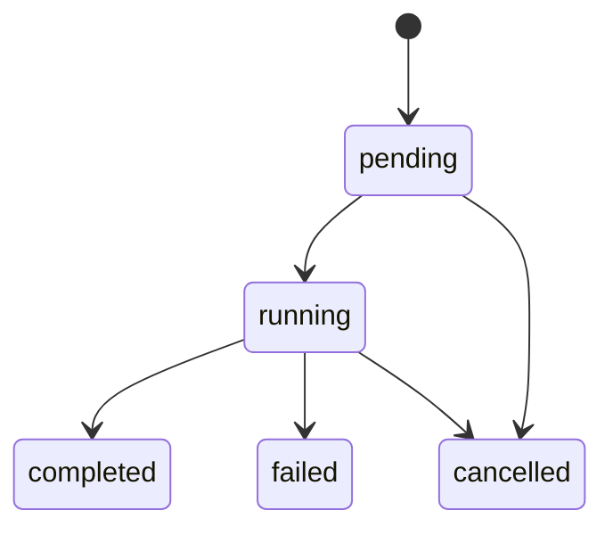

# 03. 状态与数据

## 1. 状态设计目标

OpenClaude 同时处理终端渲染、模型流、工具执行、后台任务和会话恢复。这些数据具有不同的更新频率和保存时间。系统按用途将状态分开管理。

主要目标包括：

- 流式文本更新不会触发所有模块刷新。
- 后台任务离开当前界面后可以继续运行。
- 同一会话只运行一个主请求。
- SDK 中的多个会话不会相互覆盖。
- 进程退出后可以从事件日志恢复。

## 2. 消息模型

消息是会话模块之间传递内容的统一格式。

### 2.1 用户消息

用户消息包含文本和附件引用。附件可以表示图片、文件片段、项目指令、Skill 内容、任务通知和其他结构化上下文。

用户消息还可以记录来源。来源用于区分本地用户输入、远程消息、任务通知和外部 channel 内容。

### 2.2 Assistant 消息

Assistant 消息可以同时包含以下内容：

- 文本回答。
- 思考内容。
- 工具请求。
- API 错误。
- token 用量和结束原因。

流式响应会先形成临时片段。流结束后，系统将片段合并为完整 Assistant 消息。

### 2.3 工具消息

工具请求包含工具名、调用 ID 和参数。工具结果使用相同调用 ID，并记录成功、失败或中止状态。

一条 Assistant 消息可以包含多个工具请求。对应的工具结果会按原请求顺序加入历史。该顺序可以满足 provider 对消息结构的要求。

### 2.4 系统与进度消息

系统消息用于保存重试说明、上下文压缩记录、中止标记和恢复说明。进度消息用于展示工具和后台任务的当前状态。部分进度只显示在界面中，不写入模型上下文。

### 2.5 消息关系

持久化消息包含唯一 ID 和父消息 ID。

父子关系允许一份日志保存多个分支。当前会话只选择其中一条消息链。

## 3. 状态分类

| 状态域 | 主要内容 | 更新来源 | 保存时间 |
|---|---|---|---|
| 交互状态 | 输入、对话框、滚动、当前视图 | 终端操作 | 当前界面 |
| 会话状态 | 当前模型、权限模式、消息、待办 | 用户和会话编排 | 当前会话 |
| 查询状态 | 当前阶段、中止信号、重试和预算 | 会话编排 | 当前请求 |
| 任务状态 | 任务类型、状态、进度、输出 | Agent 和任务管理 | 任务生命周期 |
| 服务状态 | MCP、LSP、插件、远程连接 | 服务管理模块 | 当前进程 |
| 持久状态 | 事件日志、设置、文件快照、大型结果 | 持久化模块 | 跨进程 |

## 4. 交互状态

交互状态服务于终端界面。它包含当前输入内容、选中项、活动对话框、流式文本、滚动位置和当前 Agent 视图。

高频状态尽量保留在对应界面区域。流式文本和动画不会写入全局设置。需要被多个组件观察的任务、权限和 MCP 状态会进入共享会话状态。

## 5. 会话状态

会话状态保存当前对话需要共享的数据：

- 当前 provider 和 model。
- 权限模式与临时授权。
- 主消息列表。
- Agent 和任务列表。
- MCP、插件和 LSP 状态。
- 待办、计划和团队信息。
- 当前工作目录和附加目录。

状态变化会通知订阅者。模型变化还会更新请求配置。权限变化还会影响工具过滤和确认流程。工作目录变化还会刷新项目指令和目录相关缓存。

## 6. 查询状态

查询状态描述当前请求的执行情况。

| 字段类别 | 作用 |
|---|---|
| 阶段 | 准备、请求模型、执行工具、恢复、结束 |
| 中止 | 保存当前 AbortSignal 和中止原因 |
| 恢复 | 保存已经执行的重试、压缩和模型切换 |
| 限制 | 保存 turn、step 和 token 预算 |
| 流式内容 | 保存尚未形成完整消息的模型输出 |
| 工具执行 | 保存调用 ID、批次和剩余结果 |

每次请求结束后，查询状态会清理。需要进入下一轮的消息和任务状态会写入会话状态或持久化日志。

## 7. 主请求并发控制

同一会话只允许一个主请求推进消息历史。系统使用同步状态记录主请求处于空闲、准备或运行状态。

用户快速连续提交输入时，第一个输入取得运行资格。后续输入根据当前状态进入 follow-up 队列或 steer 队列。取消后，新请求会获得新的 generation ID。旧请求迟到的结束回调不能结束新请求。

后台任务使用独立任务状态。它们不会占用主请求的运行资格。

## 8. 命令队列

命令队列保存当前请求运行期间到达的新事件：

- 用户追加要求。
- 用户调整当前方向的 steer 消息。
- 后台任务完成通知。
- Teammate 消息。
- 远程会话消息。
- 本地控制命令。

队列按类型和到达顺序处理。中止和本地控制命令具有较高优先级。用户输入优先于普通后台通知。当前模型或工具步骤结束后，主循环读取队列并将适用内容加入下一轮上下文。

## 9. 任务状态

任务状态用于表示持续时间超过单次工具调用的工作。

任务记录包含任务 ID、类型、描述、状态、进度、输出位置和停止方式。Agent、Shell、Remote 和 workflow 可以使用不同执行器，并向任务管理模块报告统一状态。

任务完成时只发送一次通知。读取任务输出不会重复生成完成通知。

## 10. 服务状态

MCP、LSP、插件和远程连接具有进程级状态。服务状态记录连接中、已连接、需要认证、失败和已停止等情况。

服务状态变化会更新工具池和界面。MCP 工具列表变化时，旧工具集合会被替换。LSP 重启时，已打开文件会重新同步。插件更新时，新配置准备完成后再替换旧配置。

## 11. 持久状态

持久化模块保存以下数据：

- 会话消息和父子关系。
- 会话名称、标签和模型信息。
- 上下文摘要和内容替换记录。
- 文件历史快照。
- 大型工具结果文件。
- Agent 子会话和任务输出。
- 团队与长期记忆数据。

写入采用追加方式。每条事件独立解析。单条损坏记录不会使整份日志失效。

## 12. 状态变化示例

### 12.1 用户切换模型

1. 交互模块提交模型选择。
2. 会话状态更新当前模型。
3. 模型接入模块刷新请求配置。
4. 下一次请求使用新模型。
5. 会话日志记录模型变化。

### 12.2 后台 Agent 完成

1. Agent 更新任务状态和输出。
2. 任务管理模块将通知加入命令队列。
3. 主请求在当前步骤结束后读取通知。
4. 通知作为结构化消息进入上下文。
5. 界面更新任务状态。

### 12.3 用户取消请求

1. 交互模块标记主请求结束。
2. 中止信号传给模型和工具。
3. 已产生文本保存为部分回答。
4. 未完成工具调用获得中止结果。
5. 新输入可以启动下一次请求。

## 13. 状态设计总结

状态按更新频率、读取范围和保存时间拆分。交互状态服务界面。会话状态服务当前对话。查询状态服务单次执行。任务状态服务后台工作。服务状态管理外部连接。持久状态支持恢复和审计。

下一章说明这些状态在一次完整会话请求中怎样变化。
