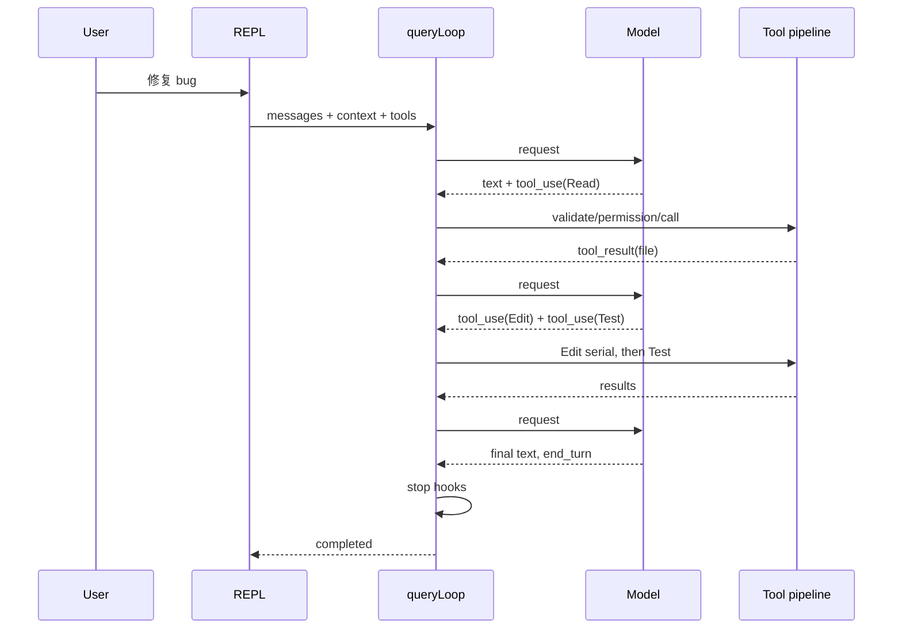

# 04. 主 Agent 执行循环

## 1. 从输入到 `query()`

交互路径：

```text
PromptInput.onSubmit
  → REPL.onSubmit
  → handlePromptSubmit
  → processUserInput
  → REPL.onQuery
  → REPL.onQueryImpl
  → query(params)
  → queryLoop(params)
```

Headless/SDK 路径绕过 React。它们同样消费 `query()`，或由 `QueryEngine` 包装该生成器。

## 2. 输入预处理

`handlePromptSubmit()` 分两条入口：

### 2.1 直接键盘输入

1. 空输入直接返回。
2. `exit/quit/:q` 改写为 `/exit`。
3. 展开粘贴文本引用。输入引用的图片会被保留。
4. query 运行中遇到 immediate local-JSX command，可直接打开 UI，不排入模型队列。
5. query 运行中普通 prompt 放入 command queue。prompt 不会默认中断当前生成。
6. idle 时构造一个 `QueuedCommand`，进入统一执行逻辑。

### 2.2 Queue processor 输入

task notification、运行中提交的用户 prompt、channel/系统消息都已经预验证，跳过重复的输入检查，批量交给 `executeUserInput()`。

### 2.3 `executeUserInput()`

- 创建新 AbortController。
- `queryGuard.reserve()`，先占 dispatching 锁。
- 对每个 queued command 调 `processUserInput()`。
- 只给第一条命令注入 IDE selection、pasted images、turn-level attachments。
- 汇总 messages、allowed tools、model/effort override。
- 调 `onQuery()`。
- finally 释放未转成 running 的 reservation。

这避免异步 slash command 预处理期间第二个 query 穿透。

## 3. `REPL.onQuery()` 的所有权协议

`onQuery()` 执行：

1. `queryGuard.tryStart()`：dispatching → running，并获得 generation。
2. 可选执行 `onBeforeQuery`。拒绝则结束本轮。
3. 把新 user/attachment messages 加入 UI state。
4. 解析该轮 token budget、重置计时和 cache metrics。
5. 调 `onQueryImpl()` 消费 generator。
6. finally 根据 abort/error 推导 terminal reason，并调用 `queryGuard.end(generation)`。

结束 guard 前需要验证 generation 匹配。取消后快速提交的新 query 不会被旧 finally 清掉。

## 4. `onQueryImpl()` 的准备阶段

每轮从 store 读取以下最新状态。该方式避免使用 closure 捕获的旧值：

- tool pool + MCP tools。
- MCP clients。
- permission context。
- agent definitions。
- provider/model/effort。
- custom system prompt。

随后并行准备：

- 需要时撤销不再允许的 bypass/auto mode。
- system prompt。
- user context。
- system context。

构造 `ToolUseContext`，包含 messages、abort、tools、state get/set、read-file cache、UI callback、权限 prompt、query activity/lease 等运行能力。

## 5. `query()` 与 `queryLoop()`

`query()` 是薄包装：调用 `queryLoop()`，并在正常结束时发 command lifecycle complete。`queryLoop()` 是真正状态机。

### 5.1 每次循环开始

- 读取 transition state。
- 判断 proactive auto-compact / forced memory-pressure compact。
- 处理 compact 结果并重建消息。
- 检查消息条数硬上限和 context blocking limit。
- 决定本次模型和 smart route。
- 生成 API-ready messages、tools、system/user context。
- 重置本 attempt 的 assistant/tool buffers。

### 5.2 请求模型流

API 层把 provider stream 转成内部事件。循环逐项处理：

- stream event 透传给 SDK/UI。
- assistant message 记录 usage、文本和 `tool_use`。
- 特定 error message 暂时 withheld，先让本地恢复逻辑判断。
- tombstone 删除无效前序消息。
- fallback 时丢弃第一次 attempt 的 executor 和 tool IDs。
- cached microcompact 可在流后生成边界消息。

`needsFollowUp` 由 tool use 等事件控制，不以文本存在状态判断。

## 6. 无工具调用时的终止/恢复

模型没有要求工具后，按顺序检查：

1. prompt-too-long：先 drain staged context collapse，再 reactive compact。
2. provider context overflow：强制 auto compact 后只重试一次。
3. provider max output cap：解析错误中的 cap 后重发。
4. max output stop：可提升请求 cap，之后最多三次 meta continuation。
5. provider rate limit：按 `providerFallbackChain` 切 profile 并重试一次。
6. API error：仅执行 StopFailure hook。
7. 普通有效回答：执行 Stop/SubagentStop hook。

Stop hook 可返回 blocking feedback，使消息加入对话并再次请求模型。对应 transition 为 `stop_hook_blocking`。为防 death spiral，compact/provider fallback guard 不会被重置。

## 7. 有工具调用时

### 7.1 Agent step limit

子代理设置 `maxSteps` 时，达到限额后：

- 尚未执行的 tool call 得到 error `tool_result`。
- 注入“停止工具调用并给出最终摘要”的控制消息。
- 下一次继续调用工具时进入 terminal `agent_step_limit`。

### 7.2 工具分批

`runTools()` 调 `partitionToolCalls()`：

- 连续的 `isConcurrencySafe()` 工具组成并行 batch。
- 非并发安全工具每个单独串行。
- batch 按原顺序执行，确保写操作边界不被越过。
- 并行上限来自配置/环境。

“只读”与“并发安全”在实践上相关。最终调度以工具的 `isConcurrencySafe()` 为准。

### 7.3 StreamingToolExecutor

启用 streaming tool execution 时，完整 `tool_use` block 一到就可排队执行，不必等整个 assistant stream 结束。关键约束：

- fallback 时必须 `discard()` 旧 executor。
- abort 时必须 drain remaining results，让所有已出现的 tool ID 有 synthetic result。
- tool progress 可先于最终 result 发给宿主。

### 7.4 工具结果回填

每个工具最终生成 user message 中的 `tool_result`。结果会经过：

- post-tool hooks。
- 结果预算/大输出落盘。
- UI progress。
- tool failure loop 分类。
- content replacement 记录。

然后消息并入 state，transition 为 `next_turn`，重新请求模型。

## 8. 工具失败循环保护

`toolFailureLoopGuard` 跟踪：

- 同一 tool + normalized error category。
- 对同一路径重复的修改失败。
- 无成功 mutation 打断的持续失败签名。

达到阈值先给 advisory，继续重复则 terminal `tool_failure_loop`。父 query abort 产生的 synthetic result 不算工具失败，tool 自身 timeout 则算。

## 9. Stop hook 和普通结束

有效模型终止后，`query/stopHooks.ts` 汇总：

- Stop 或 SubagentStop hooks。
- blocking reason。
- computer-use 等 turn cleanup。
- continuation decisions。

没有 blocking 时返回 terminal completed。API error 不进入普通 stop hook，因为它没有可审查的真实模型回答。

## 10. 取消路径

### 10.1 Streaming 期间

- 先 drain StreamingToolExecutor 或补 missing results。
- 按 abort reason 生成 system warning。
- 只有真实 user abort 添加 user interruption message。
- terminal `aborted_streaming`。

### 10.2 工具期间

- 工具共享/派生 abort signal。
- 已运行工具返回 abort result。
- 完成必要 cleanup。
- terminal `aborted_tools`。

`background`、`interrupt`、`query-timeout` 不应伪装成“用户按了 ESC”。

## 11. Turn、Step、Token 三种限制

- **maxTurns**：模型请求/工具轮的总体上限，命中后产生附件并终止。
- **maxSteps**：Agent 定义的工具使用步数上限，要求最后总结。
- **token budget**：限制输出消耗，可触发 continuation 直到预算用尽。

三者语义不同，不能用同一个 counter。

## 12. 正常时序示例



下一章：[05 上下文、Prompt、记忆与压缩](05-context-prompt-memory.md)。
