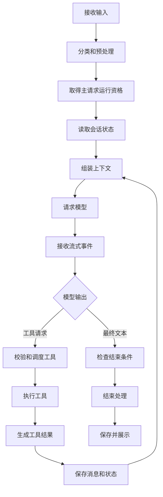
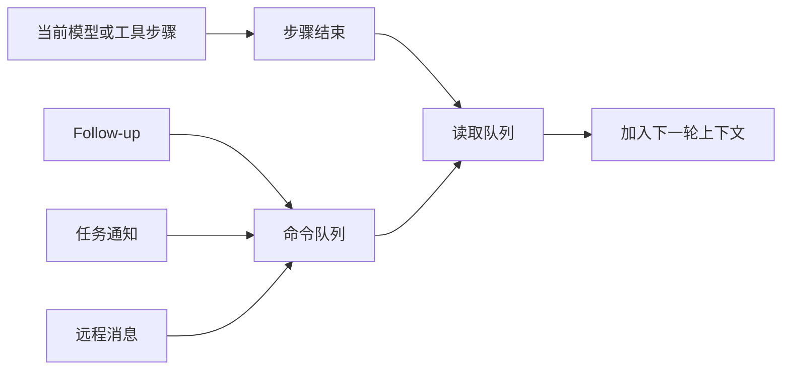
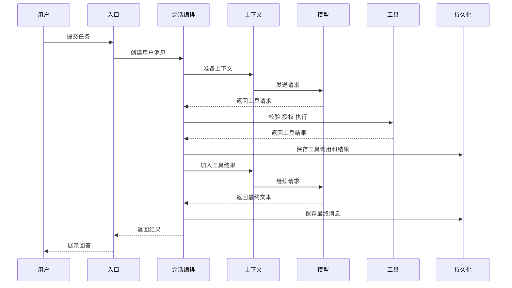

# 04. 会话执行流程

## 1. 流程目标

会话执行流程将用户要求转换为模型回答和工具操作。一次用户请求可以包含多次模型调用、多个工具批次和若干恢复操作。

流程需要保证以下结果：

- 每次模型请求使用当前有效上下文。
- 每个工具请求都得到对应结果。
- 用户可以随时中止前台请求。
- 重试和恢复具有次数限制。
- 后台通知可以安全加入后续处理。
- 最终消息和状态可以完整恢复。

## 2. 总体流程

## 3. 输入分类

入口模块接收以下输入：

| 输入类型 | 处理方式 |
|---|---|
| 普通文本 | 创建用户消息并启动主请求 |
| 附件 | 与用户消息一起加入上下文 |
| Slash command | 执行本地命令或生成模型提示 |
| Bash 快捷输入 | 直接进入 Shell 工具流程 |
| Follow-up | 排队到当前请求后续步骤 |
| Steer | 调整当前任务方向 |
| 任务通知 | 在当前步骤结束后加入上下文 |
| 中止命令 | 立即触发取消流程 |

预处理会展开粘贴内容、解析附件、检查命令类型并保存用户输入历史。

## 4. 主请求启动

系统在执行异步预处理前预留主请求状态。该设计可以防止用户连续提交输入时启动两个主请求。

主请求启动后会完成以下准备：

1. 读取最新消息、模型、权限、工具和工作目录。
2. 创建本轮中止控制器。
3. 确定 turn、step 和 token 限制。
4. 初始化流式消息缓冲和工具执行状态。
5. 记录本轮开始原因。

## 5. 上下文组装

上下文管理模块按顺序准备模型输入：

1. 系统规则和安全说明。
2. 项目与用户指令。
3. 当前会话的有效消息链。
4. 附件、技能和记忆。
5. 后台任务通知和排队输入。
6. 当前可用工具定义。

上下文模块计算 token 使用量。容量不足时，它会先使用已准备的内容缩减结果，再执行自动压缩。压缩完成后，本轮重新组装上下文。

## 6. 模型请求

模型接入模块根据当前 provider、model 和 profile 构造请求。请求包含消息、工具定义、输出上限、推理设置和 provider 专用参数。

模型流式返回以下事件：

- 消息开始。
- 文本片段。
- 思考内容片段。
- 工具请求和参数片段。
- token 用量。
- 消息结束或错误。

会话编排模块将片段合并为完整消息。入口模块可以同步展示已经收到的文本和进度。

## 7. 无工具请求的处理

模型只返回文本时，系统检查以下条件：

- 模型正常结束。
- 输出因 token 上限截断。
- Stop Hook 要求继续。
- 命令队列中存在 follow-up 或任务通知。
- 本轮达到 turn、step 或 token 限制。

正常结束会进入结束处理。输出截断可以触发有限次数的续写。Stop Hook 可以提供反馈并启动下一次模型请求。队列中存在新消息时，系统将其加入下一轮上下文。

## 8. 工具请求的处理

### 8.1 参数准备

模型返回的工具参数可能分散在多个流式片段中。系统收集完整 JSON 后执行 schema 校验和工具专用校验。

参数无效时，系统生成带错误信息的工具结果，并将错误返回模型。无效参数不会进入工具执行。

### 8.2 权限处理

工具执行前依次检查：

1. 工具处于当前会话可用列表。
2. 输入满足工具格式和状态要求。
3. PreToolUse Hook 未阻止操作。
4. Permission rule 允许操作或用户完成确认。
5. 文件路径、Shell 命令和网络目标通过安全检查。
6. 需要沙箱的进程完成隔离设置。

### 8.3 并发调度

工具声明自己的并发属性。连续的只读安全工具可以并发运行。写操作、顺序相关操作和未声明并发安全的工具会形成串行批次。

默认并发数具有上限。某个前置 Shell 命令失败时，同批依赖操作可以中止。

### 8.4 进度与结果

工具可以持续返回进度。进度用于界面和 SDK 事件。最终结果包含内容、错误状态和必要的显示信息。

结果较大时，完整内容写入会话文件。模型只接收预览和文件位置。

### 8.5 结果回填

所有工具请求按原始顺序获得工具结果。成功、失败、拒绝和中止都生成结果。工具结果保存后，系统重新组装上下文并请求模型。

## 9. 重复失败保护

模型可能持续使用相同无效参数调用同一工具。系统根据工具名、参数和错误类别识别重复失败。

达到预警次数时，系统向模型提供明确反馈。继续重复时，本轮以工具失败循环状态结束。成功调用会清理对应失败记录。

## 10. 后续输入和任务通知

当前请求运行期间到达的新消息进入命令队列。

中止命令和本地控制命令可以立即处理。普通 follow-up 和通知等待当前步骤完成。用户排队输入优先于后台通知。

## 11. 中止流程

用户取消请求时，系统执行以下操作：

1. 将主请求标记为结束，允许新输入。
2. 保存已经显示的部分文本。
3. 向模型请求、工具和子进程传播中止信号。
4. 关闭权限和输入对话框。
5. 为未完成工具请求生成中止结果。
6. 保存中止事件和当前消息。

迟到的流式事件会根据 generation ID 丢弃。后台任务根据自身生命周期继续或停止。

## 12. 恢复流程

错误发生后，会话编排层根据错误类别选择恢复操作。

| 错误 | 恢复方式 |
|---|---|
| 临时网络错误 | 重发相同 API 请求 |
| 上下文过长 | 缩减或压缩历史后重新请求 |
| 输出达到上限 | 提高允许上限或请求续写 |
| 模型持续过载 | 切换备用 model 或 provider |
| 流式连接停滞 | 在允许条件下改用非流式请求 |
| 工具参数错误 | 将错误结果返回模型 |
| 不可恢复错误 | 保存错误并结束本轮 |

每类恢复操作记录已执行次数。相同恢复不会无限重复。

## 13. 结束处理

本轮结束时，系统完成以下工作：

- 合并并保存最终 Assistant 消息。
- 运行适用的 Stop 或失败 Hook。
- 更新 token、成本和时间统计。
- 处理任务完成和会话通知。
- 清理模型、工具和权限等待资源。
- 释放主请求状态。
- 向入口模块发送最终结果。

## 14. 三类限制

| 限制 | 约束对象 | 达到限制后的行为 |
|---|---|---|
| Turn | 整体模型与工具推进次数 | 结束本轮并说明原因 |
| Step | Agent 的工具使用步数 | 要求模型给出最终总结 |
| Token budget | 模型输出消耗 | 停止生成或有限续写 |

三类限制分别计数。后台任务还具有独立超时和停止规则。

## 15. 完整时序

## 16. 会话存活判定

主请求使用运行状态、最近活动时间、工具期限和请求总时长判断存活状态。模型流事件和工具进度会更新最近活动时间。

合法等待分为两类。权限确认等人工交互会挂起会话空闲计时和请求总时长计时。MCP、TaskOutput 和同步 Subagent 等长运行工具会周期性上报活性。

人工交互使用引用计数。最后一个交互结束后，系统恢复计时并补偿人工等待时长。工具期限在人工等待期间继续生效。

长运行工具每 30 秒产生一次活动事件。父 Agent 会接收子 Agent 内部长工具的进度。工具完成、失败或中止后会清理活性定时器。

没有交互挂起、没有有效工具期限、没有活动事件的请求会触发空闲超时。工具期限和请求总时长继续限制失控任务。

完整设计见 [18 简历技术专题](18-resume-technical-deep-dives.md)。

下一章说明上下文模块怎样选择、压缩和缓存模型需要的信息。
