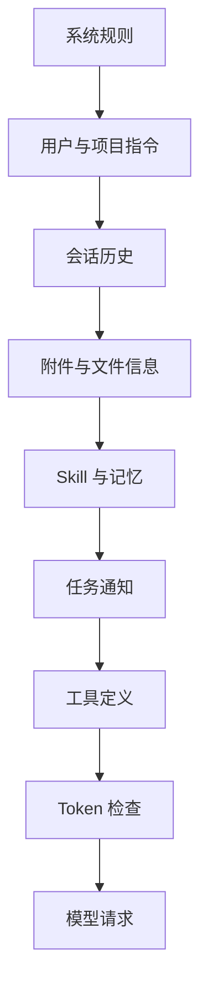
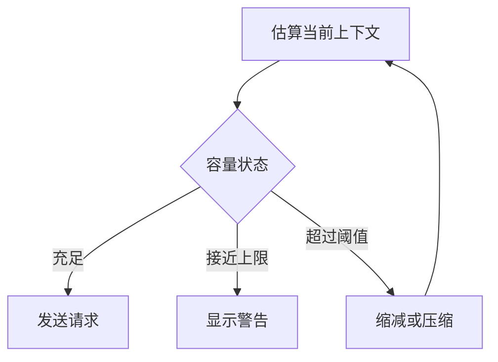

# 05. 上下文与记忆

## 1. 模块职责

上下文模块决定每次模型请求包含的内容。它需要在信息完整、token 容量、缓存稳定和会话可恢复之间取得平衡。

模型输入由以下部分组成：

1. 系统规则。
2. 用户和项目指令。
3. 当前会话历史。
4. 文件与附件信息。
5. Skill 和命令生成的内容。
6. 任务通知和外部消息。
7. 工具定义。
8. 记忆与上下文摘要。

## 2. 上下文组装顺序

固定规则放在前部。会话变化内容放在后部。该顺序可以提高 provider prompt cache 的复用率。

## 3. 系统规则

系统规则定义 Agent 的基本行为和当前运行环境。主要内容包括：

- 工具使用规则。
- 文件和命令安全要求。
- 当前工作目录和平台信息。
- 权限模式和沙箱状态。
- 输出格式要求。
- Agent 身份和协作方式。
- 当前可用功能。

工具描述也是模型请求的一部分。工具描述保持稳定。动态 Agent、MCP 和任务信息通过单独上下文加入。

## 4. 用户与项目指令

指令来源包括用户级说明、项目级说明、工作目录中的规则文件和显式包含的文件。

加载过程会完成以下检查：

1. 按目录层级发现指令文件。
2. 解析 include 引用。
3. 防止循环引用和路径逃逸。
4. 按来源和目录范围确定适用内容。
5. 记录来源，支持诊断和恢复。

工作目录变化后，目录相关指令会重新计算。子 Agent 根据自己的工作目录和职责获得适用指令。

## 5. 附件

附件用于按需加入结构化上下文。常见类型包括：

- 图片和文档。
- 文件片段和读取结果。
- 项目指令。
- Skill 内容。
- Agent 定义。
- 任务完成通知。
- 计划和待办状态。

附件可以延迟展开。系统只在构造当前模型请求时生成最终内容。该方式减少长期保存在消息中的重复文本，并支持压缩后重新构造动态信息。

## 6. 文件上下文

文件工具返回带行号或结构化片段的内容。系统记录已经读取的文件和版本状态。Edit 和 Write 可以利用该状态检查操作所依据的文件版本。

大型文件按范围读取。图片、PDF 和 Notebook 使用专用解析。文件内容受到单次结果和会话总量限制。

工作目录和附加目录决定默认文件访问范围。文件路径还要经过权限和符号链接检查。

## 7. Skill 与命令

Skill 提供领域指令、资源和可用工具说明。模型根据当前任务按需加载 Skill。加载后的文本进入上下文。Skill 触发的操作通过工具系统执行。

Prompt command 会生成新的用户提示。Local command 在本地直接执行。需要终端界面的命令只在交互模式运行。

## 8. 记忆

记忆用于保存跨轮次或跨会话有价值的信息。主要类型包括：

- 当前会话中需要持续保留的任务事实。
- 项目级约定和长期说明。
- 用户选择的长期偏好。
- Agent 或团队的工作记录。

记忆内容具有来源和范围。项目记忆不会自动应用到无关目录。子 Agent 只读取职责和目录允许的记忆。

## 9. Token 管理

上下文模块估算每次请求的输入 token，并结合模型上下文窗口和预期输出量判断容量。

输入规模包括普通消息、工具定义、系统规则、图片、缓存创建 token 和缓存读取 token。输出 token 单独统计。

## 10. 自动压缩

上下文接近模型上限时，系统会压缩较早历史。压缩目标包括：

- 保留用户任务和当前目标。
- 保留关键决定和文件变化。
- 保留未完成任务和未配对工具调用。
- 删除重复进度和低价值细节。
- 生成可供模型继续工作的结构化摘要。

压缩后，后续请求包含摘要和近期消息。完整历史继续保存在会话日志中。

## 11. 压缩流程

1. 选择需要压缩的历史范围。
2. 保留近期消息和未完成工具交互。
3. 生成任务目标、关键事实、文件状态和后续事项摘要。
4. 校验保留消息与工具结果配对。
5. 写入摘要和压缩位置。
6. 重新构造当前消息链。
7. 重试原模型请求。

压缩失败具有次数限制。连续失败后，系统暂停自动压缩，防止持续产生相同请求。

## 12. 局部缩减

系统还可以使用更轻量的缩减方式：

| 方式 | 处理内容 | 适用场景 |
|---|---|---|
| Context collapse | 分阶段缩短指定上下文片段 | 大段结构化内容 |
| Microcompact | 删除或缓存旧工具内容 | 工具结果较多 |
| Snip | 明确移除选定消息片段 | 已确认无后续价值的内容 |
| Result replacement | 将大型工具结果替换为预览和文件位置 | 输出超过上下文预算 |

每次缩减都会写入会话日志。恢复会话时，系统重新应用相同处理。

## 13. Prompt Cache

Provider prompt cache 可以复用稳定的请求前缀。系统通过以下方式提高命中率：

- 固定系统规则和工具顺序。
- 将动态信息放在稳定前缀之后。
- 在恢复时重放相同的内容替换。
- 切换 provider 或 model 时清理不兼容缓存信息。

缓存只影响请求性能和费用。会话正确性不依赖缓存存在。

## 14. 恢复后的上下文

恢复会话时，系统读取当前消息链、最近压缩摘要、保留消息、内容替换记录和记忆状态。项目规则会根据当前工作目录重新加载。

恢复结果需要满足以下条件：

- 工具请求和结果完整配对。
- 摘要后的消息顺序正确。
- 大型结果引用保持可访问状态。
- 当前模型可以接收保留的 thinking 和 media 内容。
- 损坏或无法验证的旧消息不会进入请求。

下一章说明模型选择和不同供应商 API 的转换方式。
