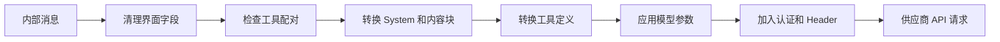

# 06. 模型供应商接入

## 1. 模块职责

模型接入模块负责选择模型、准备认证、转换请求、解析流式响应、统一错误和统计用量。

会话编排模块使用统一的内部消息。模型接入模块负责处理各供应商的 API 差异。

## 2. 核心概念

| 概念 | 作用 |
|---|---|
| Provider | 提供模型 API、认证和协议实现的后端 |
| Model | 具体模型及其能力、上下文窗口和默认参数 |
| Route | 一组 provider、model 和连接方式的组合 |
| Profile | 用户保存的 endpoint、认证、model 和兼容设置 |
| API 适配器 | 将内部消息与供应商协议相互转换 |

模型名称、展示信息和能力保存在描述配置中。API 字段和流式事件差异由适配器处理。

## 3. 模型选择

模型选择会综合以下来源：

1. 当前工具或 Agent 明确指定的 model。
2. 当前会话选择的 model。
3. 启动参数和 provider profile。
4. 用户设置和项目允许范围。
5. 系统默认值。

最终选择会经过组织 allowlist 和模型能力检查。需要视觉、工具调用或特定推理能力的任务会排除不支持的模型。

## 4. Provider Profile

Profile 将一次连接所需配置集中保存：

- Provider 类型。
- API base URL。
- API key 或 OAuth 配置。
- 默认 model。
- API 格式。
- 自定义 header。
- 代理、证书和超时。

切换 profile 时，系统清理上一 profile 的互斥配置，再创建新的 API client。项目配置不能覆盖由 SDK 或管理员控制的 provider 凭据。

## 5. 协议家族

### 5.1 Anthropic

Anthropic 路径支持 Messages API、thinking signature、prompt cache、原生网页搜索、tool use、usage 和 stop reason。

Bedrock、Vertex Anthropic 和 Foundry 使用相似消息结构，并具有独立认证和 client 创建流程。

### 5.2 OpenAI-compatible

OpenAI-compatible 路径支持 Chat Completions、Responses API 和若干兼容变体。适配内容包括：

- role 和 content 转换。
- tool schema、tool choice 和 tool result 转换。
- reasoning content。
- stream delta 合并。
- usage 和 finish reason。
- 错误类别。
- provider 专用 header、认证和请求字段。

DeepSeek、Kimi、Mistral、Azure、Ollama 等接口具有各自扩展。兼容适配器根据 route 应用对应规则。

### 5.3 Codex 与 OpenAI Responses

该路径处理 Responses API 的 item 结构、OAuth、推理内容和工具协议。GitHub 等路由可以根据模型选择 Anthropic 格式或 Responses 格式。

### 5.4 Gemini

Gemini 使用 content 和 part 结构，并提供 function calling、thought signature 和独立的 usage 字段。Vertex Gemini 还需要 Google Cloud 认证和专用 client。

## 6. 请求转换

请求转换会删除目标 provider 不支持的字段。Thinking、图片、文档、工具和 cache 参数根据模型能力处理。

## 7. 流式响应转换

供应商返回的 SSE 或 SDK 事件会转换为统一内部事件：

- 消息开始。
- Content block 开始和结束。
- 文本或 thinking 片段。
- 工具参数片段。
- Usage 更新。
- 消息结束。
- API 错误。

工具 JSON 参数可以跨多个片段。适配器在收到完整参数后再交给工具模块。会话编排层无需解析供应商原始事件。

## 8. 智能路由

Smart Routing 可以根据用户文本、非文本内容和配置选择轻量模型或强模型。一次 user turn 选定模型后，后续工具轮继续使用相同模型。

轻量模型遇到允许升级的错误时，可以切换到强模型。认证错误、参数错误和用户中止不会触发升级。

## 9. Agent 模型路由

子 Agent 可以声明模型类型或继承父会话模型。系统会根据 Agent 职责、权限模式、组织限制和模型能力得到最终选择。

同一主会话中的多个子 Agent 可以使用不同模型。它们分别统计 token、费用和错误。

## 10. 三类恢复

| 恢复方式 | 变化内容 | 典型原因 |
|---|---|---|
| API Retry | 请求内容和模型保持不变 | 临时网络错误、限流 |
| Model Fallback | 切换备用 model | 当前模型持续过载 |
| Provider Fallback | 切换 profile、provider 和主 model | 当前服务不可用 |

切换 model 或 provider 前，系统清理不兼容的 thinking、tool ID 和 cache 信息。每类切换具有次数限制。

## 11. 错误分类

适配器将供应商错误转换为统一类别：

- 认证失败。
- 请求参数无效。
- 模型不存在。
- 权限或组织限制。
- 限流。
- 服务过载。
- 上下文溢出。
- 输出上限。
- 网络和流式连接错误。

恢复模块根据类别选择重试、压缩、切换或终止。供应商原始错误会保留用于诊断。

## 12. Usage 与成本

系统记录输入 token、输出 token、cache 创建和读取 token、模型价格与请求时间。部分 provider 会通过独立 endpoint 返回余额或用量。

未知模型价格会标记为 unknown。系统不会生成虚假的精确成本。子 Agent 和主会话分别记录用量，并可以汇总到会话级统计。

## 13. Provider 接入流程

新增 provider 或 route 时，需要确定以下内容：

1. Provider、gateway、proxy 和 model 的关系。
2. 展示名称、默认 URL 和能力标记。
3. 认证方式和 Profile 字段。
4. 请求消息、工具和 thinking 格式。
5. 流式事件和错误格式。
6. Usage 和成本来源。
7. Fallback 和兼容规则。

这些信息分别进入描述配置、认证模块和 API 适配器。下一章说明模型请求的工具怎样被校验、授权和执行。
