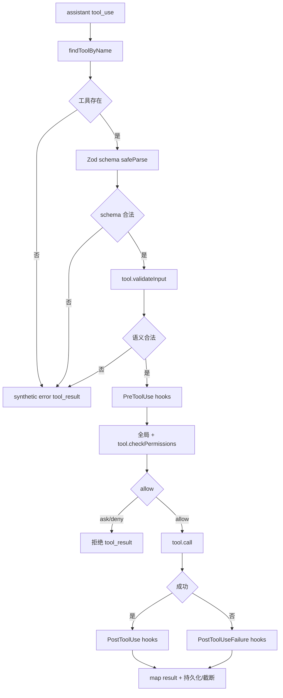

# 07. 工具、权限、沙箱与文件安全

## 1. 工具是能力协议

`src/Tool.ts` 的 `Tool<Input, Output, Progress>` 同时承担六类职责：

1. **协议**：`name`、Zod `inputSchema`、可选 JSON Schema/`outputSchema`。
2. **能力描述**：`description()`、`prompt()`、`searchHint`、`shouldDefer`。
3. **执行判定**：`isEnabled()`、`isReadOnly()`、`isDestructive()`、`isConcurrencySafe()`。
4. **安全检查**：`validateInput()`、`checkPermissions()`、`getPath()`、permission matcher。
5. **执行与回传**：`call()`、progress callback、`mapToolResultToToolResultBlockParam()`。
6. **显示**：tool use/result/progress/rejection/error/grouped rendering。

`buildTool()` 为常用字段补默认值。安全相关默认值采用保守策略。未知工具默认不可并发且具有写入能力。`isDestructive` 默认 false。默认 `checkPermissions` 返回 allow。该结果表示工具没有额外的专用限制。全局权限系统继续参与判定。

`ToolUseContext` 是一次工具运行可访问的环境，包含当前消息、工具池、MCP 连接、AbortController、文件读状态、AppState getter/setter、权限与 prompt 回调、query lifecycle、任务根状态写入器以及 Agent 身份。后台 Agent 的普通 `setAppState` 可能被隔离，跨 turn 的任务基础设施必须使用 `setAppStateForTasks`。

## 2. 工具池组成

`src/tools.ts` 是内置工具集合的权威入口：

```text
getAllBaseTools()
  -> build-time feature / env / platform 过滤
getTools(permissionContext)
  -> simple/REPL mode 过滤
  -> blanket deny 过滤
  -> isEnabled 过滤
assembleToolPool(permissionContext, mcpTools)
  -> 内置工具 + MCP 工具
  -> 两组各自按名称排序
  -> 同名去重，内置工具优先
```

先移除 blanket deny 有两个作用。模型无法看到禁止工具的 schema。调用阶段会再次鉴权。prompt 过滤用于减小暴露面。MCP 规则支持服务名前缀，因此可以一次隐藏某个 MCP server 的全部工具。

内置工具排序后保持连续前缀。MCP 工具位于内置工具之后。该顺序用于稳定服务端 system/tool prompt cache。MCP 工具变化不会打乱内置工具的缓存前缀。

Tool Search 开启时，部分工具以 `defer_loading` 发送，模型需要先通过 `ToolSearch` 激活。`alwaysLoad` 工具始终首轮可见。延期只减少 schema token，不改变调用时的安全检查。

## 3. 一次工具调用的完整流水线

权威实现位于 `src/services/tools/toolExecution.ts`：



重要细节：

- 模型输入先经过 schema 正规化，Zod 类型错误直接变成 `is_error` 的配对结果。
- `validateInput` 检查值语义，如路径、参数组合、状态前置条件。
- observable input 会在副本上 backfill，避免改动原始 API 输入导致 prompt cache key 漂移。
- PreToolUse hook 可阻止调用或返回 `updatedInput`。更新后的输入继续权限检查。
- permission 也可改写输入，真正传给 `call()` 的是最终 `processedInput`。
- 成功和失败 Hook 都可产生 progress/system 信息。Hook 自身失败不能破坏 tool pairing。
- 生命周期在开始、输入变更、结束时更新 `QueryLifecycleOperationTracker`，供 watchdog 和状态展示使用。
- `finally` 清理 in-progress ID、decision cache 和 query activity lease。

## 4. 并发由工具属性控制

`runTools()` 和 `StreamingToolExecutor` 调用每个工具的 `isConcurrencySafe(parsedInput)`。连续的安全调用形成并发批次。不安全调用形成串行屏障。默认最大并发为 10，可由 `CLAUDE_CODE_MAX_TOOL_USE_CONCURRENCY` 调整。

规则可概括为：

| 当前执行集合 | 新调用 | 结果 |
|---|---|---|
| 空 | 任意 | 启动 |
| 全部 concurrency-safe | safe | 可并行 |
| 含不安全调用 | 任意 | 等待 |
| 任意非空 | unsafe | 等待前面全部结束 |

`isReadOnly` 和 `isConcurrencySafe` 是两个独立概念。只读工具通常适合并发。工具可以因外部状态、共享 cache 或 UI 交互声明并发不安全。解析失败时按并发不安全处理。

若 Bash 工具失败，Streaming executor 可中止同批尚未完成的并发 Bash，避免在已知前置命令失败后继续产生副作用。父 query 的 abort 则为每个未完成调用生成 interrupted/synthetic result。

## 5. 权限数据模型

`ToolPermissionContext` 保存：

- `mode`。
- 分来源的 `alwaysAllowRules`、`alwaysDenyRules`、`alwaysAskRules`。
- additional working directories。
- bypass/auto 的可用状态。
- 后台运行对交互 prompt 的限制。
- plan mode 前的模式和 denial tracking。

规则来源包括 user、project、local、flag、policy、CLI、command、session。规则值是 `ToolName` 或 `ToolName(ruleContent)`，例如 Bash 命令前缀、文件路径、MCP 服务/工具名、Agent 类型。

权限决策统一为：

- `allow`：可包含最终输入、用户修改状态、反馈文字和原因。
- `ask`：包含提示、建议保存的规则、blocked path、待运行 classifier。
- `deny`：必须携带拒绝原因。

显式 `deny` 优先于 allow。`alwaysAsk` 强制某类操作进入确认流程。规则在工具池装配时用于 blanket 过滤。规则在具体输入阶段也用于内容匹配。

## 6. Permission Mode 的真实含义

当前外部模式定义在 `src/types/permissions.ts`：

| 模式 | 含义 |
|---|---|
| `default` | 低风险/已允许项直接运行，其他项可询问 |
| `acceptEdits` | 自动接受常规文件编辑。Bash 继续使用独立权限规则 |
| `plan` | 以分析和计划为主，阻止未明确允许的写操作 |
| `dontAsk` | 不能展示询问。需要询问的操作转为拒绝 |
| `bypassPermissions` | 跳过普通交互授权。policy、硬安全检查和 sandbox 继续生效 |
| `fullAccess` | 危险的全权限模式，与 bypass 一样需显式启用条件 |

构建功能开启时还可有内部 `auto`。`bubble` 仅是内部联合类型，不在用户可配置集合。`auto` 使用 transcript/classifier 判断操作风险，并保留显式规则和关键防护。

需要特别说明：

- `bypassPermissions`/`fullAccess` 是危险模式，进入流程有 availability、policy、killswitch 和用户确认约束。
- 显式 deny、工具输入验证、路径保护和 plan mode 的关键不变量不能被一次 hook 输入改写绕开。
- `dontAsk` 禁止交互询问。ask 决策通常退化为 deny。
- 后台 Agent 无交互 UI，先给 `PermissionRequest` hooks 决策机会。最终结果为 ask 时自动拒绝。

## 7. Hooks 与用户确认的协同流程

权限相关有两类 Hook：

1. `PreToolUse` 位于全局权限决策之前，可 deny、停止流程或调整输入。
2. `PermissionRequest` 在本来需要询问时运行，可按受约束的协议 allow/deny。

交互 TUI 的 `useCanUseTool` 负责将 ask 放入确认队列，并可同时等待 Bash classifier、coordinator、swarm worker、Bridge 或 channel 回调。用户选择还可产生 session/project/user 级规则更新。

输入改写后必须重新验证关键安全性质。测试专门覆盖“把 read 改成 write”“hook 在 plan mode 中放行 mutation”等场景。权限决定约束最终输入。

## 8. 文件读写边界

文件安全主要位于 `src/utils/permissions/filesystem.ts`。该实现包含以下结构化路径检查：

- 路径正规化并同时检查用户输入路径和 symlink-resolved 路径。
- Windows UNC、保留/可疑路径和大小写差异单独处理。
- cwd、additional working directories 和 session scratch/temp 形成可访问根。
- read deny/ask 与 write deny/ask 分开匹配。
- `.openclaude`/配置、凭据、shell 配置等危险文件需要更严格确认。
- `..`、前缀碰撞和中间 symlink 不能把路径带出已授权根。
- macOS `/tmp -> /private/tmp` 等常见 symlink 通过 realpath 统一。

`Read` 自身有 offset/limit、大小与 token 上限。`Edit` 依赖此前读取状态以防止盲改和文件竞态。`Write`/`Edit` 的权限判定都使用最终解析路径。Notebook、图片、PDF 等工具还叠加各自格式和尺寸验证。

## 9. Bash 的分层安全判定

Bash 是最复杂的工具，因为一段字符串可包含管道、重定向、子命令、heredoc、环境变量和命令替换。主要实现分布在：

- `tools/BashTool/bashCommandAnalysis.ts`：AST/legacy parse 分析。
- `tools/BashTool/bashPermissions.ts`：规则匹配与主权限流程。
- `tools/BashTool/bashSecurity.ts`：危险语义检查。
- `tools/BashTool/pathValidation.ts`、`sedValidation.ts`：专项限制。
- `utils/permissions/bashClassifier.ts`：分类器策略。
- `tools/BashTool/shouldUseSandbox.ts`：最终沙箱选择。

关键防护包括：

- 复合命令拆分后逐项匹配，每个命令段都参与检查。
- 只剥离白名单中的安全环境变量/包装器。
- `sh/bash -c`、`sudo`、`env`、`xargs` 等不能生成过宽的持久前缀规则。
- heredoc/多行命令生成稳定且范围受限的建议规则。
- 子命令 fan-out 超过 50 时回退 ask，防止解析导致 CPU 饥饿。
- 一次复合命令最多建议 5 条持久规则，避免用户无意扩大权限。
- AST 不可用或解析失败时采用保守结果，不把“无法证明危险”解释为安全。

## 10. OS 沙箱与权限提示属于独立层次

`src/utils/sandbox/sandbox-adapter.ts` 把 settings/permission rules 转成 `@anthropic-ai/sandbox-runtime` 的文件系统和网络限制：

- cwd 和专用 temp 默认可写。
- settings、managed settings、配置目录默认禁止写入，防止通过修改权限配置逃逸。
- Read/Edit/WebFetch 规则映射到 read/write/domain allow/deny。
- policy 可要求只接受受管的网络域或读路径。
- 支持 Unix socket、本地监听、HTTP/SOCKS proxy 和 violation store。
- git worktree 的主仓库路径会纳入配置，保证 git 元数据可用。

模型面对的 `dangerouslyDisableSandbox` 不能独立关闭沙箱：还必须有内部注入的 `_dangerouslyDisableSandboxApproved`，且运行时允许 unsandboxed command。该内部字段不在模型 schema 中。

`sandbox.excludedCommands` 提供用户便利配置。它把不适合沙箱的命令送回普通权限提示。permission pipeline 承担授权边界。解析失败时，显示层和执行层都采取保守选择。

## 11. 大输出、持久化与 UI

每个工具定义 `maxResultSizeChars`。超过阈值的结果可由 `toolResultStorage` 落入会话存储，API 消息中保留预览和文件引用。`Read` 通常设为 `Infinity`，因为它已有自身限额。把 Read 结果再次写到文件会形成“读取结果文件”的循环。

`tool_use` 在参数尚未流完时就可渲染，因此渲染方法接收 `Partial<Input>`。progress 消息与最终结果分开。transcript search 通过 `extractSearchText` 保证索引文本与真正渲染文本尽量一致。

## 12. 安全不变量检查表

修改工具或权限代码时必须证明：

1. schema 错误、拒绝、异常和 abort 都产生匹配的 `tool_result`。
2. 未知/解析失败的调用不会被判为并发安全或自动安全。
3. 任何 `updatedInput` 都在最终执行前接受适用的验证。
4. deny 和 policy 不会被较低优先级 allow 覆盖。
5. 原始路径与 realpath 都在授权根内。
6. 模型无法伪造仅供 runtime 使用的安全字段。
7. 后台/Headless 无法询问时不会静默放行。
8. prompt 中隐藏工具用于减小暴露面。执行阶段会重新鉴权。
9. 沙箱关闭或不支持时，权限系统独立工作。
10. 工具输出大小受单工具和会话级预算约束。

下一章：[08 Agent、任务、团队与编排](08-agents-tasks-orchestration.md)。
