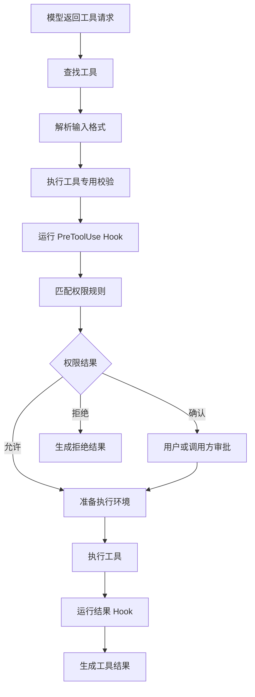
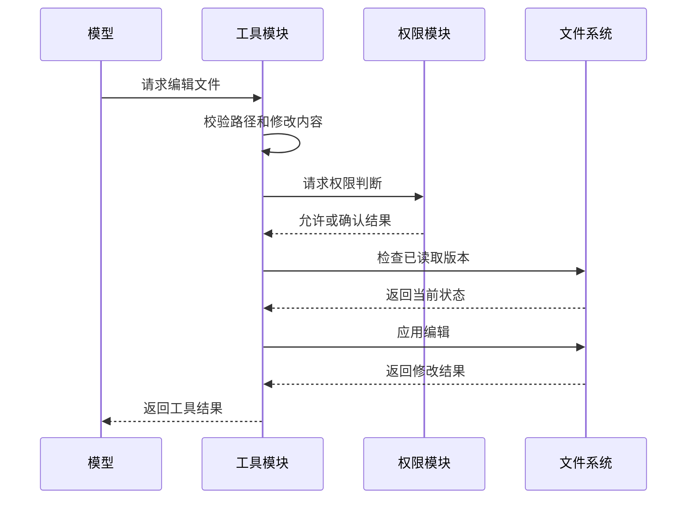

# 07. 工具与权限

## 1. 工具模块职责

工具模块将模型提出的操作请求转换为受控的本地执行。它负责工具注册、参数校验、权限判断、并发调度、进度通知、结果转换和中止处理。

工具来源包括：

- 内置文件和搜索工具。
- Shell 和进程工具。
- Agent 与任务工具。
- MCP 工具。
- SDK 注入工具。
- 功能开关启用的专用工具。

## 2. 工具定义

每个工具需要提供以下信息：

| 信息 | 作用 |
|---|---|
| 名称和说明 | 帮助模型选择工具 |
| 输入格式 | 定义允许参数和必填字段 |
| 参数校验 | 检查路径、参数组合和前置状态 |
| 权限检查 | 判断允许、拒绝或请求确认 |
| 并发属性 | 决定并发或串行执行 |
| 执行逻辑 | 完成实际操作 |
| 进度格式 | 向界面和 SDK 报告状态 |
| 结果格式 | 生成模型消息和界面内容 |

未知工具默认按可能写入外部状态处理。模型只能看到当前会话允许暴露的工具。

## 3. 工具池装配

会话启动和扩展变化时，系统构造当前工具池：

1. 加入基础内置工具。
2. 加入当前入口可用的专用工具。
3. 加入 MCP 和 SDK 工具。
4. 应用 Agent 类型和功能开关限制。
5. 应用全局 deny 和组织策略。
6. 保持稳定工具顺序。

禁止工具不会发送给模型。调用阶段还会再次检查工具和权限，防止外部消息直接调用隐藏工具。

## 4. 一次工具调用的流程

任一步骤失败都会生成与调用 ID 配对的工具结果。模型可以根据错误修改参数或结束任务。

## 5. 输入校验

输入校验分为两层：

1. Schema 校验检查字段类型、必填项和基本格式。
2. 工具校验检查路径范围、参数组合、资源状态和业务条件。

Hook 可以在允许范围内修改输入。修改后的输入需要重新接受适用校验。Hook 不能绕过 deny、路径保护和 plan mode 的强制规则。

## 6. 权限结果

权限检查产生以下结果：

| 结果 | 行为 |
|---|---|
| Allow | 使用最终输入执行工具 |
| Deny | 返回拒绝原因 |
| Ask | 请求用户或外部调用方确认 |

Allow 可以来自显式规则、当前会话批准、受控目录或工具专用安全判断。Deny 具有更高优先级。Ask 在无交互环境中会转为拒绝，除非外部权限回调给出决定。

## 7. Permission Mode

Permission Mode 定义缺少匹配规则时的默认处理。

| 模式 | 默认行为 |
|---|---|
| Default | 根据风险和规则自动允许、拒绝或确认 |
| Accept Edits | 自动批准工作区内普通编辑 |
| Plan | 只开放规划所需的读取和状态工具 |
| Dont Ask | 无法确认的操作直接拒绝 |
| Bypass | 扩大自动执行范围，并保留强制安全检查 |
| Delegate 或 Auto | 根据 Agent 或分类器规则决定 |

一次批准可以只在当前调用、当前会话或持久设置中生效。系统不会自动将一次批准保存为长期授权。

## 8. 并发调度

工具根据输入和工具属性声明并发安全性。

- 多个只读搜索和读取操作可以并发执行。
- 文件修改和状态修改按顺序执行。
- 具有依赖关系的 Shell 命令串行执行。
- 未声明并发安全的工具按串行处理。

工具请求按模型给出的顺序分批。并发批次完成后，结果按原请求顺序加入消息。

## 9. 文件安全

文件操作会检查用户输入路径和符号链接解析后的真实路径。

主要规则包括：

- 默认访问当前工作目录和明确添加的目录。
- 拒绝路径前缀碰撞和 `..` 逃逸。
- 检查中间目录中的符号链接。
- 保护配置、凭据、Git 元数据和系统文件。
- 对工作区外路径请求额外确认。
- 读取和写入使用独立规则。

Edit 会检查文件已经被读取，并确认内容未在读取后发生冲突。Write 和 Edit 使用最终解析路径执行权限判断。

## 10. Shell 安全

Shell 请求会经过命令解析、危险操作识别、路径检查和权限匹配。

检查内容包括：

- 命令及子命令。
- 管道、重定向和命令替换。
- 写入、删除和权限变更参数。
- 工作目录和文件路径。
- 网络访问和凭据使用。
- 后台进程和长时间运行行为。

允许 `git status` 不会授权其他 `git` 命令。解析失败时，系统请求确认或拒绝执行。

## 11. OS Sandbox

Sandbox 使用操作系统机制限制 Shell 等子进程的文件和网络访问。

Permission 决定应用批准或拒绝操作。Sandbox 限制已经批准的进程可以访问的资源。两项机制分别工作。

Sandbox 配置可以定义：

- 可读和可写目录。
- 允许访问的网络域。
- 代理和 DNS 策略。
- 排除的命令。
- Sandbox 不可用时的处理方式。

安全策略可以要求 Sandbox 必须可用。普通配置不能关闭管理员强制的 Sandbox。

## 12. Hook 与用户确认

PreToolUse Hook 可以允许、拒绝、修改输入或要求确认。PermissionRequest Hook 可以在无交互环境中提供决定。PostToolUse 和失败 Hook 用于记录、反馈或触发后续操作。

交互 TUI 将确认请求放入队列，并确保一次只显示一个权限对话框。SDK 和远程入口通过回调或权限桥接返回决定。

## 13. 进度、中止与结果

长工具可以持续发送进度。用户中止请求时，中止信号会传递到工具和子进程。未完成调用会获得带中止状态的结果。

每个工具具有结果大小限制。超过限制的文本写入会话文件。消息保留预览、文件位置和截断说明。图片和其他非文本内容使用对应存储方式。

## 14. 典型文件编辑流程

## 15. 模块关系

工具模块接收会话编排层的请求。权限模块给出执行决定。Hook 模块参与调用前后处理。Sandbox 包装子进程。持久化模块保存大型结果和文件历史。任务模块接管长时间运行的 Agent 与 Shell 工作。

下一章说明 Agent 和任务模块怎样组织同步、后台和团队协作。
