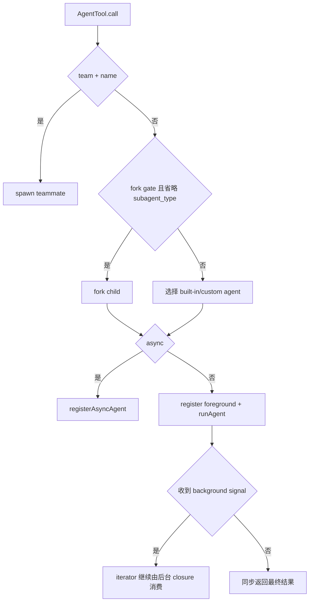

# 08. Agent、任务、团队与编排

## 1. 四种不能混为一谈的执行单元

| 概念 | 主要实现 | 生命周期 | 与父 Agent 的关系 |
|---|---|---|---|
| 同步 subagent | `AgentTool` + `runAgent()` | 父工具调用内 | 父等待最终结果 |
| 后台 local agent | `LocalAgentTask` | 独立 task | 立即返回 ID，完成后通知 |
| in-process teammate | `InProcessTeammateTask` | 长驻、可 idle | 有团队身份、邮箱和计划审批 |
| shell/remote/workflow task | `src/tasks/*` | 后台 task | 通过统一 Task 状态管理 |

`TaskCreate/TaskUpdate/TaskList/TaskGet` 还会创建**协作待办项**。它们是 Agent 团队共享的工作清单。`TaskState` 表示进程任务。两类 Task 使用独立状态机。

## 2. Agent 定义来源

`src/tools/AgentTool/loadAgentsDir.ts` 将以下来源统一成 `AgentDefinition`：

- built-in：general-purpose、Explore、Plan、statusline setup 等。
- user/project/policy/flag 目录中的 Markdown 或 JSON。
- plugin agents。
- SDK 直接传入的 agents。

定义可声明：

- `tools` / `disallowedTools`。
- system prompt、initial prompt、skills。
- model、effort、permission mode。
- max turns、max steps。
- MCP servers 与 hooks。
- persistent memory scope。
- `background: true`。
- `isolation: worktree`。

同名定义按来源组合，后处理组覆盖先处理组。managed/policy 位于最高覆盖层。`activeAgents` 还会按 required MCP server 和 allowlist 过滤。SDK non-interactive 可通过环境变量禁用全部 built-in agents。

## 3. AgentTool 输入分支选择

`AgentTool` 的基础输入是 description、prompt、可选 `subagent_type`、model、`run_in_background`。功能开启后还可包含 teammate name/team、permission mode、worktree isolation 和 cwd。

分支顺序可简化为：



teammate roster 采用扁平结构。teammate 无法继续 spawn teammate。teammate 可以运行普通同步 subagent。in-process teammate 无法启动后台 subagent。后台子任务的生命周期会超出 leader 进程中的 teammate turn。

## 4. `runAgent()` 执行流程

`src/tools/AgentTool/runAgent.ts` 复用主 `query()` 语义。该函数构造隔离的子上下文：

1. 选择 Agent model、effort 和 provider override。
2. 生成 Agent 专属 system prompt 和 user context。
3. 按定义、运行模式和常量白名单裁剪工具。
4. 合并预加载 skill、agent memory、MCP 和 session hooks。
5. 建立独立 AbortController、messages 与 token/step 限额。
6. 逐条消费 `query()` 生成器并向父侧 yield progress/message。
7. 在工具轮边界注入 `SendMessage` 排队的新消息。
8. 最终由 `finalizeAgentTool` 提取文本、usage、agent ID 等结果。

普通 subagent 默认不能使用 TaskOutput、plan mode 工具、AskUserQuestion、TaskStop 和递归 workflow。异步 Agent 的允许工具更窄，并禁止再次调用 AgentTool，避免无限后台递归。in-process teammate 额外获得团队待办和 SendMessage 工具。

Agent 的普通 `setAppState` 可被替换成 no-op，防止它修改父 TUI 的会话状态。任务注册、通知和跨 turn 清理通过 root `setAppStateForTasks` 明确穿透隔离。

## 5. 同步 Agent 的状态流

同步 Agent 可以在运行期间转入后台：

```text
created
  -> registered foreground (isBackgrounded=false)
  -> runAgent iterator yields progress
  -> completed/failed -> unregister foreground -> ToolResult
                    或
  -> background signal -> isBackgrounded=true
       -> 父 ToolResult 立即返回 task_id/output_file
       -> 后台继续消费同一个 iterator
       -> terminal state + task-notification
```

前台注册返回一个仅创建一次的 `backgroundSignal` promise。UI 的 background-all 或自动超时会解析该 promise。父侧随后停止等待。Agent iterator 保持运行。后台 closure 接管后续消费。“转后台”沿用原任务和已经产生的上下文。

若后台功能禁用、Copilot 优化要求同步或 plan mode 需要同步审批，则不会提供这条转换路径。

## 6. 显式后台 Agent

显式后台分支先 `registerAsyncAgent()`：

- 生成 `a` 前缀 task ID，同时作为 agent ID。
- `isBackgrounded=true`，状态由 pending 转 running。
- 为 task output 初始化磁盘文件/sidechain 链接。
- 使用不链接父 query ESC 的 AbortController。
- 立即向父模型返回 task ID 和 output path。
- detached runner 更新 tool-use/token/recent activity progress。
- completed/failed/killed 后发送一次 notification。

父 query 的 ESC 不应默认杀掉已明确后台化的任务。`TaskStop`、全量 kill 或进程 shutdown 才走其 kill controller。注册 cleanup 能防止进程退出时遗留运行中的本地任务。

## 7. 统一 Task 框架

`src/Task.ts` 定义运行任务公共状态：

```ts
type TaskStatus = 'pending' | 'running' | 'completed' | 'failed' | 'killed'
```

公共字段包括 ID、type、description、toolUseId、起止时间、output file/offset 和 `notified`。当前 concrete type 有：

- `local_bash`。
- `local_agent`。
- `remote_agent`。
- `in_process_teammate`。
- `local_workflow`。
- `monitor_mcp`。
- `dream`。

ID 由类型前缀加 8 位小写字母数字组成。随机性也用于降低攻击者提前布置同名 task output symlink 的可行性。

`Task` 多态接口目前只统一 `kill()`。spawn/render 各类型使用专用入口。`registerTask`、`updateTaskState`、`stopTask`、output delta 和 SDK progress 由 framework 统一提供。

`isBackgroundTask()` 把 running/pending 且已 backgrounded 的 task 放入状态栏。已注册的前台 Agent 保持前台显示状态。

## 8. 输出文件与任务通知

后台任务的完整输出落盘，AppState 只保存 offset 和摘要。这样模型可用 Read 按需读取，不需要把增长中的日志反复塞进上下文。

terminal transition 会生成：

```xml
<task-notification>
  <task-id>...</task-id>
  <status>completed|failed|killed</status>
  <summary>...</summary>
  <output-file>...</output-file>
  <result>...</result>
  <usage>...</usage>
</task-notification>
```

通知进入统一 pending notification queue。下一个队列处理周期把它作为用户侧控制消息送给模型。`notified` 在状态更新时原子检查并置位。该字段防止 TaskStop、自然完成和读取输出产生重复通知。后台状态变化还会取消基于旧 task state 的 speculative response。

`TaskOutput` 支持阻塞和非阻塞查询。该工具已标记 deprecated。当前推荐方式是直接 Read `output_file`。阻塞读取受 timeout 和 parent abort 约束。读取完成后会设置 `notified`。

## 9. LocalAgentTask 的内存控制

local agent 任务保存：progress、pending messages、少量 messages UI mirror、retain/diskLoaded、evict deadline。完整 transcript 在 sidechain JSONL 和 output file 中。

- 进入 Agent transcript 视图时 `retain=true`，防止 terminal task 被回收。
- 首次查看从磁盘 UUID-merge，之后接收 live append。
- 退出视图后设置 grace deadline。
- terminal task 默认在短暂展示后释放大对象。
- progress 的 input token 取最新累计值，output token 跨 turn 求和，避免重复计算。

## 10. SendMessage 与运行中 Agent

给正在运行的 local agent 发消息不会中断当前 API stream。消息加入 `pendingMessages`，在下一个工具轮边界 drain，作为新的 user input 注入。

给已停止且具有 transcript 的 Agent 发消息会调用 `resumeAgentBackground()`：

1. 从 sidechain 恢复并过滤空 assistant message。
2. 重建 tool-result replacement state。
3. 恢复原 Agent definition、model 和元数据。
4. 存在旧 worktree 时触碰 mtime 并继续使用。旧 worktree 缺失时回退父 cwd。
5. 重新注册后台 task，执行新 prompt。
6. 完成后照常通知。

该流程使用持久 transcript 创建新的 continuation task。已终止的 Promise 不会恢复。

## 11. Fork Agent

fork 功能开启时，省略 `subagent_type` 表示继承父对话。`buildForkedMessages()` 构造 cache-stable 前缀：

- 继承父消息上下文。
- 把同一 assistant message 中的其他 fork tool use 补成固定 placeholder result。
- 追加 fork worker 约束和当前 directive。
- 复用父侧冻结的 rendered system prompt。

所有 sibling fork 的公共前缀必须字节一致。该条件支持共享 prompt cache。fork child 保留 Agent schema，以维持 tool list/cache。`isInForkChild()` 会在调用时拒绝再次 fork。该限制防止递归 fork。

fork 默认走后台通知模型。resume 时必须重建父 system prompt。无法证明一致时直接报错，避免在错误上下文中继续。

## 12. Worktree 隔离

Agent 可由调用参数或 Agent 定义要求 `isolation: worktree`。`cwd` 与 worktree 互斥。

创建流程位于 `src/utils/worktree.ts`：

- 校验 slug 长度、字符、`.`/`..` 和路径穿越。
- 统一放在 `.openclaude/worktrees/<flattened-slug>`。
- 同仓库 mutation 通过 promise lock 串行化。
- git/SSH 禁止交互 prompt，避免后台挂死。
- 可 symlink `node_modules` 等大目录减少磁盘占用。
- Windows 可自动启用 repo-local `core.longpaths`。
- fork child 收到路径转换提示，不能盲用父 cwd 的绝对路径。

Agent 完成后，无变化的 git worktree 会自动移除。存在未提交内容或新 commit 的 worktree 会保留，并在通知中返回路径和分支。hook-based worktree 无法可靠判断 VCS 变化，因此采用保守保留策略。删除判断失败时执行 fail closed。`0 changes` 结果需要经过完整验证。

显式 `EnterWorktree/ExitWorktree` 管理主 session worktree。某个 Agent 的私有 isolation 使用独立语义。Exit 要求用户明确选择 keep 或 remove。存在文件变化时，删除操作要求显式设置 `discard_changes`。

## 13. Teammate 与 subagent 的职责差异

in-process teammate 使用 AsyncLocalStorage 隔离身份和 cwd，状态保存在 `InProcessTeammateTaskState`：

- `agentName@teamName` 身份。
- 独立 permission mode 和当前 work AbortController。
- conversation UI mirror、pending user messages。
- `isIdle`、shutdownRequested、plan approval。
- 团队共享待办和 mailbox。

完成一次 prompt 后，teammate 进入 idle loop：

1. 检查直接发给自己的 pending message。
2. 尝试领取共享待办中的 pending task。
3. 无工作则发 idle notification 并等待 callback/message。
4. 收到新工作后恢复 running。
5. 只有 shutdown、kill 或不可恢复异常才进入 terminal state。

为了防止大规模 swarm 内存增长，AppState 中 teammate 的 UI message mirror 最多保留 50 条。完整上下文保存在 runner 局部数组和 transcript 磁盘中。

## 14. 团队邮箱与协议消息

跨进程 teammate 使用文件邮箱：`~/.claude/teams/<team>/inboxes/<agent>.json`。写入采用 async file lock、重试和锁内重读，避免多个成员并发覆盖。

`SendMessage` 支持：

- 普通点对点文本。
- `*` 广播文本。
- shutdown request/response。
- plan approval response。
- feature 开启时的 UDS peer/Remote Control 文本。

结构化控制消息不能广播或跨 session，plan 只能由 team lead 批准。跨机器 bridge 文本需要额外显式许可，因为它会作为另一会话的用户 prompt 到达。

in-process teammate 的权限询问通过 leader permission bridge 进入主 TUI 的标准确认队列。保存规则可以写回共享上下文。写回过程必须保留 leader 当前 mode。worker 的派生 mode 保持在 worker 范围内。

## 15. 协作待办 DAG

`TaskCreate/Update/List/Get` 操作的是持久团队任务列表。待办包含 subject、description、active form、owner、status、blockedBy/blocks 等关系。

- teammate 可原子领取 pending 且未被阻塞的 task。
- 标记 completed 会解除依赖者的 blocked 状态。
- owner 与 roster 协同，便于 leader 观察分工。
- in-process runner 在 idle 时自动寻找可领取项。
- 状态更新立即反映在 team UI。该操作不具有 OS 进程 kill 语义。

面试时应把它称为“共享工作图/任务清单”，把 `TaskState` 称为“执行任务状态”，以避免概念混乱。

## 16. 取消和失败矩阵

| 场景 | 结果 |
|---|---|
| 同步 Agent 父 query ESC | 子 controller 中止，父得到 interrupted result |
| 显式后台 Agent 父 query ESC | 通常继续运行 |
| foreground Agent 转后台 | 不重启，iterator 被后台接管 |
| TaskStop | 类型分派 kill，状态转 killed，输出回收 |
| in-process teammate 当前工作 ESC | 当前 turn 中止，teammate 回 idle |
| teammate shutdown approval | 整个 teammate controller 中止 |
| worktree clean | 可自动清理 |
| worktree changed/检查失败 | 保留并返回位置 |
| background permission 最终为 ask | PermissionRequest hook 后自动 deny |
| resume worktree 已丢失 | 记录警告并回退父 cwd |

下一章：[09 TUI 与交互状态流](09-tui-interaction-flow.md)。
