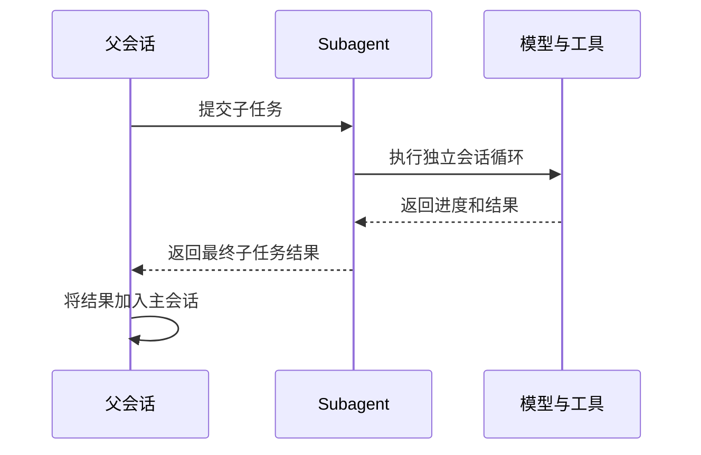
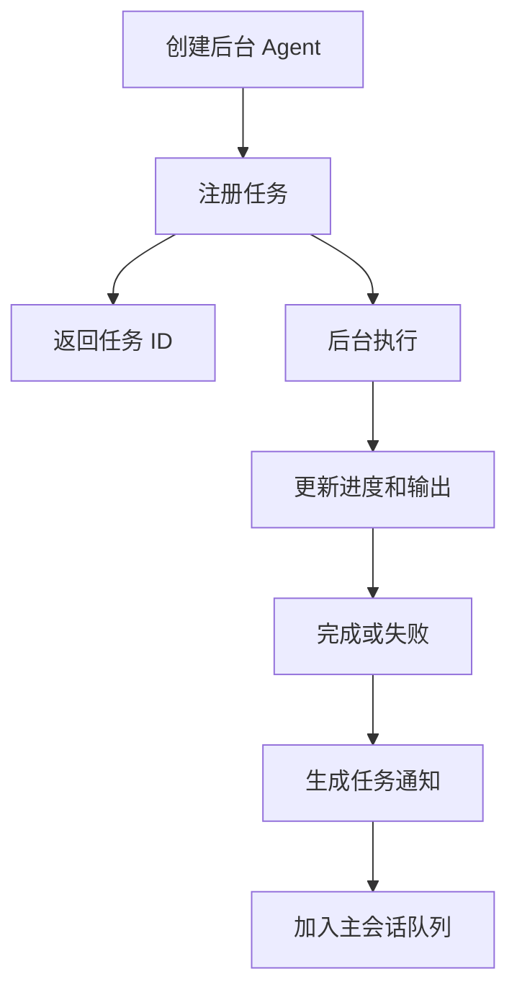

# 08. Agent 与任务编排

## 1. 模块职责

Agent 与任务模块负责拆分复杂工作、运行独立上下文、跟踪长任务、传递协作消息和隔离并行文件修改。

系统包含四类执行单元：

| 类型 | 主要用途 | 父会话等待 | 独立上下文 |
|---|---|---|---|
| 同步 Subagent | 完成一个明确子任务 | 等待 | 是 |
| 后台 Agent | 长时间或并行工作 | 不等待 | 是 |
| Teammate | 持续团队协作 | 不持续等待 | 是 |
| 普通 Task | Shell、Remote、Workflow 等长工作 | 根据类型 | 根据类型 |

协作待办项用于表示团队工作清单。它与运行中的 Task 使用不同状态和流程。

## 2. Agent 定义

Agent 定义描述一个子 Agent 的职责和限制：

- 名称和用途。
- System Prompt。
- 可用工具。
- 默认模型。
- 权限模式。
- Skill 和 MCP 要求。
- 后台运行能力。
- Worktree 隔离要求。

Agent 定义可以来自内置配置、用户配置、项目配置、插件和 SDK。管理员策略具有最高优先级。缺少必要 MCP Server 的 Agent 不会进入可用列表。

## 3. 子 Agent 上下文

子 Agent 启动时获得以下内容：

- 父任务提供的目标。
- Agent 专用 System Prompt。
- 适用的项目指令和工作目录。
- 经过裁剪的工具集合。
- 独立消息历史。
- 独立模型和权限设置。
- 父会话的中止信号。

子 Agent 不会直接修改父界面的消息状态。任务进度和最终结果通过任务模块返回。

## 4. 同步 Subagent

同步 Subagent 在父工具调用中运行。父会话持续接收进度并等待最终结果。

父任务需要直接使用子任务结果时，采用同步模式。

## 5. 后台 Agent

后台 Agent 先注册任务，再启动独立会话循环。父工具立即返回任务 ID。

用户可以查看任务状态、读取输出、发送消息或停止任务。主会话取消不会自动停止所有后台任务。任务停止使用独立操作。

## 6. 前台转后台

部分前台 Agent 可以在运行中转为后台。转换发生时，父会话停止等待，并获得任务 ID。Agent 保留已经建立的上下文、模型请求和进度。

Plan mode、特定模型限制或后台功能关闭时，系统会保持同步执行。

## 7. Task 管理

Task 记录统一保存以下信息：

- Task ID 和类型。
- 当前状态。
- 描述和启动时间。
- 进度摘要。
- 输出文件位置。
- 中止控制器。
- 前台或后台标记。
- 完成通知状态。

不同任务类型使用自己的执行器。Task 管理模块提供统一的注册、更新、停止、列表和通知能力。

## 8. 输出与通知

后台输出持续写入任务文件。界面只保留有限数量的近期消息，控制内存占用。用户打开任务详情时，系统从磁盘加载完整记录。

任务进入 completed、failed 或 cancelled 后会生成一次通知。通知包含任务 ID、状态、摘要和输出位置。主会话在当前步骤结束后读取通知。

## 9. 运行中消息

用户可以向运行中的 Agent 发送新消息。消息进入 Agent 的 pending queue。当前模型请求继续执行。一轮工具执行结束后，新消息作为用户输入加入 Agent 上下文。

消息不会插入正在传输的 API stream。该规则保持消息顺序和 provider 协议完整。

## 10. Fork Agent

Fork Agent 从父会话复制适用历史，再移除未完成工具请求和无关状态。Fork 适合需要理解父会话背景的子任务。

Fork 后的消息历史独立增长。子 Agent 的新消息不会自动加入父会话。最终结果通过工具结果或任务通知返回。

## 11. Worktree 隔离

Worktree 为 Agent 创建独立 Git 工作目录。它用于隔离并行文件修改。

创建过程会检查名称、路径、仓库状态和 Hook 结果。Agent 收到新的工作目录，并在该目录中执行文件和 Shell 工具。

Agent 完成后：

- 无文件变化的 worktree 可以自动移除。
- 存在未提交变化或新 commit 的 worktree 会保留。
- 无法确认变化状态时保留 worktree。
- 用户可以明确选择保留或删除。

Conversation branch 只创建新的消息历史。它不提供文件隔离。

## 12. Teammate

Teammate 是具有长期团队身份的 Agent。它拥有名称、邮箱、idle/active 状态、计划审批和协作任务。

Teammate 完成一次 prompt 后进入等待状态。新邮箱消息到达后，它会继续处理。Shutdown、kill 或不可恢复错误会结束 teammate。

Teammate 可以运行普通同步 Subagent。团队结构保持扁平，teammate 不会继续创建新的 teammate 层级。

## 13. 团队消息

团队消息支持以下类型：

- 普通文本。
- 广播。
- Shutdown 请求和响应。
- Plan 审批请求和结果。
- Idle 和状态通知。
- 协作任务更新。

计划只能由团队负责人审批。结构化控制消息不能跨无关 session。跨机器消息需要额外许可。

## 14. 协作待办

协作待办记录工作项、负责人、依赖关系和完成状态。依赖关系形成有向图。系统会检查循环依赖。

任务更新可以立即反映在团队界面。待办状态不会直接停止 OS 进程。运行任务需要通过 Task 停止操作中止。

## 15. 取消与失败

| 场景 | 默认行为 |
|---|---|
| 同步 Subagent 的父请求取消 | 子 Agent 接收中止信号 |
| 后台 Agent 的父请求取消 | 后台 Agent 继续运行 |
| 用户停止后台 Task | Agent 和子进程接收中止信号 |
| Agent 失败 | 保存错误并通知父会话 |
| Worktree 存在变化 | 保留目录并返回位置 |
| 权限无法确认 | 后台操作拒绝执行 |
| 恢复时工作目录丢失 | 记录警告并回到父目录 |

## 16. 模块关系

会话编排模块决定启动同步或后台 Agent。任务模块保存状态和输出。命令队列传递完成通知。持久化模块保存子 Agent 历史。权限模块处理子 Agent 工具。Git Worktree 提供文件隔离。团队模块管理身份、消息和计划。

下一章说明终端界面怎样展示这些状态并处理用户输入。
