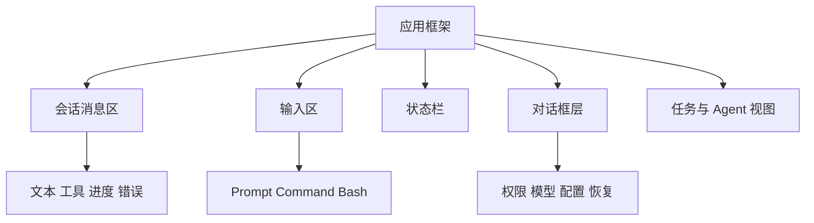
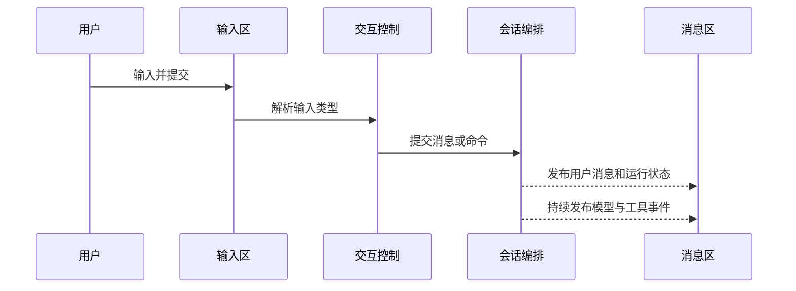

# 09. 终端交互

## 1. 模块职责

终端交互模块负责接收键盘输入、展示会话消息、显示工具和任务进度、处理权限确认、管理滚动与视图，并将用户操作转换为会话事件。

界面只负责交互和展示。模型请求、工具执行和持久化由对应模块完成。

## 2. 界面组成

### 2.1 会话消息区

消息区展示用户消息、Assistant 文本、thinking、工具调用、工具结果、系统通知和错误。流式文本在接收时持续更新。完整消息在流结束后固定。

### 2.2 输入区

输入区支持普通 Prompt、Slash command、Bash 快捷输入、粘贴文本、图片和文件引用。Vim 模式提供独立按键行为。

### 2.3 状态栏

状态栏显示当前模型、工作目录、权限模式、token 状态、MCP 连接、后台任务和 Agent 状态。

### 2.4 对话框层

对话框用于权限确认、模型选择、配置、会话恢复和其他需要用户决定的操作。一次只允许一个对话框接收输入。

## 3. 界面状态

界面状态分为三类：

| 类型 | 内容 | 保存位置 |
|---|---|---|
| 共享会话状态 | 模型、权限、任务、MCP、插件、当前 Agent | 会话状态模块 |
| 当前视图状态 | 输入、滚动、选择、对话框、流式显示 | 终端界面 |
| 外部服务状态 | 命令队列、查询运行状态、远程连接 | 对应服务模块 |

界面通过订阅获取共享状态。高频滚动和流式片段保留在局部状态，减少整体重绘。

## 4. 从输入到请求

提交前，界面会检查当前对话框和主请求状态。当前会话空闲时，普通 Prompt 启动新请求。当前请求运行中时，输入会作为 follow-up、steer 或控制命令处理。

## 5. 输入模式

### 5.1 普通 Prompt

普通文本进入主会话。多行粘贴会保持原始内容。图片和文件引用会作为附件加入。

### 5.2 Slash Command

Slash command 可以生成模型 Prompt、执行本地操作或打开交互界面。命令根据当前入口和远程安全规则决定可用性。

### 5.3 Bash 快捷输入

Bash 快捷输入转为 Shell 工具请求，并经过相同的权限和沙箱流程。

### 5.4 运行中输入

运行中输入可以补充后续要求或调整当前方向。立即中止、切换视图等本地控制命令直接处理。需要模型理解的内容进入命令队列。

## 6. 主请求状态展示

主请求状态包含准备、运行和结束阶段。界面根据该状态显示 spinner、停止按钮、token 使用和输入行为。

远端会话和前台任务可以使用独立 loading 状态。它们不会改变本地主请求的并发控制。

## 7. 命令队列展示

排队输入和任务通知会显示对应状态。队列处理顺序如下：

1. 中止和本地控制操作。
2. 用户 steer。
3. 用户 follow-up。
4. 团队和远程消息。
5. 后台任务通知。

当前步骤结束后，界面和会话编排模块同步更新消息。

## 8. 流式消息

模型文本到达时，消息区更新临时 Assistant 内容。Thinking、工具参数和用量信息分别累计。流结束后，临时内容替换为完整消息。

用户中止时，已经显示的文本会保存为部分回答，并添加中止标记。迟到事件不会覆盖下一次请求内容。

## 9. 工具与任务显示

工具调用可以显示输入摘要、当前进度、最终结果和错误。长结果默认折叠。大型结果提供文件位置。

后台任务显示任务 ID、类型、状态和进度。用户可以打开任务详情、发送消息、停止任务或返回主会话。

Agent 视图切换后，输入、消息和权限请求会发送给当前 Agent。

## 10. 权限对话框

工具需要确认时，权限请求进入对话框队列。对话框展示工具、目标资源、风险说明和可选授权范围。

用户可以允许一次、允许当前会话、保存规则或拒绝。决定返回工具模块后，对话框关闭并处理下一请求。

关键权限对话框具有最高显示优先级。工具动画和滚动不会遮挡确认界面。

## 11. 取消顺序

Escape 或停止操作按以下顺序执行：

1. 停止接受当前请求的后续流式更新。
2. 保存已经显示的部分文本。
3. 清理 spinner、token 和工具进度显示。
4. 关闭权限或输入对话框。
5. 向本地或远端执行端发送中止信号。
6. 恢复输入区可用状态。

界面会立即恢复输入。模型和工具资源在后台完成清理。

## 12. 消息渲染

不同消息类型使用专用显示组件：

- 用户文本和附件。
- Assistant 文本与 thinking。
- 工具调用和结果。
- 系统通知和错误。
- Hook、MCP 和任务事件。
- 图片、文档和代码差异。

消息 ID 用于保持组件稳定。流式更新不会改变已经完成消息的顺序。

## 13. 普通与 Fullscreen 模式

普通模式将内容写入终端滚动缓冲区。Fullscreen 模式使用 alternate screen，并由渲染器维护当前 Frame。

Fullscreen 模式适合长会话和稳定布局。终端环境不兼容 alternate screen 或 mouse tracking 时，系统使用普通模式。

## 14. 滚动和新消息

用户位于底部时，新消息自动保持底部位置。用户向上阅读历史时，新消息不会强制改变当前位置。界面显示新消息数量和跳转入口。

加载更早历史时，系统保持当前可见消息位置。搜索结果和 Agent 视图使用稳定消息 ID 定位。

## 15. 性能策略

- 高频流式内容使用局部状态。
- 共享状态订阅只更新相关组件。
- 长历史使用虚拟化和分段加载。
- 工具进度与完整消息分开更新。
- Fullscreen 只重绘变化区域。
- 后台 Agent 的界面消息数量受到限制。

## 16. 交互规则

1. 同一会话只启动一个主请求。
2. 一次只显示一个输入对话框。
3. 已完成消息顺序保持稳定。
4. 用户排队输入优先于普通后台通知。
5. 取消后旧事件不能改变新请求。
6. Agent 视图中的输入和权限发送给当前 Agent。
7. 滚动、选择和 resize 不改变消息数据。

## 17. Footer 生命周期

Footer 包含状态栏、模式提示、任务状态、历史搜索、建议列表和瞬态反馈。短暂界面状态会改变展示内容。

Footer 分别管理三个状态：

| 状态 | 作用 |
|---|---|
| mounted | 保持组件身份、内部状态和订阅 |
| visible | 决定组件占用终端行的状态 |
| active | 决定外部命令和定时器运行权限的状态 |

常规 Footer 隐藏时使用零高度容器保留组件。自定义 StatusLine、PR 刷新和倒计时会收到 active=false。它们会停止外部命令、清理待执行计时器并记录刷新需求。Footer 再次显示时会根据最新状态执行一次刷新。

展示顺序由集中规则确定。历史搜索优先使用 Footer 左侧。内联建议优先于帮助界面。退出反馈优先于粘贴反馈。自定义 StatusLine 优先于内置 StatusLine。

该设计减少短暂状态切换引发的子进程重启、订阅重建和焦点变化。完整故障分析见 [18 简历技术专题](18-resume-technical-deep-dives.md)。

下一章说明设置和会话数据怎样保存并恢复。
