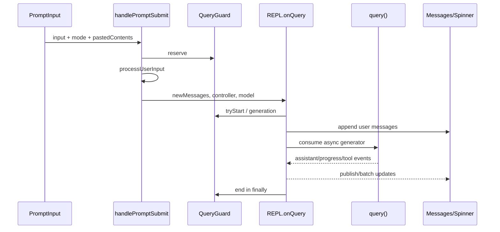

# 09. TUI 与交互状态流

## 1. TUI 的层次

```text
main.tsx
  -> render(<App initialState> <REPL .../> </App>)
App
  -> AppStateProvider
  -> StatsProvider / FPS metrics / Mailbox
REPL
  -> Messages / VirtualMessageList
  -> streaming text / spinner / task panels
  -> permission and other modal overlays
  -> PromptInput
custom Ink renderer
  -> React reconciler -> Yoga layout -> Frame -> terminal diff
```

`REPL.tsx` 是交互宿主，不只是页面组件。它拥有主消息数组、query lifecycle、streaming 聚合、输入提交、取消、dialog 仲裁、会话恢复、远端桥和 TUI 布局。

## 2. 三类 UI 状态

### 2.1 AppState

`AppStateStore` 保存需要跨组件、跨 task 或被外部系统观察的状态，例如 model、permission context、tasks、MCP、plugins、agent definitions、todos、当前 Agent 视图和 remote/bridge 状态。

store 是最小外部 store：`getState`、functional `setState`、`subscribe`。`useAppState(selector)` 基于 `useSyncExternalStore`，只在 selector 结果按 `Object.is` 改变时重渲染。selector 不应每次返回新对象。

`onChangeAppState` 是副作用 choke point：permission mode、model、verbose、expanded view、settings 等发生变化时，同步 bootstrap、配置、provider profile 和外部 metadata。这样 Shift+Tab、slash command、remote control 等所有 mutation path 都得到一致副作用。

### 2.2 REPL 局部状态

高频或只与当前视图有关的状态留在 REPL：

- `messages` 与同步 `messagesRef`；
- partial streaming text/thinking；
- current AbortController；
- tool permission/prompt/elicitation queues；
- toolJSX、modal、search、scroll 与 transcript mode；
- input placeholder、spinner timing 和当前 query generation。

这样 streaming delta 不会让整个 AppState 订阅树更新。

### 2.3 模块级外部状态

command queue、QueryGuard、task runtime maps 和若干 manager 不属于 React。它们提供同步读写或 `useSyncExternalStore` snapshot，避免 React batching 造成“逻辑上已运行但 state 尚未提交”的竞态。

## 3. `isLoading` 为什么是派生值

REPL 使用：

```text
isLoading = queryGuard.isActive || isExternalLoading
```

主 query 的权威状态在 `QueryGuard`，远端 viewer/foregrounded task 等不走本地 onQuery 的宿主使用 `isExternalLoading`。过去同时维护 React loading state 与同步 ref 容易不同步，所以当前实现由 guard snapshot 驱动。

`QueryGuard` 至少有三阶段语义：

- idle：可接收新主 turn；
- dispatching/reserved：正在异步解析输入或执行本地命令；
- running：已取得 query generation 并进入主循环。

guard 必须在 `processUserInput()` 前 reserve。Slash/Bash 预处理本身可能 await；如果此时仍显示 idle，第二次 Enter 会启动并发主 query。

每次运行携带 generation。旧 Promise 的 finally 只能结束自己拥有的 generation，不能清掉后来启动的新 query。

## 4. 从 Enter 到界面更新



提交时输入框与 placeholder 在同一 React batch 更新。`userInputOnProcessing` 覆盖从清空输入到 user message 真正进入 `messages` 的短暂间隙，防止屏幕闪空；消息长度超过基线后自动隐藏。

## 5. PromptInput 的输入模式

PromptInput 支持 prompt、bash 及构建功能控制的特殊模式。输入前缀可切换模式；history 保存原始 mode 字符和 pasted contents。Vim 模式换用 `VimTextInput` 状态机，普通模式使用 `TextInput`。

输入层还负责：

- slash/typeahead、文件/目录、shell history 和 skill suggestion；
- multiline、external editor、stash/restore；
- bracketed paste、ANSI 清理和长文本折叠引用；
- clipboard/dragged image placeholder；
- model/thinking/permission mode 快捷操作；
- footer task/team/bridge/tmux 导航；
- history search 和 message selector。

长粘贴不会始终把全文放在输入 buffer，而是存入 `pastedContents` 并插入引用。提交前展开文本引用；图片只有 placeholder 仍存在时才发送，删除 pill 会清理 orphan image。

## 6. 提交时运行中和空闲中的差异

### 6.1 空闲

所有输入先构造为一个 `QueuedCommand`，再进入统一 `executeUserInput()`。因此直接输入和稍后 dequeue 的输入共享同一处理路径，图片 resize、附件和 message origin 不会分叉。

### 6.2 已运行

- prompt 输入不打断当前 turn，而是进入 queue，作为下一 turn 的引导；
- bash 等可中断模式在有 interruptible tool 时可 abort 当前工具；
- local-JSX immediate command 可在 query 运行时打开配置/诊断 UI；
- 不可排队的特殊 mode 被忽略；
- 提交时就展开文本 paste，保证以后执行看到的是当时内容。

## 7. 统一命令队列

`messageQueueManager.ts` 的队列是模块级数组，snapshot 在每次 mutation 后冻结并换引用。所有用户输入、task notification、orphaned permission 和外部消息使用同一机制。

优先级为：

| priority | 典型含义 |
|---|---|
| `now` | 需要抢占当前操作 |
| `next` | 用户输入和普通外部输入 |
| `later` | 后台 task notification |

同优先级 FIFO。`now` 到达时 REPL 会 abort 当前 controller。用户输入默认高于后台通知，避免多个后台完成事件使真实输入饥饿。

`processQueueIfReady()` 只在 turn 间运行，并过滤 `agentId`，防止把发给子代理的消息由主线程消费。规则是：

- slash command 单独执行；
- bash 单独执行，保留逐命令 exit/progress/error；
- 其他相同 mode 一次 drain 成批；
- prompt 与 task-notification 不混批。

一批中的第一项获得 IDE selection、attachments 和 pasted image；后续项 `skipAttachments`，避免同一 turn 重复注入环境上下文。

## 8. Query 流如何更新消息

主循环事件通过 `handleMessageFromStream` 归类：

- 完整 message 进入 `messages`；
- 高频 text delta 先积累在 ref，再按换行/节流发布 visible streaming text；
- thinking 有独立 streaming state，结束一段时间后隐藏；
- progress 与 in-progress tool IDs 更新 spinner/tool row；
- compact boundary、API retry 和 system event 各有专门消息组件。

`messagesRef` 在 functional update 内同步更新，确保随后同一 tick 的异步回调读取最新数组。只依赖 React state closure 会在批处理下发生 last-write-wins 或读取旧消息。

流结束时 final assistant message 替代临时 streaming 展示。取消时则先把 ref 中尚未完整发布的 partial text 固化为 assistant message，再追加 interruption marker，保证用户看得到已经生成的内容。

## 9. Escape 的取消顺序

`onCancel()` 不是简单调用 `abort()`：

1. 暂停 proactive mode。
2. snapshot query lifecycle 中的 API/tool operation。
3. `QueryGuard.forceEnd()` 立即释放交互所有权。
4. 保存 partial streamed text。
5. 清 spinner/streaming/token budget 状态。
6. 若在 permission dialog，调用对应 `onAbort` 并清队列。
7. 若在 prompt dialog，reject pending promise。
8. remote mode 发送远端 cancel，否则 abort 本地 controller。
9. 清除 stale controller 并记录 terminal reason。

先释放 guard 是为了让 UI 立即恢复可输入；generation 检查保证旧 query 的迟到 finally 不会影响新 turn。工具配对修复仍由 query/tool 层完成。

## 10. Dialog 焦点仲裁

REPL 每帧只选一个 `focusedInputDialog`。大致优先级：

1. exit flow；
2. message selector、resume compact；
3. sandbox permission、tool permission、prompt、worker permission、MCP elicitation、cost；
4. idle return、ultraplan；
5. onboarding/effort/remote callout；
6. LSP/plugin hint/desktop suggestion。

critical dialog 可在某些 toolJSX 动画期间显示，防止 Agent 等待用户而 UI 被 background hint 遮住。低优先级 dialog 在用户主动输入时被抑制，避免抢焦点。

进入 tool permission 会暂停 turn elapsed 统计；离开时累计 paused duration。fullscreen 中 dialog 与 transcript 共用 ScrollBox，出现/消失时 `useLayoutEffect` 重新 pin 到底部，避免阻塞对话框位于视口外。

## 11. Message 渲染管线

`Messages` 先移除 null-rendering attachment，再按 message type 分发到：

- user text/image/bash/command/task notification；
- assistant text/thinking/tool use；
- tool result 的 success/error/reject/cancel；
- system API error、rate limit、compact/snip boundary；
- hook progress、team control message。

多个可折叠 read/search/tool use 可 grouped render。`verbose` 决定展开程度；brief mode 隐藏非关键细节。工具用 `renderToolUseMessage`/`renderToolResultMessage` 提供自己的显示，而不是 REPL 硬编码所有工具类型。

Agent transcript 视图替换 displayed messages 和 in-progress ID；输入经 selector 路由到 leader、viewed teammate 或 named local agent。切换视图不会把子 Agent 消息并入主 transcript。

## 12. 普通模式与 Fullscreen 模式

### 12.1 普通模式

输出利用终端原生 scrollback。内容增长时 Ink diff 更新底部，选择/复制主要由终端控制。

### 12.2 Fullscreen/无闪烁模式

启用后使用 alternate screen、固定 viewport 和 `ScrollBox`：

- transcript 可虚拟化，只 mount 可见窗口附近消息；
- prompt/modal 固定在底部；
- wheel、PgUp/PgDn、Home/End 由应用处理；
- 支持 hit test、点击展开、文本选择和 hyperlink；
- 离开底部后关闭 sticky follow，新消息以 divider/pill 提示；
- 回到底部重新启用 sticky follow。

tmux `-CC` 与 alt-screen/mouse tracking 不兼容时默认禁用 fullscreen，显式环境变量仍可覆盖。mouse capture 可独立关闭，保留 keyboard scroll 和虚拟化。

## 13. 自维护 Ink 渲染器

`src/ink/` 的主要阶段：

```text
React reconcile
  -> terminal DOM mutation/dirty flags
  -> Yoga layout
  -> render-node-to-output
  -> back Frame(screen cells + cursor + viewport)
  -> renderer diff(front, back)
  -> ANSI patches
  -> swap/reuse frame buffers
```

Frame cell 存字符、style/hyperlink ID；pool 减少重复分配。diff 输出 cursor move/show/hide、write、clear 和 scroll 等 patch。

以下情况需要全量或高写入比重绘：首帧、resize、remount/offscreen、前帧被 selection overlay 污染。稳定 streaming 采用局部 diff。

ScrollBox 对纯滚动/尾部追加可生成 DECSTBM scroll hint：把上一屏对应区域内存 blit 到新 Frame，只渲染新露出的边缘行；若同时发生复杂布局变化则回退完整路径。virtual scroll clamp 防止快速 PageUp 时 scrollTop 超过当前 mounted range。

## 14. 滚动与新消息一致性

用户离开底部时，REPL 记录当时 message index 和 scroll height。随后：

- transcript 在第一条新消息前显示 divider；
- pill 计算可见 assistant turn 数，而不是 raw message 数；
- tool-use-only/progress 不单独算一条 assistant 回复；
- 只要已有任何新内容，pill 至少显示 1，避免工具执行期间仍写“Jump to bottom”；
- prepend 历史消息时同步平移 divider index/height；
- submit、显式 bottom 或视图切换会重新 pin/清理。

ScrollBox 自身由外部 store 暴露位置 snapshot，pill 可直接订阅是否越过 divider，不要求每个滚动帧重渲染整个 REPL。

## 15. UI 性能与正确性不变量

1. query 所有权由同步 guard 决定，不由延迟 React state 决定。
2. streaming 的逻辑数据在 ref 中完整保存，state 只负责可见发布。
3. 外部 store selector 返回稳定引用，避免无穷重渲染。
4. 同时只允许一个输入 dialog 接收按键。
5. 关键授权 dialog 不能被 tool animation 或滚动位置遮住。
6. background notification 不应抢在用户 queued input 前面。
7. Agent view 的输入、消息和 permission mode 必须路由到当前 Agent。
8. selection、resize 和 alt-screen 切换必须使旧 Frame 失效，不能复用受污染像素。
9. 虚拟化不得改变 transcript 顺序、tool pairing 或搜索 anchor。
10. Escape 后 UI 立即可用，迟到事件仍不能污染下一代 query。

下一章：[10 配置与会话持久化](10-configuration-session-persistence.md)。
