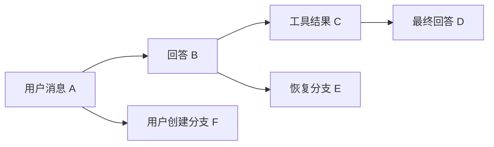
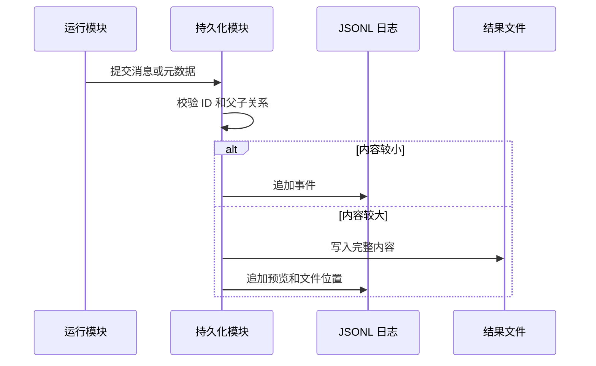

# 10. 配置与会话持久化

## 1. 模块职责

持久化模块负责保存设置、会话事件、分支关系、文件历史、大型工具结果和任务输出。它支持进程重启后的恢复，并保留可审计历史。

## 2. 配置来源

设置可以来自以下来源：

| 来源 | 典型范围 | 主要用途 |
|---|---|---|
| 管理员策略 | 组织或设备 | 强制安全和功能限制 |
| 启动参数 | 当前进程 | 本次运行覆盖 |
| 会话设置 | 当前会话 | 模型、权限和显示选择 |
| 本地项目设置 | 当前机器的当前项目 | 本地路径和偏好 |
| 项目共享设置 | 项目目录 | 团队约定和项目能力 |
| 用户设置 | 当前用户 | 默认偏好 |
| 插件默认值 | 插件范围 | 扩展初始配置 |

安全相关字段保留来源。项目设置不能覆盖管理员策略和启动参数中的强制限制。

## 3. 配置合并

配置加载流程包括读取、解析、校验、合并和来源标记。

普通对象按字段合并。部分列表按规则追加或替换。`undefined` 表示删除字段。托管配置目录中的文件按稳定顺序合并。

配置变化可以触发热更新。模型、权限、MCP、插件和界面读取更新后的有效配置。需要重新启动的设置会给出提示。

## 4. 会话目录

每个会话拥有独立存储目录。目录中可以包含：

- JSONL 会话日志。
- 大型工具结果。
- 后台任务输出。
- 文件历史快照。
- 上下文压缩和内容替换记录。
- 调试和诊断信息。

项目、工作目录和 session ID 用于定位会话。会话名称和标签用于用户检索。

## 5. 事件日志

会话使用追加式 JSONL 事件日志。每行表示一个独立事件。

常见事件包括：

- 用户消息。
- Assistant 消息。
- 工具结果。
- 系统通知。
- 上下文摘要。
- 模型和权限变化。
- 会话名称和标签。
- 文件历史与内容替换记录。

追加式写入保留完整变化过程。单行损坏时，加载器可以跳过该行并继续读取其他事件。

## 6. 父子消息链

每个持久化消息包含 UUID 和 parent UUID。新消息指向它所基于的上一条消息。

同一日志可以保存多个分支。恢复时，系统选择一个末端事件，并沿 parent UUID 重建当前消息链。

## 7. 写入流程

事件写入按会话串行化，保持父子关系稳定。退出前会刷新待写入事件。

## 8. 会话恢复

恢复流程如下：

1. 校验 session ID 和日志位置。
2. 解析所有有效事件。
3. 选择目标末端事件。
4. 沿 parent UUID 重建当前消息链。
5. 应用上下文压缩和内容替换记录。
6. 修复可确认的工具配对。
7. 恢复模型、工作目录和会话元数据。
8. 恢复文件历史、任务引用和大型结果位置。

损坏或无法验证的孤立事件不会进入当前消息链。

## 9. Continue 与 Resume

Continue 根据当前项目和时间选择最近适用会话。Resume 加载用户指定的 session。

恢复工作目录存在时，系统切换到该目录。目录已经删除时，系统记录警告并使用当前或父工作目录。启动参数明确指定的新工作目录具有更高优先级。

## 10. Conversation Branch

Conversation Branch 从历史消息创建新的会话链。

分支记录以下信息：

- 新 session ID。
- 直接父 session。
- 根 session。
- 来源 session。
- 分支时间。
- 分支点消息 ID。

分支复制当前有效消息链，并重写会话标识。其他历史分支不会复制。文件系统保持共享。

## 11. 对话回退与文件回退

对话回退改变当前消息链的末端位置。文件回退应用文件历史快照。两项操作可以单独执行。

| 操作 | 消息历史 | 文件系统 |
|---|---|---|
| 只回退对话 | 改变 | 保持当前状态 |
| 只回退文件 | 保持当前链 | 恢复快照 |
| 同时回退 | 改变 | 恢复快照 |
| 从此处总结 | 写入摘要 | 保持当前状态 |

文件写入或删除失败会中止文件回退，并返回明确错误。

## 12. 上下文压缩记录

压缩事件保存摘要、压缩位置和需要保留的近期消息。加载时，系统从最近有效压缩记录开始构造模型上下文。

压缩记录损坏时，系统只使用能够确认的后续历史。完整原始日志继续保留，用于审计和人工检查。

## 13. 大日志读取

大日志采用分块扫描。加载器在找到最近压缩记录后丢弃此前不需要的累积内容。内存只保留最终需要恢复的事件。

轻量会话列表只读取日志头尾和必要元数据。用户打开具体会话后再执行完整恢复。

## 14. 大型工具结果

工具结果超过上下文预算时，完整内容写入独立文件。消息保留约定大小的预览和文件位置。

普通文本预览保留开头和结尾。JSON 预览只保留开头，避免拼接后形成错误对象。恢复、分支和重放会使用相同表示。

## 15. 文件历史

文件历史记录 OpenClaude 工具修改前后的快照。它支持文件回退，并独立于 Git。

外部程序修改、未被文件工具跟踪的文件和 Git 状态不属于文件历史恢复范围。大型历史文件具有内存保护限制。

## 16. 后台任务与子会话

后台 Agent 使用独立子会话日志和输出文件。主会话任务记录保存引用和近期摘要。打开任务详情时，系统从子会话日志加载完整历史。

任务完成后，主会话保存结构化通知。子会话日志继续保留，支持后续查看和审计。

## 17. 数据一致性规则

1. UUID 在会话中保持唯一。
2. Parent UUID 指向已有事件或合法起点。
3. 工具请求和结果保持配对。
4. 内容替换在恢复和分支后保持一致。
5. 会话分支保留来源和根 session。
6. 文件回退失败时返回错误。
7. 大型结果文件位置必须经过访问检查。

下一章说明 MCP、插件、Hook、LSP 和命令怎样扩展系统能力。
