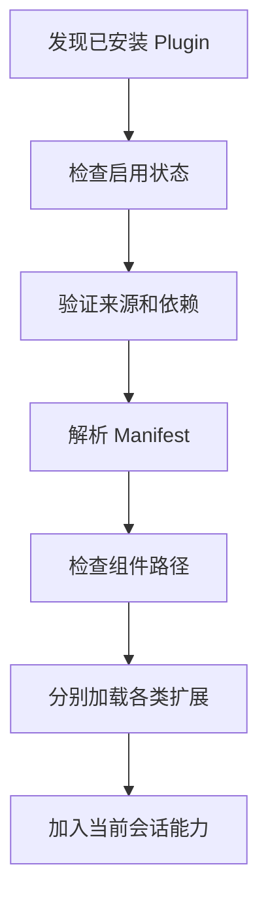
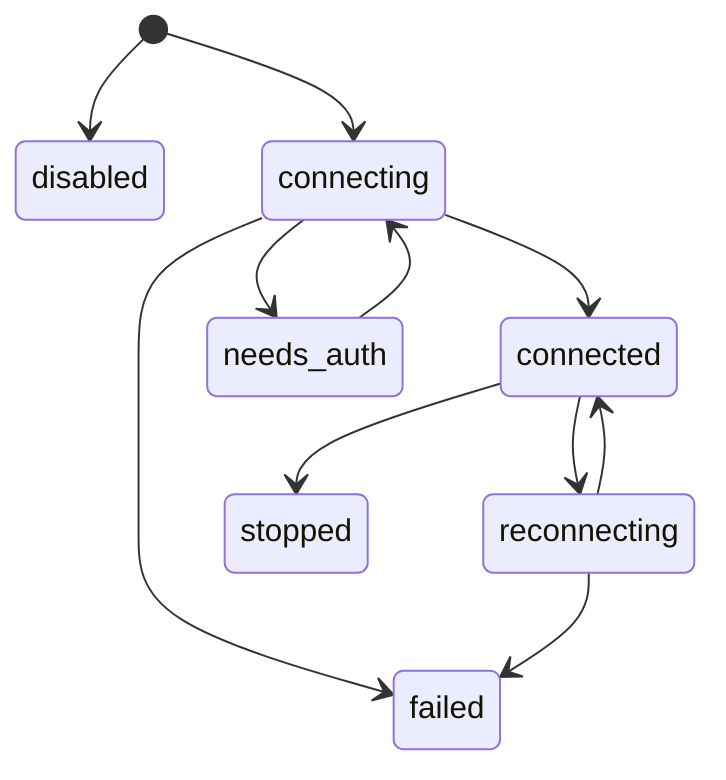
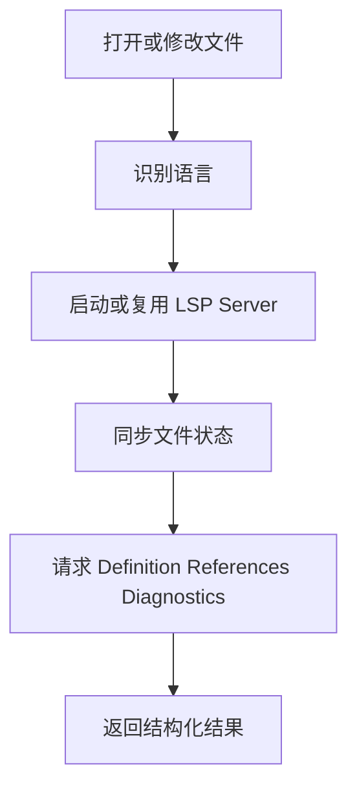
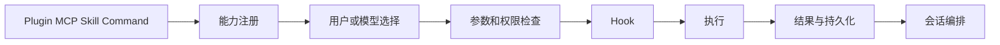

# 11. 扩展系统

## 1. 模块职责

扩展系统允许 OpenClaude 增加命令、工具、Agent、Skill、Hook、MCP Server 和 LSP 能力。扩展沿用主系统的配置来源、目录信任、权限和持久化机制。

| 扩展类型 | 提供内容 | 主要使用方 |
|---|---|---|
| Command | 用户可触发的操作 | 用户 |
| Skill | 领域指令和资源 | 模型与用户 |
| Plugin | 多种扩展的安装包 | 系统 |
| MCP | 外部工具、资源和 Prompt | 模型与系统 |
| Hook | 生命周期处理 | 系统与策略服务 |
| LSP | 代码定义、引用、诊断和补充信息 | 工具与界面 |

## 2. Command

Command 分为三类：

### 2.1 Prompt Command

Prompt Command 将用户输入转换为模型 Prompt。它可以引用参数、文件和上下文，并进入普通会话流程。

### 2.2 Local Command

Local Command 在本地执行设置、会话、任务或管理操作。它不需要调用模型。

### 2.3 Interactive Command

Interactive Command 打开终端对话框或专用视图。它只在具有本地 TUI 的入口运行。

远程和 Headless 入口会过滤需要本地界面的命令。命令的用户调用权限和模型调用权限分别配置。

## 3. Skill

Skill 由说明文本、资源和允许工具声明组成。系统根据名称、任务和配置发现 Skill。加载后的说明进入模型上下文。

Skill 可以由内置包、用户目录、项目目录、插件和 MCP 提供。目录信任和路径检查适用于项目 Skill。Skill 不能直接绕过工具权限执行操作。

## 4. Plugin

Plugin 是扩展的安装和分发单元。一个 Plugin 可以同时提供：

- Command。
- Agent 定义。
- Skill。
- Hook。
- MCP 配置。
- LSP 配置。
- 输出风格。

### 4.1 加载流程

所有组件路径必须位于 Plugin 根目录。跨 marketplace 依赖需要显式许可。项目提供的 Plugin 在目录信任确认后加载。

### 4.2 更新与热重载

Plugin 变化时，系统重新解析新版本。新组件准备完成后替换旧组件。加载失败时，旧组件保持工作，并显示更新错误。

## 5. MCP

MCP 让外部进程或服务向 OpenClaude 提供 tools、resources 和 prompts。

支持的连接方式包括：

- stdio 子进程。
- HTTP SSE。
- Streamable HTTP。
- WebSocket。
- SDK 进程内连接。

## 6. MCP 连接流程

连接建立后，系统执行 initialize 和能力发现。Server 名称会加入工具命名空间，防止不同 Server 和内置工具重名。

## 7. MCP 能力发现

MCP Server 可以提供：

- Tools。
- Resources 和 resource templates。
- Prompts。
- Server instructions。
- Roots 请求。
- Elicitation 请求。
- Channel notification。

工具列表变化时，系统替换该 Server 的旧工具集合。被删除工具不会继续暴露给模型。

Server instructions 具有长度限制。Resource 内容按外部输入处理。Channel message 会标记来源，并经过启用状态和权限检查。

## 8. MCP 工具调用

MCP Tool 会包装为普通 Tool。调用流程包括参数校验、Permission、PreToolUse Hook、远程调用、结果转换和 PostToolUse Hook。

远程工具具有调用超时。二进制或大型结果可以写入会话存储。连接断开时，调用返回明确错误，并根据连接策略尝试重连。

## 9. MCP OAuth

远程 MCP 可以使用 OAuth。认证流程包含服务发现、浏览器授权、token 保存、refresh 和重新认证。

收到 401 时，连接状态改为 needs_auth。系统尝试刷新 token。刷新失败后请求用户重新认证。Token 保存使用安全存储。

## 10. Hook

Hook 在指定生命周期事件发生时运行。常见事件包括：

- Session Start 和 End。
- User Prompt Submit。
- PreToolUse 和 PostToolUse。
- Permission Request。
- Stop 和 Stop Failure。
- Agent、Task、Teammate 状态变化。
- Config、Worktree、File 和 Cwd 变化。

## 11. Hook 执行方式

Hook 可以使用本地命令、HTTP 请求、模型 Prompt、Agent 或 SDK callback。

每个 Hook 具有独立超时和中止信号。长 Hook 可以转为异步执行，并在完成后向会话队列发送通知。

## 12. Hook 结果

Hook 结果可以：

- 允许当前操作。
- 阻止当前操作。
- 修改工具输入。
- 请求用户确认。
- 添加上下文或反馈。
- 记录诊断信息。

结构化结果需要通过校验。普通 stdout 只作为文本输出，不会直接成为权限决定。

多个 Hook 同时运行时，阻止结果优先。非阻断错误会记录并允许主流程继续。Stop Hook 要求继续时，系统记录当前状态，防止相同 Stop Hook 持续重复。

## 13. LSP

LSP 提供代码语言服务，包括 definition、references、hover、symbols 和 diagnostics。

LSP Server 由已启用 Plugin 提供。配置包含启动命令、参数、文件扩展名、语言映射、环境变量和连接方式。

LSP 访问文件时受读取权限限制。Server 失败会进入重启流程。超过重试限制后，系统停止该 Server 并显示错误。

## 14. 扩展进入主流程

扩展可以增加能力定义。具体操作继续经过工具、权限和持久化模块。下一章说明外部服务和运行流程失败时的恢复方式。
