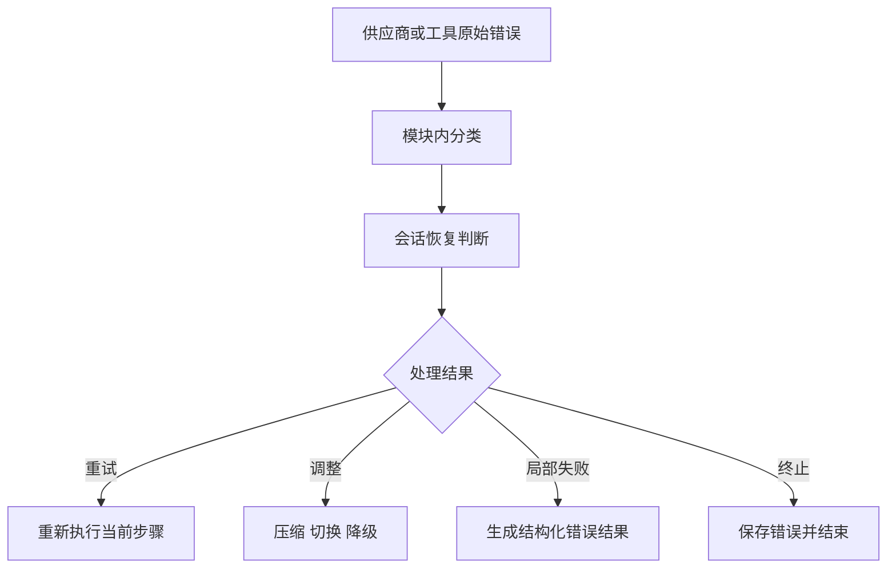

# 12. 错误与恢复

## 1. 模块职责

错误恢复模块负责分类失败、限制重试、选择恢复方式、传播中止原因、保护消息结构并完成进程退出。

错误处理目标包括：

- 临时故障可以自动恢复。
- 参数和权限错误不会重复请求。
- 恢复操作具有明确次数限制。
- 中止后的消息历史保持合法。
- 可选组件失败不会破坏核心会话。
- 不可恢复错误可以完整记录和展示。

## 2. 错误层次

Provider、工具、MCP、Hook 和进程分别识别本模块错误。会话编排层只读取统一类别和恢复建议。

## 3. API Retry

API Retry 重新发送内容和参数完全相同的模型请求。

适合重试的情况包括：

- 连接重置和临时 DNS 错误。
- 请求超时。
- 部分 429 限流。
- 5xx 服务错误。
- 合法 Retry-After 指定的等待。

认证失败、参数错误、模型不存在、用户中止和明确权限拒绝不会进入普通重试。

重试采用指数退避和随机抖动，并设置最大次数。Retry-After 在合理范围内具有优先级。

## 4. 服务过载

前台请求遇到 529 或同类过载错误时，可以有限重试。连续失败达到阈值后，系统可以切换备用 model。

后台标题、摘要等辅助请求默认减少过载重试，避免服务压力增加。没有备用模型时，系统返回明确的持续过载错误。

## 5. 上下文溢出

上下文溢出表示输入、工具定义和预期输出总量超过模型窗口。

恢复顺序如下：

1. 提交已经准备的局部上下文缩减。
2. 执行自动压缩并重新组装上下文。
3. 使用允许的其他压缩路径。
4. 返回原始错误。

每种压缩方式在同一恢复流程中只执行有限次数。

## 6. 输出达到上限

输出达到 token 上限表示模型请求已经成功，并在回答结束前停止。

系统可以执行以下处理：

- 在允许条件下提高输出上限。
- 保留已经产生的 Assistant 内容。
- 加入继续回答的控制消息。
- 有限次数续写。

续写达到次数或预算上限后，系统保存部分回答并结束。

## 7. Model 与 Provider Fallback

当前模型持续过载时，系统可以切换备用模型。当前 provider 不可用时，系统可以切换备用 profile 和 provider。

切换前会清理目标协议不接受的 thinking、cache 和 tool ID。切换完成后，系统使用相同任务目标重新构造请求。

## 8. 自动压缩暂停

自动压缩连续失败达到限制时，系统暂停新的自动压缩。默认暂停一段时间后允许一次试运行。

试运行成功会清空失败计数。试运行失败会重新进入暂停期。该机制防止上下文错误持续触发压缩请求。

## 9. 工具重复失败

系统根据工具名、输入和错误类别识别重复失败。

达到预警次数时，系统向模型加入具体反馈。模型继续产生相同失败时，本轮结束。工具成功后，对应失败记录会清理。

用户中止产生的工具结果不计为工具失败。工具自身 timeout 计为失败。

## 10. 中止传播

中止可以来自用户、父任务、超时、权限取消、远程断开或进程退出。

中止信号从会话编排层传到模型请求、工具、Hook、MCP 和子进程。各模块完成必要清理，并返回对应中止状态。

系统保留具体中止原因。界面可以区分用户取消、超时、父任务结束和进程退出。

## 11. 工具配对修复

中止或流式错误可能发生在工具请求已经出现、工具结果尚未生成的阶段。系统会为每个未完成工具请求生成带错误或中止状态的结果。

恢复加载时还会执行以下修复：

- 移除重复工具结果。
- 补充缺少结果的工具请求。
- 为角色内容为空的消息加入占位。
- 排除无法确认位置的孤立消息。

修复后的历史可以继续发送给 provider。

## 12. 流式连接停滞

模型流在一段时间内没有事件时，系统将其识别为停滞。允许的 provider 可以改用非流式请求重试一次。

非流式降级具有独立开关和次数限制。系统不会在流式与非流式方式之间持续切换。

## 13. 局部失败隔离

可选组件失败会限制在对应模块：

| 组件 | 失败处理 |
|---|---|
| 单个 MCP Server | 标记失败并保留其他 Server |
| 单个 Hook | 根据阻断属性记录或终止当前操作 |
| 单个 LSP Server | 重启或停止该语言服务 |
| 单个 Plugin | 跳过该 Plugin 并保留其他扩展 |
| 后台 Task | 标记失败并通知主会话 |
| 远程查看连接 | 重连或回到本地状态 |

核心模型认证、强制安全能力和主会话存储失败通常会终止当前入口。

## 14. 内存压力

长会话通过以下方式控制内存：

- 上下文压缩。
- 大型工具结果外置。
- 后台 Agent 只保留近期界面消息。
- 大日志分块读取。
- 已完成任务按保留规则回收。
- 流式缓冲在消息完成后释放。

内存压力日志会记录当前会话、任务和结果存储状态，用于诊断。

## 15. 进程退出

SIGINT、SIGTERM、SIGHUP、终端断开和显式退出都会进入统一关闭流程。

1. 标记进程正在关闭。
2. 中止模型、工具和 Hook。
3. 保存待写入会话事件。
4. 停止后台任务或记录脱离状态。
5. 关闭 MCP、LSP、远程连接和监听器。
6. 恢复终端设置。
7. 返回退出状态。

关闭流程可以重复调用，并只执行一次实际清理。

## 16. 用户可见结果

错误结果应包含错误类别、发生阶段、已经执行的恢复操作和可采取的下一步。敏感凭据、完整工具输入和内部路径会根据日志策略过滤。

下一章说明各运行入口怎样使用相同的恢复和资源管理能力。
