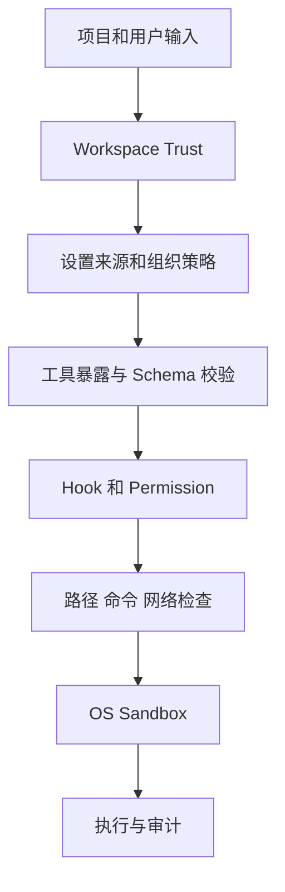
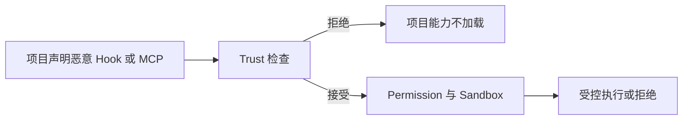

# 14. 安全模型

## 1. 安全目标

OpenClaude 将模型输出、项目内容、外部服务和扩展代码视为不可信输入。系统通过确定性检查限制它们可以执行的操作。

安全目标包括：

- 未经信任的项目配置不会自动执行。
- 模型只能调用当前会话允许的工具。
- 文件和 Shell 操作限制在授权范围。
- 子进程可以受到操作系统隔离。
- 网络请求不能访问受保护地址。
- 凭据和敏感日志受到保护。
- SDK 和远程入口具有明确调用方责任。

## 2. 威胁来源

| 来源 | 典型风险 |
|---|---|
| 模型输出 | 错误命令、越权路径、重复副作用 |
| 项目目录 | 恶意 Hook、MCP、命令和环境变量 |
| Prompt injection | 诱导读取和上传敏感信息 |
| Plugin 与 MCP | 供应链代码、伪装工具、外部内容 |
| Shell 与依赖 | 任意代码执行、配置文件加载 |
| 网络 | SSRF、云 metadata、受限内网访问 |
| 远程调用方 | 未授权会话、伪造权限响应 |
| 日志与会话 | 凭据泄漏、长期敏感数据保存 |

## 3. 防护层次

各层检查不同风险。完整防护需要组合适用层次。

## 4. Workspace Trust

Workspace Trust 控制项目级配置的加载权限。确认前，系统不会启用项目 Hook、MCP、命令、Skill 和危险环境变量。

信任提示会展示当前目录可能启用的能力。用户接受后，项目配置进入后续加载流程。具体操作继续接受 Permission、路径和 Sandbox 检查。

Headless 和 bypass 模式没有本地信任对话框。调用方需要确认目标目录来源。

## 5. 设置来源

系统记录安全相关设置来自管理员策略、启动参数、用户、项目或本地配置。

- 管理员策略可以强制权限和 Sandbox。
- 项目配置不能关闭外层强制安全要求。
- SDK 管理 provider 时，项目配置不能替换凭据和路由。
- Plugin 跨 marketplace 依赖需要明确许可。
- Trust 确认前只读取可信来源中的危险环境设置。

## 6. 工具调用检查

模型请求工具后，系统执行以下检查：

1. 工具在当前暴露列表中。
2. 工具名称映射到注册工具。
3. 输入通过 Schema 和工具校验。
4. PreToolUse Hook 给出允许结果。
5. Permission rule 给出允许或确认结果。
6. 目标路径、命令和网络地址通过安全检查。
7. 需要的 Sandbox 已经准备。

任一步骤拒绝时，工具不会执行，并向模型返回结构化错误。

## 7. Permission

Permission 根据工具、输入和规则来源决定允许、拒绝或确认。

Deny 优先于 Allow。Always Ask 强制显示确认。Plan mode 限制写入能力。Dont Ask 拒绝无法自动批准的操作。Bypass 扩大自动批准范围，并保留强制路径和策略检查。

用户可以允许一次、允许当前会话或保存持久规则。一次授权不会自动扩大为长期权限。

## 8. 文件系统保护

文件安全检查用户路径和符号链接解析后的真实路径。

主要保护包括：

- 当前工作目录和附加目录范围。
- `..` 和路径前缀逃逸。
- 中间符号链接。
- Git 元数据、Shell 配置、IDE 配置和 OpenClaude 控制目录。
- 凭据和系统敏感文件。
- Windows UNC 和保留路径。

读取和写入使用独立权限。工作区外文件需要额外批准或 Sandbox allowlist。

## 9. Shell 与进程

Shell 安全检查命令结构、参数、重定向、管道、工作目录和目标文件。

只读程序也会检查具体参数。配置覆盖、输出重定向和写入参数可以改变操作风险。允许一个子命令不会授权整个可执行程序。

子进程环境会移除调用程序的私有变量，并按策略注入代理和凭据。用户 Shell 配置和可执行文件本身可能运行任意代码。

## 10. OS Sandbox

Sandbox 限制子进程的文件和网络访问。它可以配置可读目录、可写目录、允许网络域、代理和排除命令。

Permission 负责批准操作。Sandbox 负责限制批准后的进程。Sandbox 未启用时，子进程使用当前 OS 用户权限。

管理员可以要求 Sandbox 必须可用。依赖缺失时，强制模式会停止执行。

## 11. 网络与 SSRF

HTTP Hook 和其他受控网络请求会检查目标地址。

检查内容包括：

- 私有 IPv4 网络。
- Link-local 和云 metadata 地址。
- IPv6 ULA、link-local 和 unspecified 地址。
- 映射到受限 IPv4 的 IPv6 地址。
- DNS 解析结果。

Loopback 用于本地策略服务，因此处于允许范围。本机服务需要自己的认证和访问控制。

使用全局代理时，代理承担 DNS 和出站检查。部署方需要配置代理 ACL 和 egress policy。

## 12. Plugin、MCP、Hook 与 LSP

扩展通常使用 OpenClaude 进程权限运行。安装来源、依赖和组件路径需要检查。

Plugin 安装许可只覆盖安装操作。运行时工具继续经过 Permission。MCP 工具使用 Server 命名空间，并接受普通工具检查。Hook 结构化结果需要校验。LSP 文件访问受读取权限限制。

外部资源和 Server instructions 会作为不可信内容进入模型上下文。域名允许只表示系统可以获取内容。

## 13. 凭据与敏感数据

凭据优先保存在 macOS Keychain、Windows Credential Manager 或 Linux secret storage。平台安全存储不可用时，fallback 的保护等级取决于系统能力。

日志和分析事件会过滤已知 token、Authorization header 和敏感环境变量。工具原始输入和路径不会无条件进入遥测。

公开构建版本的 analytics sink 不发送产品分析数据。模型 API、OAuth、MCP、WebFetch、插件和更新会产生对应功能需要的网络流量。

## 14. 远程与 SDK

Remote 会话使用认证凭据建立连接。Permission 请求通过远程桥接返回控制端。断开或超时会形成拒绝或失败。

外部 session 消息包含来源信息。身份认证确认发送者权限。消息内容接受普通上下文和工具安全检查。

SDK 调用方需要：

- 保护传入环境变量和凭据。
- 正确实现 Permission callback。
- 传播中止信号。
- 限制输出文件位置。
- 关闭 Session 和迭代器。
- 控制注入的 MCP Server 和工具。

## 15. 典型攻击流程

### 15.1 恶意项目配置

### 15.2 Prompt Injection

网页或 MCP 内容可能要求读取密钥并上传。读取工具、敏感路径规则、网络权限和用户确认分别限制读取与发送操作。

### 15.3 Symlink 逃逸

用户路径位于工作区内，并通过 symlink 指向外部目录时，真实路径检查会识别外部目标。系统请求额外权限或拒绝写入。

### 15.4 MCP 工具伪装

MCP 工具带 Server 命名空间。内置工具特殊规则不会应用到 MCP 工具。Schema、Permission 和用户确认继续生效。

## 16. 残余风险

以下风险需要部署和用户共同控制：

- 用户明确授权任意 Shell 命令后的宿主机风险。
- 未启用 Sandbox 时的进程权限。
- 已信任 Plugin 和 Hook 的供应链风险。
- Loopback 服务缺少认证。
- 代理错误配置导致的网络访问扩大。
- 会话日志中长期保存的业务敏感内容。
- Headless 调用方错误信任未知目录。

安全模型通过多层检查降低风险。实际隔离强度取决于启用的 Sandbox、OS 权限和部署环境。
