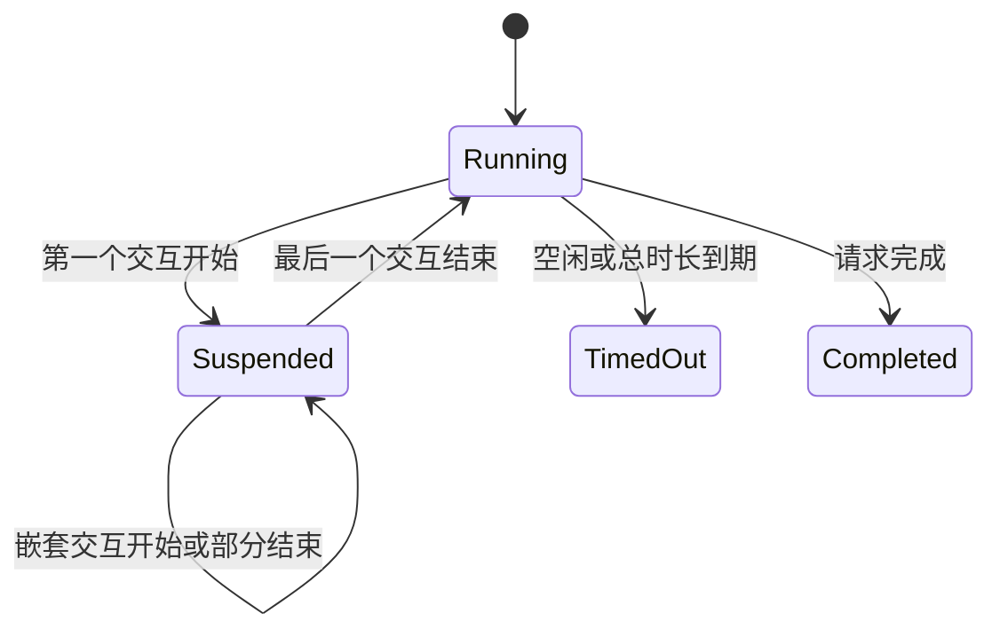
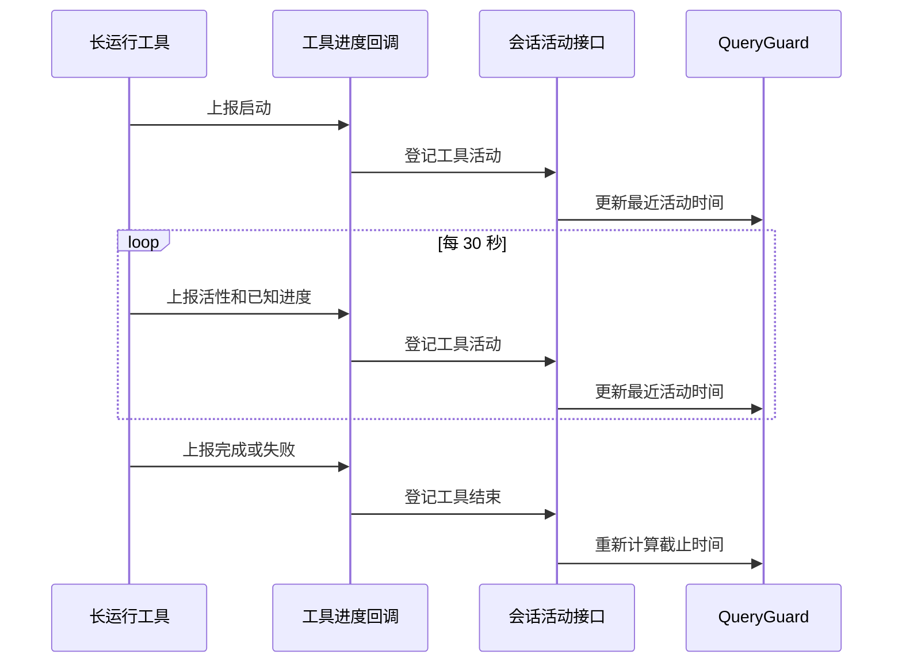
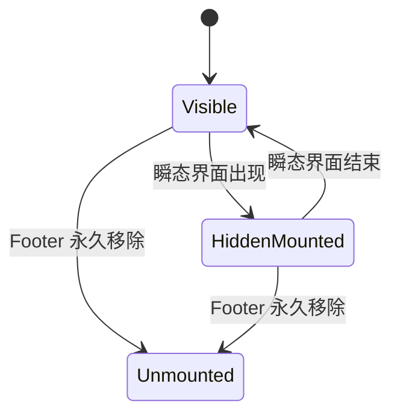
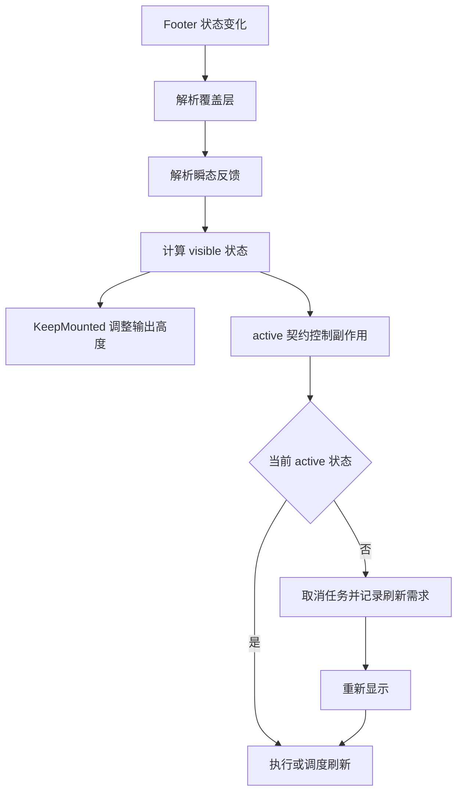
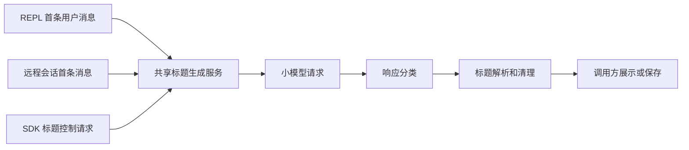
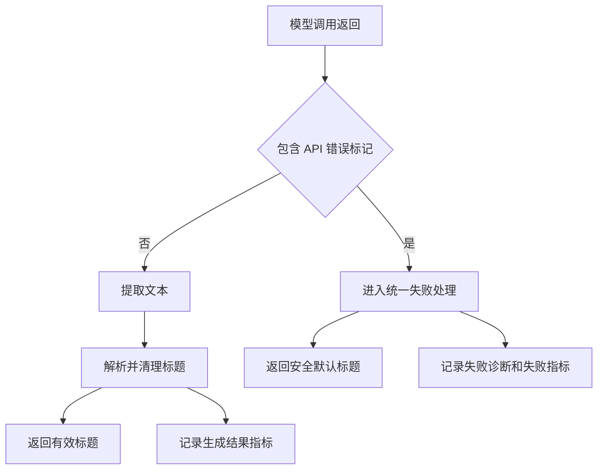

# 18. 简历技术专题

本章说明三项稳定性改进的技术背景、架构位置、执行流程和验证方法。每项内容都包含适合口头介绍的表达框架。

## 18.1 三项改进的架构位置

| 改进主题 | 核心模块 | 关联模块 | 目标 |
|---|---|---|---|
| 会话存活判定 | 会话运行状态、QueryGuard | 权限对话框、MCP、Task、Subagent | 准确识别合法等待和真实停滞 |
| Footer 生命周期 | Prompt Footer、状态栏 | 外部命令、历史搜索、提示层、焦点管理 | 保持组件身份并约束隐藏期间的副作用 |
| 标题响应校验 | 会话标题生成服务 | REPL、远程会话、SDK、分析日志 | 阻止 API 错误内容进入标题展示 |

三项改进都处理跨模块状态。会话存活判定处理时间状态。Footer 改进处理组件状态。标题响应校验处理数据有效状态。

## 18.2 会话存活判定机制

### 18.2.1 原有机制

主会话使用 QueryGuard 管理以下状态：

| 状态 | 含义 |
|---|---|
| idle | 当前没有主请求 |
| dispatching | 队列已经取得执行资格，异步准备尚未完成 |
| running | 主请求正在执行 |

QueryGuard 使用两个默认时间限制：

| 限制 | 默认值 | 作用 |
|---|---:|---|
| 空闲超时 | 5 分钟 | 回收长时间没有活动的请求 |
| 请求总时长上限 | 30 分钟 | 限制单次请求占用会话的最长时间 |

模型流事件、工具开始、工具进度和工具结束都会登记活动。每次有效活动都会更新最近活动时间。

### 18.2.2 误终止场景

系统中存在两类没有输出的正常状态。

第一类状态是人工等待。权限确认、用户问题和计划选择都需要等待用户决定。用户思考期间没有模型事件和工具事件。

第二类状态是处于运行阶段的静默工具。MCP 工具可能执行长时间索引。阻塞式 TaskOutput 可能等待后台任务。同步 Subagent 可能正在等待内部 MCP 工具或后台任务。

原有空闲计时会把这两类状态识别为无活动状态。达到超时后，QueryGuard 会中止请求并释放主会话。

### 18.2.3 场景分类

| 运行状态 | 识别方式 | 计时策略 | 终止条件 |
|---|---|---|---|
| 等待用户决定 | 交互窗口已经登记 | 暂停会话空闲计时和总时长计时 | 交互结束后恢复计时 |
| 长运行工具 | 工具周期性上报活性 | 持续刷新最近活动时间 | 工具超时、租约到期或请求总上限 |
| 工具真实停滞 | 没有进度和活性上报 | 空闲计时继续 | 空闲超时 |
| 请求整体失控 | 总执行时间超出限制 | 总时长计时继续 | 请求总时长上限 |

人工等待和程序运行具有不同含义。两类状态使用独立机制。

## 18.3 引用计数式挂起与恢复

### 18.3.1 状态变化

第一次进入人工交互时，QueryGuard 记录挂起时间并将计数加一。嵌套交互继续增加计数。每个交互结束时调用对应的恢复函数。最后一个交互结束后，QueryGuard 执行实际恢复。

引用计数解决两个并发问题。多个交互可以共享同一个会话。任意一个交互提前结束都不会恢复全部计时。

### 18.3.2 时间补偿

恢复时会执行以下操作：

1. 计算本次人工等待时长。
2. 将等待时长加入累计挂起时间。
3. 根据累计挂起时间顺延请求总时长截止点。
4. 将最近活动时间更新为恢复时刻。
5. 重新安排下一次超时检查。

工具租约的截止时间保持原值。该规则保证人工对话框不会延长正在进行的程序工作期限。

### 18.3.3 挂起范围

挂起范围从权限对话框进入可响应状态开始。挂起范围在某个处理路径取得最终决定时结束。

权限分类器、Hook 和权限持久化属于程序工作。这些阶段继续接受超时监督。该范围可以识别权限检查内部的真实停滞。

### 18.3.4 恢复时机

多个来源可能同时给出权限决定。来源包括本地终端、远程控制端、消息通道、Hook 和外部中止信号。

所有终止路径先竞争唯一决定权。取得决定权的路径立即恢复 QueryGuard。后续权限保存和清理操作在恢复后的监督状态中执行。

恢复函数具有幂等性。同一个交互的重复恢复不会重复减少计数。旧请求的恢复函数带有 generation 校验。旧请求无法修改新请求的计时状态。

### 18.3.5 异常清理

人工交互具有以下终止路径：

| 终止路径 | 处理动作 |
|---|---|
| 用户允许 | 取得决定权、恢复计时、保存授权、继续工具 |
| 用户拒绝 | 取得决定权、恢复计时、生成拒绝结果 |
| 用户取消 | 取得决定权、恢复计时、生成中止结果 |
| 外部中止 | 恢复计时、移除本地队列项、取消远程请求、解除消息订阅 |
| 创建前已中止 | 直接结束交互，不创建过期对话框 |
| 对话框创建抛错 | 恢复计时、清理已注册资源、继续抛出错误 |

终止路径的完整性决定挂起机制的可靠性。遗漏恢复会导致后续请求失去超时保护。遗漏界面清理会留下无法操作的旧对话框。

## 18.4 长运行工具的周期性活性上报

### 18.4.1 活性上报流程

活性事件表示工具调用路径处于运行状态。业务进度字段可以为空。MCP Server 已经返回具体进度时，后续活性事件会携带最近一次进度值。

### 18.4.2 MCP 工具

MCP 活性计时从连接准备阶段开始。覆盖范围包括连接建立、会话恢复、协议重试、URL elicitation 和工具执行。

MCP 工具每 30 秒发送一次 progress 事件。事件包含 Server、工具、已运行时间和最近一次 Server 进度。成功或失败后停止定时器。

### 18.4.3 TaskOutput

阻塞式 TaskOutput 会立即发送一次 waiting 事件。等待期间每 30 秒重复发送 waiting 事件。任务完成、超时或中止后清理定时器。

事件 ID 使用稳定的 Task ID。界面可以把多次上报识别为同一等待过程。

### 18.4.4 同步 Subagent

同步 Subagent 在父工具调用中运行。子 Agent 内部的 MCP progress 和 waiting_for_task 需要传给父工具进度回调。父会话收到这些事件后更新自己的最近活动时间。

缺少转发时，子 Agent 保持活跃，父会话保持静默。父会话会根据自己的计时状态触发误终止。

### 18.4.5 故障终止能力

周期性活性上报保留以下终止条件：

- 工具自身超时。
- 工具租约到期。
- 请求总时长达到上限。
- 活性定时器停止后达到空闲超时。
- 用户或父任务发出中止信号。

全局关闭超时会失去真实故障回收能力。按场景登记等待状态可以保留回收能力。

### 18.4.6 会话存活测试

| 测试类别 | 验证内容 |
|---|---|
| 计时测试 | 挂起期间空闲超时不会触发 |
| 总时长测试 | 人工等待时长进入截止点补偿 |
| 租约测试 | 人工等待期间租约截止点继续生效 |
| 嵌套测试 | 最后一个恢复函数决定实际恢复时刻 |
| 幂等测试 | 重复恢复只执行一次 |
| 代际测试 | 旧 generation 无法影响新请求 |
| 竞争测试 | 多个权限来源只产生一个最终决定 |
| 中止测试 | 外部中止会恢复计时并清理全部交互资源 |
| MCP 测试 | 静默调用每 30 秒产生活性事件 |
| Task 测试 | 阻塞等待持续产生 waiting 事件 |
| Agent 测试 | 子 Agent 的长工具进度传到父会话 |
| 清理测试 | 完成、失败和中止后不再产生定时事件 |

### 18.4.7 口头介绍模板

这项改进解决了会话看门狗对合法等待的误判。我先梳理 QueryGuard 的空闲计时、请求总时长、工具进度和强制终止路径。我把合法等待分成人工交互和长运行工具两类。人工交互使用引用计数挂起会话计时。长运行工具使用 30 秒活性上报刷新空闲时间。工具超时、租约和请求总时长继续提供故障终止能力。测试覆盖嵌套交互、竞争决策、外部中止、异常创建、MCP 静默调用、Task 等待和 Subagent 进度转发。

## 18.5 终端 Footer 生命周期

### 18.5.1 故障表现

终端偶发出现键入延迟、状态元素消失和焦点变化。问题常在 Slash suggestions、帮助界面、历史搜索和 Ctrl+C 反馈出现时触发。

这些界面状态持续时间较短。每次状态切换都会替换 Footer 的常规组件树。

### 18.5.2 根因

React 条件渲染会卸载当前分支。Footer 常规区域包含自定义 StatusLine、模式提示、PR 状态、倒计时和输入焦点相关组件。

自定义 StatusLine 可以执行用户配置的外部命令。组件卸载会中止当前命令。组件重新挂载会启动新命令。短时间内反复切换会造成子进程重启、定时器重建、订阅重建和焦点重新注册。

组件显示状态、组件挂载状态和副作用运行状态是三个独立状态。

| 状态 | 含义 |
|---|---|
| mounted | React 组件身份、内部状态和订阅保持存在 |
| visible | 组件内容占用终端行并参与输出 |
| active | 组件可以运行外部命令、定时器和刷新任务 |

### 18.5.3 零高度保活组件

KeepMounted 始终保留子组件。隐藏状态使用零高度容器和 overflow 裁剪。终端输出不占行。React 子树保持挂载。

零高度保活解决组件身份问题。副作用由 active 契约控制。

### 18.5.4 active 生命周期契约

Footer 将当前可运行状态传给内部组件。隐藏期间组件继续挂载，并执行以下处理：

1. 取消正在执行的 StatusLine 外部命令。
2. 清理尚未触发的防抖计时器。
3. 停止 PR 状态刷新和主动任务倒计时。
4. 记录隐藏期间发生的状态变化。
5. 重新显示时使用最新状态执行一次刷新。

StatusLine 使用布局阶段处理 active 变化。外部命令会在隐藏画面提交时得到中止信号。普通副作用阶段负责统一决定执行、延迟执行、取消或保持现状。

### 18.5.5 状态栏更新规则

| 条件 | 动作 |
|---|---|
| 组件处于隐藏状态 | 取消当前任务并标记需要刷新 |
| 首次显示 | 立即执行一次状态命令 |
| 隐藏期间数据变化 | 保存刷新标记，不启动命令 |
| 再次显示 | 使用最新数据执行一次命令 |
| 可见期间普通状态变化 | 防抖后执行 |
| 状态栏命令配置变化 | 取消旧命令并立即执行新命令 |
| 组件永久卸载 | 清理命令、定时器和控制器 |

该状态机把命令执行从组件挂载次数中分离。短暂隐藏不会重建整个组件生命周期。

### 18.5.6 Footer 展示优先级

Footer 使用纯状态解析函数确定展示内容。

| 优先级 | 状态 | 展示结果 |
|---:|---|---|
| 1 | 历史搜索 | 关闭帮助界面并让搜索输入取得 Footer 左侧区域 |
| 2 | 内联建议 | 隐藏常规 Footer 并展示建议列表 |
| 3 | 帮助界面 | 隐藏常规 Footer 并展示帮助内容 |
| 4 | 退出反馈 | 替换常规左侧状态 |
| 5 | 粘贴反馈 | 替换常规左侧状态 |
| 6 | 自定义 StatusLine | 满足显示条件时优先展示 |
| 7 | 内置 StatusLine | 没有自定义配置时展示 |
| 8 | 常规模式、任务和快捷提示 | 展示日常状态 |

Fullscreen 高度不足、非 Prompt 模式和瞬态反馈会关闭 StatusLine 的 visible 状态。StatusLine 的 mounted 状态由配置决定。

### 18.5.7 完整流程

### 18.5.8 Footer 测试

| 测试类别 | 验证内容 |
|---|---|
| 挂载测试 | 隐藏和显示过程中只挂载一次 |
| 输出测试 | 隐藏状态不产生终端行 |
| 清理测试 | 永久卸载时执行一次清理 |
| 命令测试 | 隐藏时中止外部 StatusLine 命令 |
| 延迟测试 | 隐藏期间状态变化不会启动命令 |
| 恢复测试 | 再次显示时只刷新一次 |
| 防抖测试 | 隐藏时清理待执行计时器 |
| 优先级测试 | 搜索、建议、帮助、退出和粘贴使用确定顺序 |
| 状态栏测试 | 自定义、内置和隐藏条件产生确定结果 |

### 18.5.9 口头介绍模板

这项改进解决了终端 Footer 短暂切换引发的组件生命周期问题。我从键入延迟和状态元素消失追踪到 Footer 子树反复卸载。自定义状态栏会在挂载期间启动外部命令。反复卸载会造成命令重启、订阅重建和焦点变化。我引入零高度 KeepMounted 保留组件身份。我增加 active 契约控制隐藏期间的外部命令和定时器。我还把历史搜索、建议、帮助、退出反馈、粘贴反馈和状态栏的展示顺序集中为确定规则。测试覆盖挂载次数、终端输出、命令中止、隐藏更新和重新激活。

## 18.6 LLM 响应处理边界

### 18.6.1 标题生成流程

会话标题生成是辅助模型请求。系统从用户描述中提取文本，调用小模型生成短标题，校验标题格式，并把结果返回不同入口。

### 18.6.2 故障原因

部分模型调用失败时会返回带有 API 错误标记的 Assistant 结构。调用 Promise 正常完成。消息文本包含供应商错误说明。

标题解析器支持多种兼容格式。解析器会尝试结构化 JSON、内嵌 JSON、引号字符串和短文本行。API 错误文本可能满足短文本条件，并被识别成会话标题。

错误内容随后会进入会话列表、远程会话标题或 SDK 返回值。

### 18.6.3 校验位置

校验位于共享标题生成服务内部。检查时点位于模型调用返回之后，文本提取和标题解析之前。

共享位置保证 REPL、远程会话和 SDK 使用相同规则。调用方不需要维护独立错误判断。

### 18.6.4 失败分类

| 响应情况 | 处理结果 | 指标结果 |
|---|---|---|
| 有效结构化标题 | 返回清理后的标题 | success=true |
| 可接受的兼容文本 | 返回清理后的标题 | success=true |
| 空响应 | 返回默认标题 | success=false |
| 无法使用的内容 | 返回默认标题 | success=false |
| API 错误标记 | 进入 query_error 处理并返回默认标题 | success=false |
| 抛出异常、超时或中止 | 进入 query_error 处理并返回默认标题 | success=false |

默认标题用于保持调用方流程稳定。标题失败不会中断主会话请求。

### 18.6.5 三类调用场景

| 调用场景 | 触发时机 | 结果用途 | 失败影响 |
|---|---|---|---|
| REPL | 第一条真实用户消息提交后 | 本地会话标题 | 使用默认标题或后续本地回退 |
| 远程会话 | 没有初始 Prompt 的远程会话收到首条消息后 | 远程任务或会话列表标题 | 使用安全回退标题 |
| SDK | 调用方发送生成标题控制请求后 | SDK 返回值和可选持久化标题 | 返回默认标题并保持控制通道可用 |

### 18.6.6 可观测性

失败诊断记录以下信息：

- 任务类型。
- Provider 和 Model。
- 响应长度。
- 解析失败类别。
- 使用的回退路径。
- 异常类型。

分析事件记录标题生成结果。API 错误标记统一记录为失败。该数据可以区分供应商错误和普通格式兼容问题。

### 18.6.7 测试设计

回归测试构造一个 Promise 正常完成的模型结果。该结果带有 API 错误标记。消息文本使用真实供应商错误格式。

测试验证以下结果：

1. 返回安全默认标题。
2. 错误文本不会进入返回值。
3. 诊断类别记录为 query_error。
4. 标题生成指标记录 success=false。
5. 正常标题解析路径保持原有行为。

### 18.6.8 口头介绍模板

这项改进处理了共享会话标题生成路径的数据边界。部分供应商会用带错误标记的 Assistant 消息表示 API 失败。Promise 在这种情况下正常完成。原有兼容解析会把错误文本当作短标题。我把错误标记检查放到共享标题服务中，并放在文本提取之前。错误响应进入现有失败处理，返回安全默认标题，并记录失败诊断和失败指标。REPL、远程会话和 SDK 三类调用方同时获得一致行为。回归测试覆盖错误标记、回退标题、诊断类别和分析事件。

## 18.7 三项改进的共同工程方法

| 方法 | 会话存活判定 | Footer 生命周期 | 标题响应校验 |
|---|---|---|---|
| 明确状态分类 | 人工等待、工具运行、真实停滞 | mounted、visible、active | 正常标题、格式失败、API 错误 |
| 找到状态所有者 | QueryGuard | Footer 与 StatusLine | 共享标题生成服务 |
| 缩小规则作用范围 | 只挂起人工交互窗口 | 只暂停隐藏组件副作用 | 在共享响应边界统一检查 |
| 覆盖全部结束路径 | 允许、拒绝、中止、异常、竞争 | 隐藏、恢复、卸载、配置变化 | 成功、空响应、错误标记、异常 |
| 保留故障处理 | 空闲、租约和总时长限制 | 永久卸载清理 | 默认标题和失败日志 |
| 使用行为测试 | 虚拟时间和竞争回调 | 真实挂载和外部命令中止 | 模拟已完成的错误响应 |

## 18.8 相关追问知识矩阵

| 考察主题 | 回答要点 |
|---|---|
| 引用计数的必要性 | 嵌套交互具有独立结束时间。布尔状态无法表达两个并发交互只结束一个的情况。 |
| 恢复发生在决定权取得时 | 后续权限持久化属于程序工作。该阶段需要继续接受超时监督。 |
| generation 校验 | 取消后的旧异步回调可能延迟返回。generation 可以阻止旧回调修改新请求。 |
| 恢复函数幂等 | 本地、远程和中止路径可能竞争。幂等恢复保证计数最多减少一次。 |
| 人工等待期间的工具租约 | 租约约束程序工作。人工等待不会延长程序工作期限。 |
| 活性上报周期 | 30 秒显著小于 5 分钟空闲超时。该周期控制额外事件数量并提供充足安全余量。 |
| 活性事件的含义 | 活性事件表示调用路径处于运行状态。事件不声明任务已经取得业务进展。 |
| 定时器泄漏风险 | 成功、失败和中止路径都需要清理定时器。清理测试需要在任务结束后继续推进虚拟时间。 |
| Subagent 进度转发 | 父会话只观察父工具回调。子 Agent 内部事件需要显式传到父级。 |
| KeepMounted 的作用 | 保留组件身份和内部状态，并通过零高度容器移除终端占位。 |
| active 契约的作用 | 组件保持挂载时，active 控制外部命令、定时器和刷新任务。 |
| 布局阶段取消 | 隐藏状态提交时立即发出中止信号，减少旧命令继续运行的时间窗口。 |
| Footer 纯规则函数 | 状态优先级可以独立测试。组件 JSX 只负责应用解析结果。 |
| 标题错误检查的位置 | 共享服务是三个入口共同经过的位置。文本解析之前可以保留错误标记。 |
| 错误标记和异常 | 错误标记属于成功返回的错误结果。异常属于调用失败。两类情况进入相同安全回退。 |
| 辅助请求失败策略 | 标题属于辅助信息。失败返回安全默认值，主会话继续执行。 |
| 失败指标 | success=false 反映真实失败率。诊断字段用于定位 Provider、Model 和失败类别。 |

## 18.9 三项经历的连续介绍

我在 OpenClaude 中主要处理了三类跨模块稳定性问题。

第一项工作是改进 Agent 会话存活判定。我梳理了 QueryGuard 的空闲计时、总时长、活动登记和强制终止路径。我将合法等待分成人工交互和长运行工具两类。人工交互使用引用计数挂起和恢复。MCP、TaskOutput 和同步 Subagent 使用周期性活性事件。真实停滞继续由空闲超时、工具期限和请求总上限处理。

第二项工作是修复终端 Footer 生命周期。我从键入延迟和状态消失定位到瞬态界面触发的卸载与重挂载。组件重挂载会重新启动自定义状态栏命令，并重建订阅和焦点。我使用零高度保活组件保持 React 子树。我增加 active 状态控制隐藏期间的命令和定时器。我把 Footer 多种状态的展示顺序收敛为纯规则函数。

第三项工作是加固会话标题的 LLM 响应边界。API 错误可以通过带标记的 Assistant 消息返回。原有兼容解析可能把错误文本识别成标题。我在共享标题服务中增加错误标记检查。失败路径返回安全默认标题并记录失败指标。REPL、远程会话和 SDK 同时获得一致处理。

三项改进都先确定状态所有者，再定义状态转换和终止条件。测试重点覆盖时间推进、竞争路径、组件生命周期和共享调用边界。
