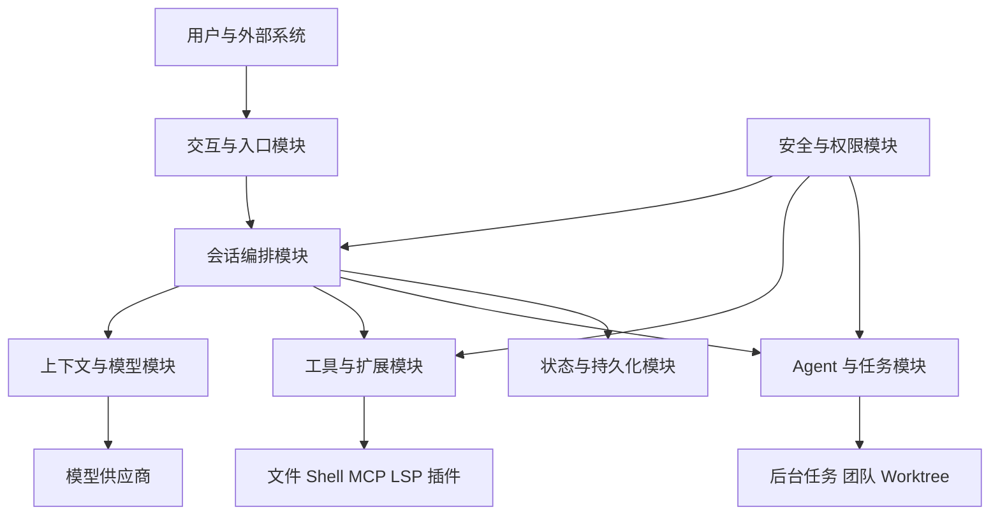
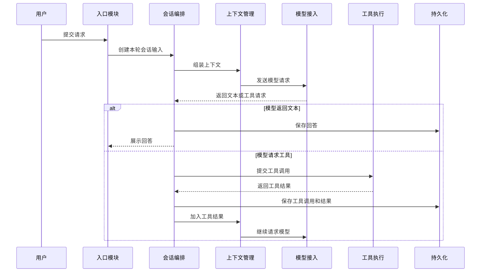

# OpenClaude 架构与功能报告

本报告说明 OpenClaude 的系统架构、模块职责、运行流程和关键设计。正文关注系统行为和模块协作。源码路径、构建命令和测试方法集中在附录。

## 报告范围

报告覆盖以下内容：

1. 用户通过终端、Headless、SDK、远程会话等入口使用系统的方式。
2. 用户请求从输入、模型推理、工具执行到结果展示的完整流程。
3. 上下文、项目指令、技能、记忆和压缩的组织方式。
4. Anthropic、OpenAI-compatible、Gemini、Bedrock 和 Vertex 的接入方式。
5. 文件、Shell、MCP、LSP、插件和子 Agent 等能力的管理方式。
6. 前台 Agent、后台任务、团队成员和 worktree 的协作方式。
7. 会话记录、恢复、分支和大型工具结果的保存方式。
8. 权限、目录信任、路径检查、沙箱、网络和凭据保护。
9. 限流、上下文溢出、重复失败、中止和进程退出等异常处理。
10. 会话存活判定、终端 Footer 生命周期和标题响应校验三项简历技术专题。

## 总体架构

系统以会话编排模块为中心。入口模块接收输入并展示输出。上下文与模型模块准备模型需要的信息。工具与扩展模块执行模型请求的操作。Agent 与任务模块管理并行和后台工作。状态与持久化模块保存当前状态和历史记录。安全与权限模块检查每次具有外部影响的操作。

## 核心模块

| 模块 | 主要职责 | 输入 | 输出 |
|---|---|---|---|
| 交互与入口 | 接收文本、命令、结构化消息和远程事件 | 用户输入、SDK 调用、远程消息 | 标准会话请求、界面事件 |
| 会话编排 | 维护一轮请求的阶段和终止条件 | 会话请求、模型事件、工具结果 | 下一次模型请求、最终回答、任务通知 |
| 上下文管理 | 组织系统提示、项目规则、历史、附件和记忆 | 会话历史、文件信息、技能、设置 | 发送给模型的上下文 |
| 模型接入 | 选择模型并转换请求与流式响应 | 内部消息、模型配置 | 统一的模型事件和错误类别 |
| 工具执行 | 校验参数、检查权限、调度并执行工具 | 模型工具请求 | 工具结果、进度和错误 |
| Agent 与任务 | 运行子 Agent、后台任务和团队协作 | 子任务、团队消息、计划 | 子任务结果、状态变化、通知 |
| 扩展系统 | 加载 MCP、插件、Hook、LSP 和命令 | 扩展配置、外部服务 | 新工具、新命令、生命周期处理 |
| 状态管理 | 保存界面状态、查询状态和任务状态 | 各模块的状态变化 | 可订阅状态和并发控制结果 |
| 持久化 | 保存会话事件、设置、文件快照和大型结果 | 消息、元数据、工具结果 | 可恢复会话和历史分支 |
| 安全 | 检查信任、权限、路径、进程、网络和凭据 | 操作请求、配置来源、目标资源 | 允许、拒绝、请求确认或隔离执行 |

## 一次普通请求的流程

一次请求可以包含多次模型调用和多次工具执行。会话编排模块在每个阶段检查中止、重试、上下文容量、工具步数和最终结束条件。

## 后台任务流程

后台 Agent 启动后会获得独立上下文和任务记录。父会话会立即得到任务 ID。后台 Agent 持续运行并写入自己的对话记录。任务完成后，任务模块向主会话队列加入结构化通知。主会话在当前模型或工具步骤结束后读取该通知，并决定展示结果或继续处理。

团队成员使用长期身份和邮箱。团队消息进入接收方队列。计划审批由团队负责人处理。worktree 为并行修改提供独立文件目录。对话分支只改变消息历史，不改变文件目录。

## 会话恢复流程

每条会话事件都包含自身 ID 和父事件 ID。加载会话时，系统从选定的末端事件沿父事件 ID 向前查找，重建当前消息链。对话分支会创建新的末端事件。文件回退使用单独保存的文件快照。上下文压缩会保存摘要和压缩位置，完整日志继续保留。

## 主报告章节

| 章节 | 内容 |
|---|---|
| [00 总体架构](00-architecture-overview.md) | 系统分层、模块关系和主要数据流 |
| [01 运行环境与系统装配](01-repository-build-runtime.md) | 发布形态、运行环境和可选功能装配 |
| [02 启动流程](02-entrypoints-startup.md) | 配置加载、模式选择、会话恢复和服务启动 |
| [03 状态与数据](03-state-and-data-model.md) | 消息、界面状态、查询状态、任务状态和历史链 |
| [04 会话执行流程](04-query-agent-loop.md) | 输入、模型、工具、继续请求和终止条件 |
| [05 上下文与记忆](05-context-prompt-memory.md) | Prompt、项目规则、附件、记忆和压缩 |
| [06 模型供应商接入](06-provider-model-transport.md) | 模型选择、请求转换、流式响应和切换策略 |
| [07 工具与权限](07-tools-permissions-security.md) | 工具分类、校验、权限、并发和沙箱 |
| [08 Agent 与任务编排](08-agents-tasks-orchestration.md) | 子 Agent、后台任务、团队和 worktree |
| [09 终端交互](09-tui-interaction-flow.md) | 输入、显示、队列、取消和界面状态 |
| [10 配置与会话持久化](10-configuration-session-persistence.md) | 配置优先级、事件日志、恢复和分支 |
| [11 扩展系统](11-mcp-plugins-hooks-lsp-commands.md) | MCP、插件、Hook、LSP 和命令 |
| [12 错误与恢复](12-errors-retries-recovery-edge-cases.md) | 重试、降级、循环保护、中止和退出 |
| [13 使用入口与部署形态](13-entrypoint-modes-sdk-remote.md) | TUI、Headless、SDK、Remote、SSH 和 gRPC |
| [14 安全模型](14-security-model.md) | 信任、权限、路径、进程、网络和凭据 |
| [18 简历技术专题](18-resume-technical-deep-dives.md) | 会话看门狗、Footer 生命周期和 LLM 响应边界 |

## 附录

| 章节 | 用途 |
|---|---|
| [15 工程质量与验证](15-engineering-and-testing.md) | 构建、测试、调试和贡献流程 |
| [16 架构场景串联](16-interview-playbook.md) | 使用典型场景串联多个模块 |
| [17 源码索引与术语](17-source-map-glossary.md) | 源码定位、术语解释和进一步查证 |

主报告可以独立阅读。附录用于验证实现细节和定位源码。

简历内容的集中学习入口为 [18 简历技术专题](18-resume-technical-deep-dives.md)。该章提供故障背景、状态模型、执行流程、异常路径、测试矩阵和口头介绍模板。

需要快速准备项目介绍时，按照 [简历内容优先阅读目录](resume-priority/README.md) 中的顺序阅读。
