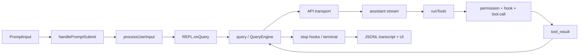

# OpenClaude 项目深度指南

> 对应当前仓库 `@gitlawb/openclaude` 0.24.0。本文档按当前源码说明；实验功能由 `bun:bundle` 的 `feature()` 在构建期裁剪，未启用功能不能仅凭源码存在推断为当前产物可用。

## 这套指南解决什么问题

读完后，你应能不依赖“它类似 Claude Code”这种模糊表述，完整解释：

1. CLI 如何从 `bin/openclaude` 启动，如何区分交互、Headless、SDK、远程和 SSH 模式。
2. 一条用户输入如何变成消息、API 流、工具调用、工具结果和下一轮模型请求。
3. 系统提示、项目指令、附件、技能、记忆和压缩如何组成并维护上下文。
4. 多供应商如何在统一消息语义下选择 Anthropic、OpenAI-compatible、Gemini、Bedrock、Vertex 等传输路径。
5. 工具如何注册、过滤、验证、授权、并发执行并回填严格配对的 `tool_result`。
6. 子代理、后台任务、团队成员、worktree 隔离和跨代理消息如何协作。
7. React/Ink TUI 的状态源、查询状态机、队列优先级、取消和渲染流程。
8. 设置优先级、JSONL 会话链、恢复、分支、压缩边界和大文件优化。
9. MCP、插件、Hooks、LSP、IDE、SDK、gRPC/Server 等扩展边界。
10. 重试、限流、上下文溢出、无效工具结果、中止、循环保护等异常路径。
11. 项目的安全模型、可测试边界以及面试时如何讲清设计权衡。

## 推荐阅读顺序

| 顺序 | 章节 | 重点 |
|---|---|---|
| 1 | [00 全景与核心心智模型](00-architecture-overview.md) | 建立系统边界和五层模型 |
| 2 | [01 仓库、构建与运行时](01-repository-build-runtime.md) | 目录、技术栈、单文件构建、DCE |
| 3 | [02 入口与启动链路](02-entrypoints-startup.md) | launcher、Commander、初始化分岔 |
| 4 | [03 状态与数据模型](03-state-and-data-model.md) | 消息、AppState、bootstrap state、任务状态 |
| 5 | [04 主 Agent 执行循环](04-query-agent-loop.md) | 一轮请求完整时序和状态迁移 |
| 6 | [05 上下文、Prompt、记忆与压缩](05-context-prompt-memory.md) | 模型真正看到什么 |
| 7 | [06 模型供应商与协议适配](06-provider-model-transport.md) | 路由、传输、能力差异、流式协议 |
| 8 | [07 工具、权限、沙箱与文件安全](07-tools-permissions-security.md) | 工具生命周期和安全判定 |
| 9 | [08 Agent、任务、团队与编排](08-agents-tasks-orchestration.md) | sync/async、队伍、任务通知、worktree |
| 10 | [09 TUI 与交互状态流](09-tui-interaction-flow.md) | REPL、QueryGuard、输入队列、取消 |
| 11 | [10 配置与会话持久化](10-configuration-session-persistence.md) | 设置合并、JSONL、恢复和大文件策略 |
| 12 | [11 MCP、插件、Hooks 与 LSP](11-mcp-plugins-hooks-lsp-commands.md) | 动态扩展系统 |
| 13 | [12 错误恢复与特殊场景](12-errors-retries-recovery-edge-cases.md) | 防止死循环和故障升级 |
| 14 | [13 多入口与部署形态](13-entrypoint-modes-sdk-remote.md) | Headless、SDK、Server、Remote、SSH |
| 15 | [14 安全边界与威胁模型](14-security-model.md) | trust、permission、路径、进程、凭据 |
| 16 | [15 工程质量与测试方法](15-engineering-and-testing.md) | 测试层次、构建门禁、调试路线 |
| 17 | [16 简历与面试讲解稿](16-interview-playbook.md) | 30 秒、3 分钟和深入追问 |
| 18 | [17 源码导航与术语表](17-source-map-glossary.md) | 按问题定位文件和统一术语 |

## 三条主线

### 主线 A：一次普通交互



### 主线 B：控制面和数据面

- **控制面**：CLI 参数、设置合并、provider profile、权限模式、feature gate、插件与 MCP 配置。
- **数据面**：`Message[]`、API stream、`tool_use/tool_result`、task notification、JSONL transcript。
- **运行状态面**：`AppStateStore`、`QueryGuard`、模块级 command queue、任务表、AbortController。

混淆这三类状态，是阅读该项目最常见的困难。例如：模型选择既有持久配置，又有会话内 `AppState.mainLoopModel`，还有某次子代理运行的局部路由；它们不是同一层。

### 主线 C：同步路径和后台路径

- 同步 Agent 在父工具调用内持续产出 progress，父查询等待它完成。
- 异步 Agent 先注册 `local_agent` 任务并立即返回，后台生命周期独立于当前 ESC；结束后用 `<task-notification>` 回到统一命令队列。
- foreground Agent 可在运行中切换为 background；转换由 signal promise 打断父侧等待，但不销毁 Agent iterator。
- in-process teammate 与普通 subagent 不同：它有团队身份、邮箱、idle/active 行为和计划审批协议。

## 阅读源码时的约定

- 文中源码引用采用 `路径 → 导出符号/职责`，不绑定易漂移的行号。
- `feature('X')` 表示构建期功能开关，不等同于普通运行时 `if`。
- `getFeatureValue_CACHED_MAY_BE_STALE()` 是实验/远端配置层；它和构建期开关可能同时存在。
- `*_DEPRECATED` 常是兼容桥，不代表当前调用无效。
- “当前 open build”存在少数内部功能 stub；应按构建产物而不是源码文件数量判断可用性。

## 最小验证实践

按仓库规则，源码构建用 Bun，发布产物运行于 Node 22+：

```bash
bun run build
bun run smoke
bun run typecheck
bun test ./path/to/focused.test.ts
```

本指南不是用户使用手册；它是代码级架构说明。具体 provider 配置仍以 `docs/integrations/` 为准。
